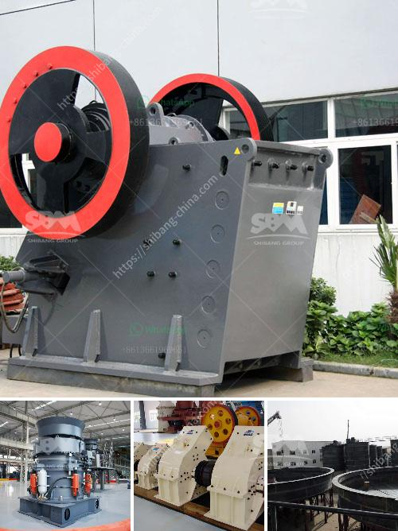

<h3>احتياطي في مطحنة الكرة</h3>
تعتبر مطحنة الكرة واحدة من أهم المعدات اللازمة في صناعة التعدين والتجهيزات المعدنية. تستخدم مطاحن الكرة لطحن المواد الصلبة بواسطة قوة الاحتكاك والصدمة بين الكرات المعدنية الموجودة داخل الأسطوانة والمواد الصلبة المطحونة. يشمل احتياطي في مطحنة الكرة عددًا من العناصر التي تؤثر على أداء المطحنة وفعالية عملية الطحن.

أحد العوامل الرئيسية التي يجب مراعاتها في احتياطي مطحنة الكرة هو نوعية الكرات المعدنية المستخدمة. يجب أن تكون الكرات مصنوعة من مادة عالية الجودة قادرة على تحمل ضغط الصدمة المتكرر والاحتكاك المستمر. يفضل استخدام الكرات المصنوعة من الفولاذ المقاوم للصدأ أو الكروم العالي، حيث أنها تتميز بالصلابة العالية والمتانة.

بالإضافة إلى ذلك، يجب توفير سطح مستقيم ومستوٍ داخل المطحنة لضمان توزيع متساوٍ للكرات المعدنية والمواد الصلبة المطحونة. يتم ضبط ذلك بواسطة ألواح الدعم المثبتة على جانبي الأسطوانة وداخلها، حيث يتم تثبيت البطانة من الداخل لتوفير سطح مستوٍ ومستقيم وأيضًا لحماية الأسطوانة من التلف الناتج عن عملية الطحن.

علاوة على ذلك، يعتبر التزويد بنظام تبريد فعال من أولويات الاحتياطي في مطحنة الكرة لتقليل درجة حرارة المطحنة والحد من التآكل الناجم عن الاحتكاك المستمر. يتم ضخ المياه المبردة داخل المطحنة عن طريق أنابيب موصلة، ويتم الحفاظ على درجة حرارة الماء بواسطة وحدة تبريد خارجية. يساهم هذا النظام في زيادة عمر المطحنة وتحسين كفاءة عملها.

لا يمكن لاحتياطي في مطحنة الكرة أن يكتمل من دون التأكد من تركيب جهاز التشتيت الداخلي. يتم تثبيت الجهاز داخل المطحنة لضمان توزيع متساوٍ للمواد المطحونة والوقاية من الكرات المعدنية المتراكمة. يضمن جهاز التشتيت الداخلي تدفقًا طبيعيًا للمواد داخل المطحنة ويزيد من كفاءة الطحن.

باختصار، يعتبر الاحتياطي في مطحنة الكرة العنصر الأساسي للحفاظ على أداء المطحنة وفاعليتها. من خلال اختيار الكرات المعدنية المناسبة، وتوفير سطح مستقيم ومستوٍ، وتوفير نظام تبريد فعال، وتثبيت جهاز التشتيت الداخلي، يمكن تحقيق أداء مثالي لمطحنة الكرة وتحسين عملية الطحن وتقليل التكاليف المتعلقة بالصيانة واستبدال الأجزاء.
<h3>Contact us</h3><ul><li><strong>Whatsapp:&nbsp;<a href="https://wa.me/8613661969651">+8613661969651</a></strong></li><li><a href="https://swt.shibang-china.com/?git&amp;zhl&amp;احتياطي في مطحنة الكرة"><strong>Online Service(chat now)</strong></a></li></ul><h3>Related</h3><ul><li><a href='تكلفة مطاحن الهامر للسعر.md'>تكلفة مطاحن الهامر للسعر</a></li><li><a href='تكلفة مصنع الأسمنت 200 طن في اليوم.md'>تكلفة مصنع الأسمنت 200 طن في اليوم</a></li><li><a href='مطحنة المطرقة في نيجيريا.md'>مطحنة المطرقة في نيجيريا</a></li><li><a href='مصنع غسيل رمال الكروم بأسعار مناسبة.md'>مصنع غسيل رمال الكروم بأسعار مناسبة</a></li><li><a href='اليابان لمصنع تكسير متنقل.md'>اليابان لمصنع تكسير متنقل</a></li></ul>