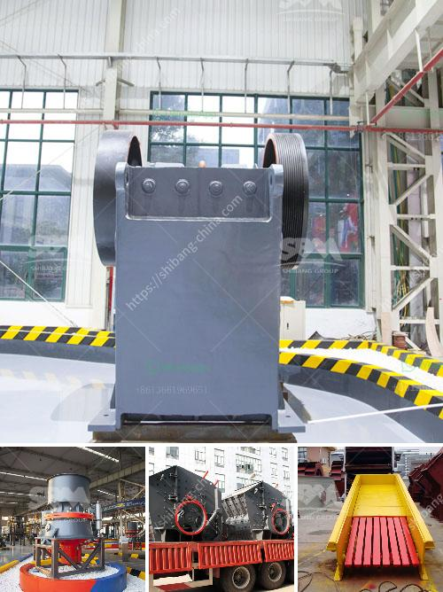

<h3>اختلافات بين مطحنة الهامر ومطحنة الكرة</h3>
تعتبر مطاحن الهامر ومطاحن الكرة من أشهر وأكثر أنواع المطاحن انتشارًا في صناعة الطحن. تختلف هاتان المطحنتان في الكثير من الجوانب التقنية والأداء. سنلقي نظرة على أهم الاختلافات بين المطحنة الهامر والمطحنة الكرة:

تستخدم مطاحن الهامر عادةً في طحن المواد الخام المنتجة من المناجم أو المواد الخشنة مثل الحجر الجيري والفحم. من ناحية أخرى، تستخدم مطاحن الكرة عادةً في طحن المواد الناعمة والمتوسطة مثل الأسمنت والكاولين والسيراميك.

تتكون مطحنة الهامر من غرفة طحن مع ذراع قوي يدور بسرعة عالية لتحطيم المواد الخام. أما مطحنة الكرة فتتكون من أسطوانة طويلة تحتوي على كرات طحن منصوبة على حوافها الداخلية وتدور على محور أفقي.

تعتمد مطاحن الهامر على آلية الاصطدام لتدمير وطحن المواد الخام. يتم اصطدام المواد بالجزء الدوار للمطحنة مما يتسبب في تكسيرها وتحطيمها. على الجانب الآخر، تعتمد مطاحن الكرة على قوة الاحتكاك والسحق لطحن المواد الخام. يتم وضع المواد داخل الأسطوانة مع الكرات وتدور الأسطوانة بشكل مستمر لطحن المواد بفعل قوة الاحتكاك بين الكرات والمواد الخام.

بشكل عام، تعتبر مطاحن الكرة أكثر كفاءة وإنتاجية من مطاحن الهامر. يعود ذلك جزئيًا إلى أن مطاحن الكرة تستخدم ضغطًا عاليًا وحركة دوران سريعة لطحن المواد، بينما تستخدم مطاحن الهامر الطرد المركزي لتسريع الجسيمات والتأثير عليها. وبالتالي، فإن مطاحن الكرة تمتاز بطحن الكميات الأكبر من المواد بفعالية أكبر.

عند التفكير في التكلفة، يجب مراعاة عدة عوامل مثل حجم المطحنة والسعة الإنتاجية المطلوبة وسهولة التشغيل وصيانة المطحنة. من المعروف أن مطاحن الهامر تكون أرخص قليلاً في التكلفة بالمقارنة مع مطاحن الكرة. ومع ذلك، قد تؤدي احتياجات الإنتاج والكفاءة إلى تفضيل استخدام مطاحن الكرة رغم أعلى التكلفة.

باختصار، رغم أن كلا المطحنتين يقومان بنفس الوظيفة الأساسية التي هي طحن المواد، إلا أنهما مختلفتان في نهج الطحن والتصميم والكفاءة والتكلفة. ويجب اختيار المطحنة المناسبة وفقًا لاحتياجات التطبيق والظروف المحددة.
<h3>Contact us</h3><ul><li><strong>Whatsapp:&nbsp;<a href="https://wa.me/8613661969651">+8613661969651</a></strong></li><li><a href="https://swt.shibang-china.com/?git&amp;zhl&amp;اختلافات بين مطحنة الهامر ومطحنة الكرة"><strong>Online Service(chat now)</strong></a></li></ul><h3>Related</h3><ul><li><a href='عملية تصنيع هيدروتون الحصى الطيني.md'>عملية تصنيع هيدروتون الحصى الطيني</a></li><li><a href='موردين كسارات الفك والمخروط في موكوباني.md'>موردين كسارات الفك والمخروط في موكوباني</a></li><li><a href='آلات الطحن بالكرات الكوارتز.md'>آلات الطحن بالكرات الكوارتز</a></li><li><a href='كسارة معدنية للإيجار.md'>كسارة معدنية للإيجار</a></li><li><a href='غرابيل للبيع في ساسكاتشوان.md'>غرابيل للبيع في ساسكاتشوان</a></li></ul>