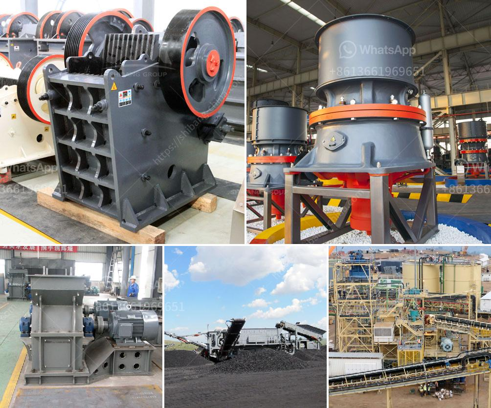

<h3>استثمار مصنع كسارة الحجر</h3>
تعتبر صناعة البناء والتشييد من القطاعات الحيوية في أي اقتصاد، حيث يعتمد العديد من القطاعات الأخرى على إمدادات مواد البناء لتلبية احتياجاتها. ومن أهم هذه المواد حجر البناء. استثمار مصنع كسارة الحجر يمثل فرصة مجدية ومربحة في هذه الصناعة المهمة.

يعكف المستثمرون في الفترة الحالية على البحث عن فرص استثمارية ناجحة تضمن لهم العائد المربح. واستثمار مصنع كسارة الحجر يعتبر واحدًا من تلك الفرص، حيث يعتبر قيمة الحجر الناتج من المصنع من القيم المضافة للمشاريع الكبيرة.

يأتي المصنع المتكامل للكسارة مع العديد من المميزات والفوائد. أولًا، يتميز المصنع بالقدرة على إنتاج حجم كبير من الحجر المكسر والغرامات المنتجة بشكل يلبي احتياجات السوق المحلية والعالمية. كما يتميز المصنع بالقدرة على إنتاج عدة أحجام وأشكال من الحجر، مما يعزز من قابلية بيع المنتج في السوق.

ثانيًا، يتمتع المصنع بتكنولوجيا حديثة ومتقدمة، مما يؤدي إلى زيادة كفاءة الإنتاج وتقليل تكاليف التشغيل. كما يمكن تجهيز المصنع بمعدات مستقلة لإجراءات معالجة الحجر، مثل آلة الغربلة والفرز ومطحنة الكرات، مما يخفض تكلفة التصنيع ويزيد من جودة المنتج.

ثالثًا، استثمار مصنع كسارة الحجر يعتبر استثمارًا آمنًا ومربحًا في نفس الوقت، حيث تنمو صناعة البناء باستمرار وتتطلب إمدادات قوية من الحجر. تعد العديد من المشاريع الكبيرة، مثل البناء السكني والتجاري والصناعي، هي مصدر رئيسي لاستخدام حجر البناء المكسر. وبالتالي، يؤدي الاستثمار في مصنع كسارة الحجر إلى استدامة العمل وزيادة الأرباح على المدى الطويل.

عند اتخاذ قرار استثمار مصنع كسارة الحجر، يجب أن يتم دراسة الجوانب الفنية والتقنية للمشروع، بما في ذلك تقدير سعر الحجر واحتياجات السوق وتوافر المواد الخام. يتطلب الامتثال للتشريعات البيئية المتعلقة بتشغيل مصانع الكسارة ومعالجة النفايات والحفاظ على البيئة.

باختصار، استثمار مصنع كسارة الحجر يعتبر فرصة ذهبية للحصول على عائد استثماري مربح في صناعة البناء النامية. يمنح المصنع المتكامل المستثمر فرصة لإنتاج وتوريد الحجر المكسر عالي الجودة، والذي يعد قطعة أساسية في مشاريع البناء المختلفة. وبتوجيه دراسة الجدوى اللازمة واتخاذ الخطوات الملائمة، يمكن للاستثمار في مصنع كسارة الحجر أن يكون ناجحًا ومجزيًا على المدى الطويل.
<h3>Contact us</h3><ul><li><strong>Whatsapp:&nbsp;<a href="https://wa.me/8613661969651">+8613661969651</a></strong></li><li><a href="https://swt.shibang-china.com/?git&amp;zhl&amp;استثمار مصنع كسارة الحجر"><strong>Online Service(chat now)</strong></a></li></ul><h3>Related</h3><ul><li><a href='مصنع سحق في ماليزيا.md'>مصنع سحق في ماليزيا</a></li><li><a href='الطحن بالكرات في بنغالور.md'>الطحن بالكرات في بنغالور</a></li><li><a href='مطحنة عمودية للكالسيوم.md'>مطحنة عمودية للكالسيوم</a></li><li><a href='تكلفة مطاحن الهامر للسعر.md'>تكلفة مطاحن الهامر للسعر</a></li><li><a href='سعر كسارة الصخور 8 مم.md'>سعر كسارة الصخور 8 مم</a></li></ul>