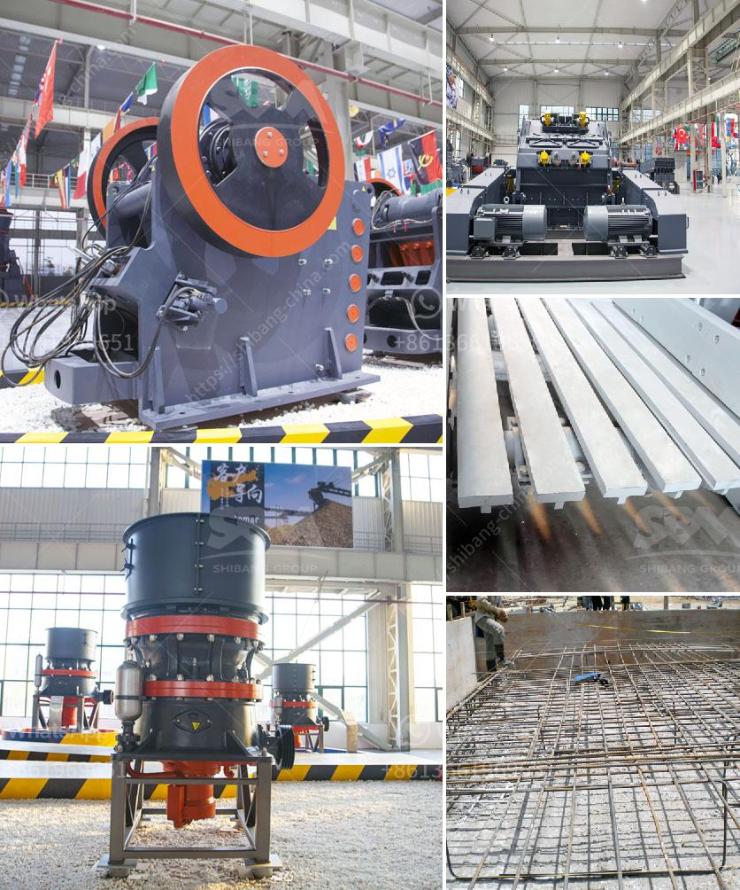

<h3>استخدام آلة مطحنة الكرة في إندونيسيا</h3>
تُستخدم آلة مطحنة الكرة على نطاق واسع في صناعة التعدين في إندونيسيا. وتستخدم لطحن المواد الخام بحجم صغير إلى مسحوق ناعم لإنتاج الأسمنت والسيراميك والصناعات الأخرى المختلفة.

تتألف آلة مطحنة الكرة من جسم أسطواني يحتوي على كرات فولاذية داخله. يتحرك الأسطوانة بشكل دوراني حول محورها، وعندما تدخل المواد الخام إلى الجسم الأسطواني، تتم سحقها وطحنها من قبل الكرات الفولاذية. تعتمد سرعة دوران الأسطوانة وحجم الكرات الفولاذية على نوع المواد الخام التي تراد طحنها والنسبة المطلوبة من النعومة في المنتج النهائي.

تستخدم آلة مطحنة الكرة في إندونيسيا لطحن المواد الخام مثل المعادن الثقيلة والفحم والفوسفات والأسمنت. تُعد صناعة التعدين من الصناعات الرئيسية في إندونيسيا، وتحتل المراتب العالية في إنتاج الزنك والنحاس والذهب والنفط. تلعب آلة مطحنة الكرة دورًا حاسمًا في عمليات التعدين هذه حيث تساهم في تكسير المواد الخام إلى حجم صغير جدًا يمكن استخلاص الموارد المعدنية منها.

بالإضافة إلى صناعة التعدين، يُستخدم مطحنة الكرة في العديد من الصناعات الأخرى في إندونيسيا. يمكن استخدامها في صناعة السيراميك لطحن المواد الخام السيراميكية إلى مسحوق دقيق، الأمر الذي يسهم في تحسين جودة المنتج النهائي. كما يمكن استخدامها في إنتاج الأسمنت لطحن الكلنكر (المادة الرئيسية في الأسمنت) إلى مسحوق ناعم لتحقيق أعلى نوعية من الأسمنت.

تتميز آلة مطحنة الكرة بسهولة التشغيل والصيانة. يمكن تعديل سرعة دوران الأسطوانة وحجم الكرات الفولاذية بسهولة لتحقيق النتائج المرجوة. بالإضافة إلى ذلك، يتمتع الجسم الأسطواني بقدرة تحمل عالية للحرارة والضغط، مما يجعله مثاليًا للاستخدام في الظروف القاسية لصناعة التعدين.

باختصار، تُعد آلة مطحنة الكرة من المعدات الأساسية في صناعة التعدين والصناعات الأخرى في إندونيسيا. تساهم في تكسير المواد الخام إلى حجم صغير جدًا يمكن استخدامها في إنتاج مجموعة متنوعة من المنتجات عالية الجودة. كما أنها تتميز بسهولة التشغيل والصيانة، مما يجعلها اختيارًا مناسبًا للشركات الراغبة في تطوير صناعاتها بشكل مستدام في إندونيسيا.
<h3>Contact us</h3><ul><li><strong>Whatsapp:&nbsp;<a href="https://wa.me/8613661969651">+8613661969651</a></strong></li><li><a href="https://swt.shibang-china.com/?git&amp;zhl&amp;استخدام آلة مطحنة الكرة في إندونيسيا"><strong>Online Service(chat now)</strong></a></li></ul><h3>Related</h3><ul><li><a href='كسارات الحجر المحلية.md'>كسارات الحجر المحلية</a></li><li><a href='بيع كسارة مخروطية صنعت في الصين.md'>بيع كسارة مخروطية صنعت في الصين</a></li><li><a href='سعر آلة صنع الرمل الاصطناعي.md'>سعر آلة صنع الرمل الاصطناعي</a></li><li><a href='مصنعو آلات تكسير الحجر.md'>مصنعو آلات تكسير الحجر</a></li><li><a href='آلة سحق الطين.md'>آلة سحق الطين</a></li></ul>