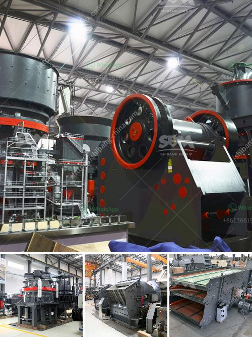

<h3>استخدام كسارة الفك المتنقلة</h3>
تعد كسارة الفك المتنقلة إحدى التقنيات المبتكرة في صناعة التعدين والبناء، حيث يتم استخدامها في سحق الصخور الصلبة والمواد الخام الأخرى. توفر هذه الكسارة مرونة عالية وقدرة تحميل قوية، مما يجعلها مثالية للاستخدام في مشاريع البناء والتعدين.

تتميز كسارة الفك المتنقلة بعدة ميزات هامة. أولاً، فهي قابلة للتنقل بسهولة وتستطيع الانتقال بين المواقع المختلفة بسرعة، وهذا يعني أنه يمكن استخدامها في أي موقع دون الحاجة إلى بنية تحتية معقدة. بالإضافة إلى ذلك، يمكن ضبط حجم المنتج المطلوب بسهولة عن طريق ضبط فتحة الفك، مما يعطي مرونة واختيارًا كبيرًا للمستخدمين.

تتكون كسارة الفك المتنقلة من جزئين رئيسين: الفك الثابت والفك الحركي. يتم وضع المواد الخام بين الفكين، ويتم سحقها عن طريق حركة الفك الحركي المتقارب والبعد عن الفك الثابت. يتم تحويل المواد المسحوقة إلى حجم أصغر واستخدامها بواسطة الآلات الثانوية لفصلها واستخدامها في العديد من التطبيقات المختلفة.

توفر كسارة الفك المتنقلة فوائد عديدة. تساعد في توفير الموارد والوقت، حيث يمكن سحق المواد في نفس الموقع الذي تم جمعها منه، وبالتالي فإنها لا تتطلب نقل المواد إلى مكان آخر للمعالجة. بالإضافة إلى ذلك، فإن استخدام كسارة الفك المتنقلة يقلل من تكلفة النقل والتخزين ويجنب أية تلوث بيئي ناتج عن ذلك.

بالنسبة لمستخدمي كسارة الفك المتنقلة، يعتبر استخدامها سهلاً وآمنًا. يمكن للمشغل ضبط سرعة التغذية وحجم المنتج بسهولة، وتتوفر أيضًا ميزة حماية الزائد للحفاظ على سلامة الجهاز. كما أن هذه الكسارة توفر طاقة كهربائية منخفضة وتستهلك كمية قليلة من الموارد الطبيعية، مما يجعلها اختيارًا بيئيًا أفضل.

في الختام، تعتبر كسارة الفك المتنقلة خيارًا ممتازًا للشركات في قطاع التعدين والبناء. تسمح بسهولة النقل والتنقل، وتوفر مرونة وسرعة في التشغيل، وتقلل من التكاليف والتأثير البيئي. إن استخدام كسارة الفك المتنقلة يؤدي إلى زيادة الكفاءة والإنتاجية في العمل وتقديم منتجات عالية الجودة للعملاء.
<h3>Contact us</h3><ul><li><strong>Whatsapp:&nbsp;<a href="https://wa.me/8613661969651">+8613661969651</a></strong></li><li><a href="https://swt.shibang-china.com/?git&amp;zhl&amp;استخدام كسارة الفك المتنقلة"><strong>Online Service(chat now)</strong></a></li></ul><h3>Related</h3><ul><li><a href='معدات إعادة تدوير الجبس للبيع.md'>معدات إعادة تدوير الجبس للبيع</a></li><li><a href='عملية كربونات الكالسيوم المترسبة.md'>عملية كربونات الكالسيوم المترسبة</a></li><li><a href='مطحنة هامر تقليدية.md'>مطحنة هامر تقليدية</a></li><li><a href='آلة تكسير الحجر للبيع.md'>آلة تكسير الحجر للبيع</a></li><li><a href='قطع غيار كسارة مخروطية hp 500.md'>قطع غيار كسارة مخروطية hp 500</a></li></ul>