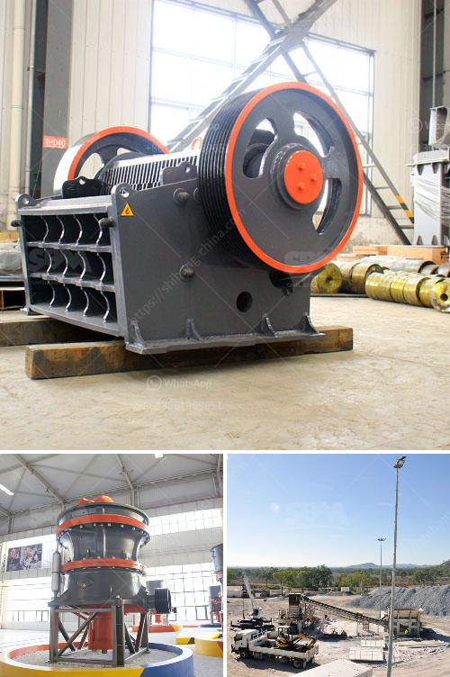

<h3>استخدام كسارة فكية صغيرة للخرسانة</h3>
تعتبر الكسارات الفكية الصغيرة أداة هامة في صناعة البناء والخرسانة. فهي تستخدم لتكسير الخرسانة الكبيرة إلى قطع صغيرة بحجم مناسب، مما يتيح إعادة استخدامها في عمليات البناء المختلفة. توفر الكسارة الفكية الصغيرة فوائد عديدة وتعزز استدامة العمليات الإنشائية. في هذه المقالة، سنستعرض أهمية استخدام كسارة فكية صغيرة للخرسانة.

أولاً، توفر الكسارة الفكية الصغيرة الكفاءة والسرعة في عملية تكسير الخرسانة. فبدلاً من الاعتماد على العمالة اليدوية أو الأدوات التقليدية لتكسير الخرسانة الكبيرة، يمكن للكسارة الفكية الصغيرة تحويل الأعمدة والبلاط والخرسانة المتبقية إلى قطع صغيرة بسهولة وفي وقت قصير. هذا يقلل من تكاليف العمالة ويسرع وتيرة العمل في الموقع.

ثانياً، فإن استخدام الكسارة الفكية الصغيرة يقلل من حجم المخلفات ويعزز المسؤولية البيئية. بدلاً من التخلص من الخرسانة ورميها في المكبات العامة، يمكن استخدام الكسارة الفكية لتكسير الخرسانة وإعادة تدويرها في عمليات البناء الجديدة. هذا يحسن استدامة مواردنا الطبيعية ويقلل من احتياجنا لمصادر الحصى والرمل الطبيعية.

ثالثاً، يمكن للكسارة الفكية الصغيرة أن توفر خامات بناء ذات جودة عالية. فمن خلال تكسير الخرسانة الكبيرة، يمكننا الحصول على قطع صغيرة من الخرسانة تتناسب مع الاحتياجات البنائية المختلفة. هذه القطع يمكن استخدامها في إنشاء المسارات والجدران والأساسات بشكل فعال ودقيق.

أخيراً، يعمل الاستخدام المستدام للكسارات الفكية الصغيرة على تحقيق التوازن بين الاحتياجات البنائية والحفاظ على البيئة. فعندما نعيد استخدام الخرسانة المكسورة في مشاريع البناء الجديدة، فإننا نحمي موارد الأرض ونحسن جودة الهواء والمياه في المناطق المحيطة. بالإضافة إلى ذلك، يساهم الاستخدام المستدام للكسارات الفكية الصغيرة في تقليل الانبعاثات الكربونية وتقليل التلوث الناجم عن الأنشطة البنائية.

لخلاصة، تعد الكسارات الفكية الصغيرة أداة فعالة في عمليات تكسير الخرسانة وإعادة تدويرها. من خلال استخدامها، يمكن تحقيق الكفاءة والسرعة في العمل، وتقليل النفايات وتعزيز المسؤولية البيئية، والحصول على خامات بناء ذات جودة عالية، وتحقيق التوازن بين الاحتياجات البنائية والحفاظ على البيئة.
<h3>Contact us</h3><ul><li><strong>Whatsapp:&nbsp;<a href="https://wa.me/8613661969651">+8613661969651</a></strong></li><li><a href="https://swt.shibang-china.com/?git&amp;zhl&amp;استخدام كسارة فكية صغيرة للخرسانة"><strong>Online Service(chat now)</strong></a></li></ul><h3>Related</h3><ul><li><a href='تقرير جدوى مصنع الأسمنت.md'>تقرير جدوى مصنع الأسمنت</a></li><li><a href='آلة كسارة حجر للبيع.md'>آلة كسارة حجر للبيع</a></li><li><a href='مصنع كسارة الحجر والجرانيت.md'>مصنع كسارة الحجر والجرانيت</a></li><li><a href='إعداد مصفاة الكروم.md'>إعداد مصفاة الكروم</a></li><li><a href='أسعار كسارة الحجر.md'>أسعار كسارة الحجر</a></li></ul>