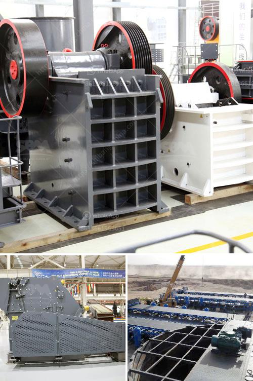

<h3>استخدام مسحوق الجبس في البناء</h3>
يعتبر مسحوق الجبس من المواد الأساسية التي تستخدم في صناعة البناء. فهو يتميز بخصائصه المتميزة وقدرته على تحقيق الاستقرار والمتانة في المنشآت. يتم اشتقاق مسحوق الجبس من صخور الجبس الخالصة، ويُخلط في الماء لخلق حالة من الليونة قبل أن يصبح صلبًا عن طريق التجفيف. في هذه المقالة، سوف نناقش استخدام مسحوق الجبس في البناء وفوائده.

أحد الاستخدامات الرئيسية لمسحوق الجبس هو في صناعة الأسقف والجدران. يمكن استخدامه لتشكيل أسقف مستوية وسلسة بشكل سريع وسهل. فهو يساعد في توزيع المواد بشكل متساوٍ ويضمن الاستقرار الهيكلي للمباني. علاوة على ذلك، يعطي الجبس تشطيبًا ناعمًا ومتجانسًا للجدران والأسقف، مما يقلل من الحاجة إلى أعمال التشطيب الإضافية.

يستخدم مسحوق الجبس أيضًا في صناعة الديكور الداخلي. فهو يتيح إمكانية تشكيل الأشكال والأنماط الجميلة، مثل الارتفاعات والقطع المعمارية المزخرفة. بفضل مرونة الجبس، يمكن صب الأشكال المعقدة والمحتكرة بدقة وسهولة. علاوة على ذلك، يمكن تزيين الأسطح بنقشات فنية لتكون مرآة للفن الجميل.

بالإضافة إلى جمالياته، يتميز الجبس بخصائصه الصوتية والحرارية الممتازة. ومن هنا، فإنه يوفر عزلًا جيدًا للحرارة والصوت في المباني. يعمل على تحسين الاستدامة البيئية للمنشآت، حيث يقلل من حاجة استخدام الطاقة في عمليات التدفئة والتبريد.

علاوة على ذلك، يمتاز مسحوق الجبس بخصائصه النارية. فهو غير قابل للاشتعال ويمكنه التعامل مع درجات الحرارة العالية بكفاءة عالية. بالتالي، فإن استخدام الجبس في الجدران الداخلية والأسقف يعزز سلامة المبنى ويوفر حماية إضافية في حالة نشوب الحرائق.

في الختام، يمكن القول بأن مسحوق الجبس يعتبر من مكونات البناء الهامة والمتعددة الاستخدامات. فهو يساعد في بناء مبانٍ قوية ودائمة ويعزز جمالية المساحات الداخلية. كما يقدم خصائصه العزلية والحرارية والنارية التي تضمن الراحة والأمان للسكان. لذلك، ينصح بشدة باستخدام مسحوق الجبس في صناعة البناء للحصول على نتائج مثالية وعمرٍ مديد للمباني.
<h3>Contact us</h3><ul><li><strong>Whatsapp:&nbsp;<a href="https://wa.me/8613661969651">+8613661969651</a></strong></li><li><a href="https://swt.shibang-china.com/?git&amp;zhl&amp;استخدام مسحوق الجبس في البناء"><strong>Online Service(chat now)</strong></a></li></ul><h3>Related</h3><ul><li><a href='تقدير تكلفة مصنع تعدين النحاس.md'>تقدير تكلفة مصنع تعدين النحاس</a></li><li><a href='بيع كسارة مخروط قديمة.md'>بيع كسارة مخروط قديمة</a></li><li><a href='عمليات محجر الحجر الجيري.md'>عمليات محجر الحجر الجيري</a></li><li><a href='تكلفة آلة سحق الحجر كسارة الحجر.md'>تكلفة آلة سحق الحجر كسارة الحجر</a></li><li><a href='آلة كسارة الحجر للبيع في الإمارات.md'>آلة كسارة الحجر للبيع في الإمارات</a></li></ul>