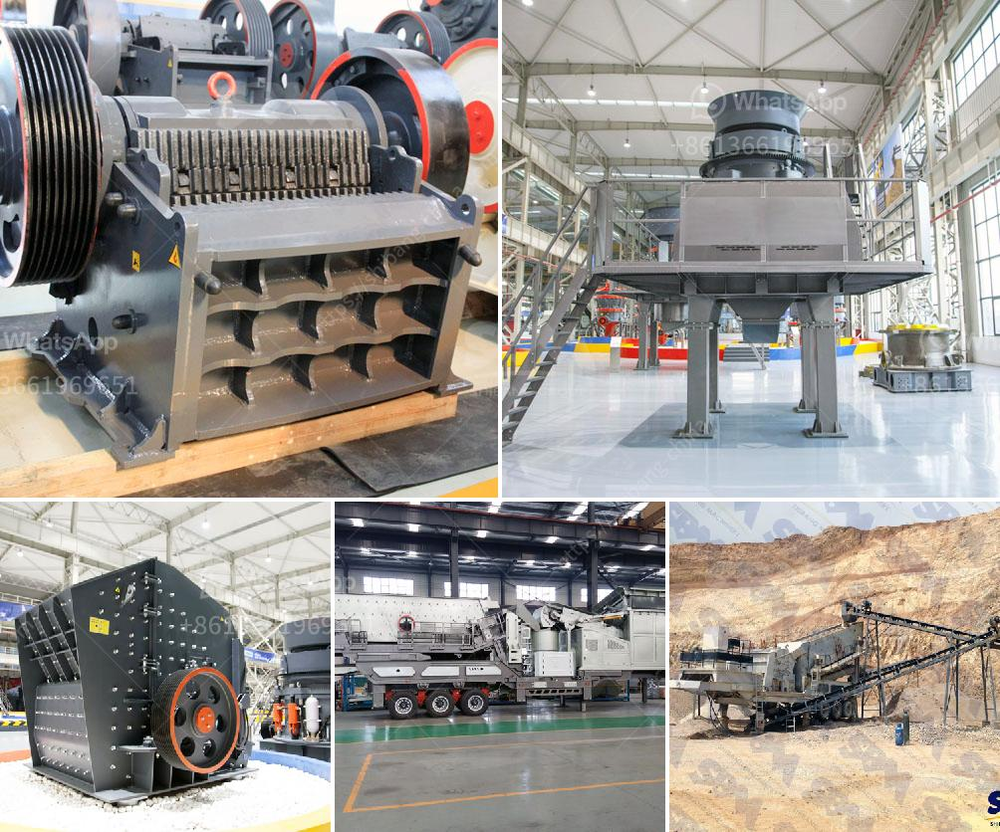

<h3>استخدام مصانع التكسير للبيع في الإمارات</h3>
تعتبر صناعة التكسير من الصناعات الهامة في دولة الإمارات العربية المتحدة، حيث تلعب دورًا حاسمًا في توسيع البنية التحتية ودعم التطور الاقتصادي والبنى التحتية والاستدامة البيئية. تعتبر مصانع التكسير للبيع أداة فعالة لإعادة تدوير مواد البناء والهدم، وهي تعمل على تكسير المواد المنتجة من عمليات الهدم لمنزل أو مبنى مهجورة، أو ردمات الطرق والجسور والمنشآت الأخرى.

تعتبر مصانع التكسير في الإمارات من أحدث التقنيات المستخدمة في صناعة البناء والهدم. فهي تقوم بتكسير المواد الخرسانية والحصى والطوب والزجاج والأسمنت والقوالب الحديدية إلى قطع صغيرة يمكن إعادة استخدامها في البناء الجديد. وبالإضافة إلى ذلك، فإن استخدام مصانع التكسير يساهم في حماية البيئة والحفاظ على الموارد الطبيعية، حيث يقلل من حاجة استخراج واستهلاك المواد الطبيعية الجديدة.

باستخدام مصانع التكسير، يمكن تقليل تكاليف الهدم وتخلص من المخلفات بطريقة فعالة ومستدامة. تقول الشركات المتخصصة في هذا المجال ، أنه من خلال إعادة تدوير المواد الخرسانية وإعادة استخدامها ، يمكن توفير المال للمطورين وأصحاب المشاريع وتحسين فرص الأعمال المستدامة في الدولة.

علاوة على ذلك، فإن استخدام مصانع التكسير يقلل من التلوث البيئي، حيث يقلل من احتياج المشاريع الجديدة إلى استخراج المواد الطبيعية الجديدة ويحد من إنتاج النفايات. بدلاً من ذلك، يمكن إعادة استخدام هذه المواد في البناء الجديد وتجنب النفايات البنائية المتزايدة التي تعاني منها الكثير من المدن.

ما يميز صناعة مصانع التكسير في الإمارات هو الابتكار والتقنيات المتقدمة المستخدمة. حيث تعتمد هذه المصانع على تكنولوجيا متطورة تسمح بمعالجة المواد بسرعة وكفاءة عالية. كما أن هذه المصانع مجهزة بالمعدات والأجهزة المناسبة لتلبية الطلب الكبير على خدمات التكسير في الدولة.

باختصار، تعتبر مصانع التكسير للبيع في الإمارات خيارًا مثاليًا لإعادة تدوير المواد البنائية والهدم وتوفير التكاليف والمساهمة في الاستدامة البيئية. وتشير الاحصائيات إلى أن صناعة البناء في الإمارات تزيد بشكل مستمر، وبالتالي فإن الطلب على خدمات التكسير سيتزايد أيضًا. لذلك، يتوقع أن يستمر دور مصانع التكسير في دعم النمو الاقتصادي والبنية التحتية في الإمارات للسنوات القادمة.
<h3>Contact us</h3><ul><li><strong>Whatsapp:&nbsp;<a href="https://wa.me/8613661969651">+8613661969651</a></strong></li><li><a href="https://swt.shibang-china.com/?git&amp;zhl&amp;استخدام مصانع التكسير للبيع في الإمارات"><strong>Online Service(chat now)</strong></a></li></ul><h3>Related</h3><ul><li><a href='كيفية صنع كسارة كرات.md'>كيفية صنع كسارة كرات</a></li><li><a href='آلات تصنيع كتل الجبس في إيطاليا.md'>آلات تصنيع كتل الجبس في إيطاليا</a></li><li><a href='كسارات متنقلة للتأجير في جوهانسبرغ.md'>كسارات متنقلة للتأجير في جوهانسبرغ</a></li><li><a href='مورد مصنع تكسير الحجر في الفلبين.md'>مورد مصنع تكسير الحجر في الفلبين</a></li><li><a href='شراء آلة محجر من أوروبا.md'>شراء آلة محجر من أوروبا</a></li></ul>