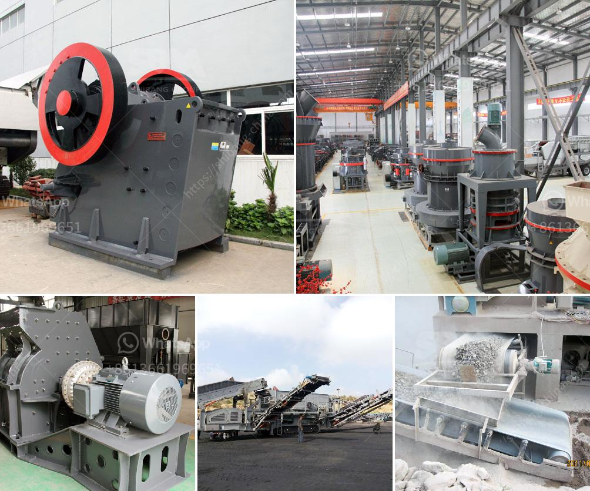

<h3>استخدام مطحنة ريموند</h3>
تعتبر مطحنة ريموند من الآلات الحديثة المستخدمة في صناعة الطحن. تحتوي هذه المطحنة على عدة مكونات أساسية تسمح بتحقيق نتائج طحن فعالة وعالية الجودة.

تستخدم مطحنة ريموند على نطاق واسع في عدة صناعات مثل التعدين والبناء والكيمياء والمعادن والمواد الأولية وغيرها. تعمل هذه المطحنة عن طريق جهاز الطحن الذي يدور بسرعة عالية داخل الجهاز المحيطي للمطحنة. وتعتمد كفاءة الطحن على حجم المادة المراد طحنها، حيث تستخدم مطحنة ريموند بشكل عام لطحن المواد الصلبة ذات الرطوبة المنخفضة أو المتوسطة.

توفر مطاحن ريموند سرعة وسهولة في الطحن، حيث يمكن استخدامها لطحن المواد الساحقة بشكل مستمر دون أية توقف. كما تساعد في تحقيق توزيع حبيبات متساوٍ ودقيق للمادة المطحونة، مما يسمح بتحقيق نتائج طحن ممتازة.

بالإضافة إلى ذلك، فإن استخدام مطاحن ريموند يساعد في تقليل استهلاك الطاقة والتكاليف العامة لعملية الطحن. فهي تتميز بكفاءة عالية واستهلاك منخفض للطاقة، مما يجعلها خيارًا مثاليًا للشركات التي تسعى لتحقيق توفير في تكاليف الإنتاج.

هناك العديد من المميزات الأخرى لاستخدام مطاحن ريموند بدلاً من طرق الطحن التقليدية. فعلى سبيل المثال، يمكن تعديل سرعة الدوران والضغط داخل المطحنة وذلك لتلبية متطلبات الطحن المختلفة. كما يمكن أيضًا تجهيز المطحنة بأنواع مختلفة من المصافي والفرز للحصول على نتائج طحن مختلفة.

إجمالًا، فإن استخدام مطاحن ريموند يعزز كفاءة الطحن ويساهم في توفير الطاقة والتكاليف العامة. لذا، فإن استخدام هذه المطاحن واسع الانتشار في العديد من الصناعات حول العالم.
<h3>Contact us</h3><ul><li><strong>Whatsapp:&nbsp;<a href="https://wa.me/8613661969651">+8613661969651</a></strong></li><li><a href="https://swt.shibang-china.com/?git&amp;zhl&amp;استخدام مطحنة ريموند"><strong>Online Service(chat now)</strong></a></li></ul><h3>Related</h3><ul><li><a href='تكنولوجيا معالجة خام الباريت.md'>تكنولوجيا معالجة خام الباريت</a></li><li><a href='تقدير تكلفة مصنع تعدين النحاس.md'>تقدير تكلفة مصنع تعدين النحاس</a></li><li><a href='مطحنة طحن الكرة في الهند.md'>مطحنة طحن الكرة في الهند</a></li><li><a href='شركة تصنيع معدات التكسير.md'>شركة تصنيع معدات التكسير</a></li><li><a href='الأحجار الكريمة الموجودة في نيجيريا.md'>الأحجار الكريمة الموجودة في نيجيريا</a></li></ul>