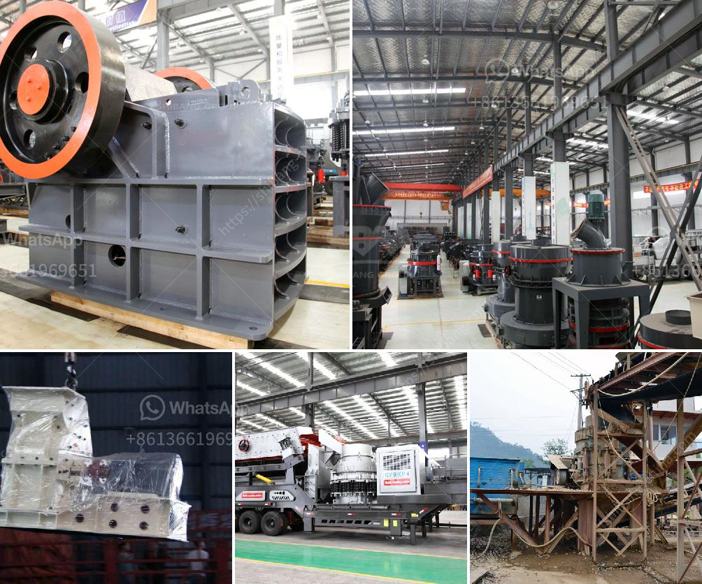

<h3>استخدامات الصناعية لمسحوق الرخام الأبيض</h3>
يعد مسحوق الرخام الأبيض من المنتجات الصناعية ذات التركيبة الكيميائية المعدلة للاستخدام في العديد من الصناعات المختلفة. يتم استخدامه بشكل واسع في مجالات مثل البناء، والصناعة الكيميائية، والإلكترونيات، وصناعة الأغذية والعديد من الصناعات الأخرى. وفيما يلي بعض الاستخدامات الصناعية الشائعة لمسحوق الرخام الأبيض:

1- صناعة السيراميك: يتم استخدام مسحوق الرخام الأبيض في إنتاج السيراميك والبورسلين، حيث يعمل على تحقيق لون أبيض مشرق وتأثيرات بصرية جميلة. تستخدم هذه المنتجات على نطاق واسع في المطابخ والحمامات والأرضيات والجدران.

2- صناعة الدهانات: يعتبر مسحوق الرخام الأبيض من المكونات الأساسية لصناعة الدهانات، حيث يساهم في توحيد لون الدهان وتعزيز قوة اللمعان والمتانة. كما يساعد على تحسين استقرار الصبغة وتوزيعها بشكل متساوٍ على السطح المدهون.

3- صناعة البلاستيك: يستخدم مسحوق الرخام الأبيض كحشوة في إنتاج البلاستيك، حيث يساهم في تقليل التكلفة وتحسين الخواص الميكانيكية للمنتجات البلاستيكية. كما يعزز استقرار الأشعة فوق البنفسجية ويقلل من تأثير الحرارة على المواد البلاستيكية.

4- صناعة المطاط: يتم استخدام مسحوق الرخام الأبيض في إنتاج المطاط المعجون، حيث يعمل على تحسين خصائص المطاط مثل المتانة والتحمل للتآكل والمرونة. كما يمنح المطاط الأبيض شكلًا بصريًا جميلاً ويعزز قوة التصاق الأشرطة.

5- صناعة الزجاج: يعتبر مسحوق الرخام الأبيض إضافة مهمة في صناعة الزجاج، حيث يساعد على زيادة السطوع واللمعان للزجاج. يساهم في توحيد اللون وتحسين جودة الاستوديوهات الزجاجية.

6- صناعة الأغذية: يستخدم مسحوق الرخام الأبيض في بعض المنتجات الغذائية مثل المعجنات والحلويات والشوكولاطة. يتم استخدامه كمادة تحسين القوام والمذاق والمظهر الجمالي للمنتجات الغذائية.

باختصار، يلعب مسحوق الرخام الأبيض دورًا هامًا في عدة صناعات لتحقيق الكثير من الاستخدامات المتنوعة والعديد من الفوائد الوظيفية. يعزز جودة المنتجات النهائية ويضيف لمسة جمالية وقوة إلى العديد من المواد الصناعية.
<h3>Contact us</h3><ul><li><strong>Whatsapp:&nbsp;<a href="https://wa.me/8613661969651">+8613661969651</a></strong></li><li><a href="https://swt.shibang-china.com/?git&amp;zhl&amp;استخدامات الصناعية لمسحوق الرخام الأبيض"><strong>Online Service(chat now)</strong></a></li></ul><h3>Related</h3><ul><li><a href='مصنع تصنيع لوحات الجبس في الهند.md'>مصنع تصنيع لوحات الجبس في الهند</a></li><li><a href='كسارة الحجر بوزولانا 100 طن في الساعة.md'>كسارة الحجر بوزولانا 100 طن في الساعة</a></li><li><a href='آلة سحق الحديد.md'>آلة سحق الحديد</a></li><li><a href='معدات تعدين الرمال والحصى للبيع.md'>معدات تعدين الرمال والحصى للبيع</a></li><li><a href='آلة صنع الرمل الاصطناعي.md'>آلة صنع الرمل الاصطناعي</a></li></ul>