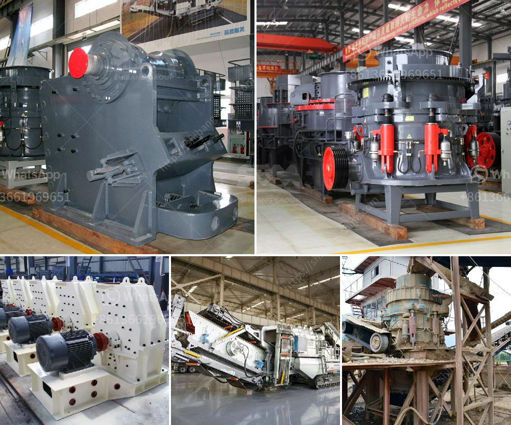

<h3>استخراج الحجر في باكستان</h3>
يعتبر قطاع استخراج الحجر في باكستان من أهم القطاعات الاقتصادية في البلاد، حيث يعتبر الحجر واحدًا من الموارد الطبيعية الرئيسية التي تعزز اقتصاد البلاد وتسهم في توفير فرص العمل. تمتاز باكستان بوجود مناطق غنية بالموارد الحجرية مثل ريف بيشاور، بلوشستان وباجا وقدوتة خيل. 

يتم استخراج الحجر في باكستان بعدة طرق، منها الاستخراج اليدوي والاستخراج الآلي. في الاستخراج اليدوي، يعمل العمال على تفتيت الصخور الكبيرة باستخدام الأدوات اليدوية مثل الأسطوانات والمطراق. بعد ذلك يتم نقل الحجر إلى أماكن التجهيز والتحضير للبيع. أما في الاستخراج الآلي، فيستخدم العمال الآلات المتطورة مثل الحفارات والكسارات الحجرية لتكسير الصخور ونقلها بكفاءة أعلى. 

تعتبر صناعة الحجر في باكستان من أهم الصناعات الناشئة والمزدهرة في البلاد، حيث يصدر الحجر الباكستاني إلى عدة دول حول العالم. يتم استخدام الحجر في العديد من الأغراض مثل البناء والأشغال العامة والديكورات والتماثيل وغيرها من الاستخدامات. وتعد صناعة الحجر في باكستان من المصادر الرئيسية للدخل الوطني وتساهم في توفير فرص العمل وتقديم دخل للعديد من الأسر. 

على الرغم من أهمية صناعة الحجر في باكستان، إلا أنها تواجه بعض التحديات. من أبرز هذه التحديات هي المخاطر الصحية والسلامة التي يتعرض لها العمال في عمليات الاستخراج، حيث يتعرضون لخطر الحوادث والإصابات أثناء عملهم بسبب عدم التزام ببعض الإجراءات الأمنية. هذا يتطلب تعزيز وتحسين سلامة وصحة العمال في قطاع استخراج الحجر، مما يتطلب تدريب وتثقيف العمال حول أفضل الممارسات واستخدام الأدوات الوقائية.

باختصار، يعتبر استخراج الحجر في باكستان قطاعًا حيويًا للاقتصاد الوطني ومصدرًا للدخل وفرص العمل. تحتاج الصناعة إلى العمل على تحسين سلامة وصحة العمال والالتزام بالتشريعات البيئية والزيادة في الاستثمارات والتكنولوجيا لتعزيز استدامة هذا القطاع الحيوي في باكستان.
<h3>Contact us</h3><ul><li><strong>Whatsapp:&nbsp;<a href="https://wa.me/8613661969651">+8613661969651</a></strong></li><li><a href="https://swt.shibang-china.com/?git&amp;zhl&amp;استخراج الحجر في باكستان"><strong>Online Service(chat now)</strong></a></li></ul><h3>Related</h3><ul><li><a href='أفضل آلات الكسارة.md'>أفضل آلات الكسارة</a></li><li><a href='استخدام كسارة الفك المتنقلة.md'>استخدام كسارة الفك المتنقلة</a></li><li><a href='مصنع كسارة الحجر الجيري في الهند.md'>مصنع كسارة الحجر الجيري في الهند</a></li><li><a href='معدات مستخدمة في تعدين الفحم.md'>معدات مستخدمة في تعدين الفحم</a></li><li><a href='قائمة شركات التعدين على الحجر الجيري في الصين.md'>قائمة شركات التعدين على الحجر الجيري في الصين</a></li></ul>