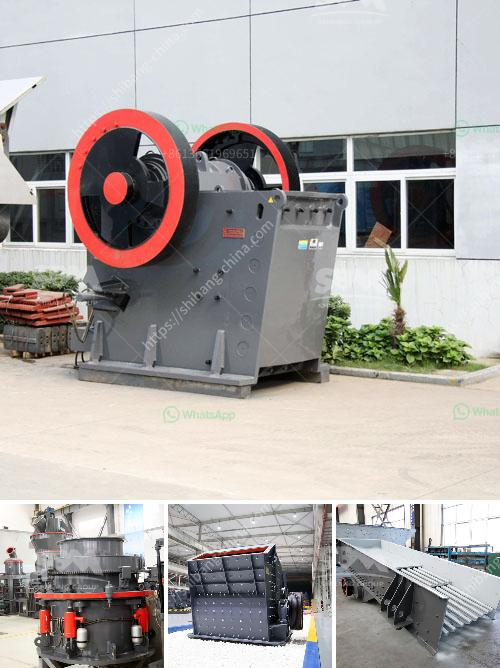

<h3>استشاريو تحسين خام الحديد في الهند</h3>
في الهند، تعد صناعة تعدين وتكرير خام الحديد من الصناعات الهامة والتي تلعب دورًا محوريًا في اقتصاد البلاد. ومن أجل الوفاء بالطلب المتزايد على الحديد في الهند وفي العالم، تعتمد الشركات المعدنية والمصانع على خبراء واستشاريين تحسين جودة خام الحديد.

يعمل استشاريو تحسين خام الحديد على تقديم نصح فني ومعرفة عميقة في إدارة وتحسين عملية تصنيع وتكرير الحديد. واستنادًا إلى التكنولوجيا والابتكار، يؤدي هؤلاء الاستشاريون دورًا حيويًا في تحسين الكفاءة والجودة وخفض التكاليف في هذه الصناعة الحيوية.

تشمل مهام الاستشاريين في تحسين خام الحديد في الهند التحليل الفني لصفات الخام المختلفة، مثل تركيز الحديد وركاز الكبريت والرطوبة والتربة، وتقديم النصح والاستشارات لتحسين هذه الصفات بحيث يتمكنوا من استخلاص أقصى قيمة من الخام.

باستخدام أحدث التقنيات المتاحة والبحوث العلمية، يذهب الاستشاريون في تحسين خام الحديد في الهند بعيدًا في تحسين العمليات والإجراءات للحصول على نتائج أفضل. فمن خلال تحليل البيانات واستخدام البرامج المتقدمة للنمذجة، يتم تحديد أفضل طريقة لتطوير وتحسين سلاسل الإمداد وعمليات التكرير والتحسين.

بالإضافة إلى ذلك، يعمل الاستشاريون في تحسين خام الحديد على مراقبة أداء المصانع وتوفير النصح المستمر لتحقيق أفضل النتائج. فهم يعملون عن كثب مع فرق الإنتاج والفحص المعدني لتحديد المشكلات المحتملة وتنفيذ التحسينات اللازمة للتأكد من التشغيل السلس للمصانع وتعزيز الإنتاجية.

يجب أن يكون استشاريو تحسين خام الحديد في الهند على اطلاع دائم بأحدث التطورات التكنولوجية والابتكارات في هذا المجال. وعلاوة على ذلك، يجب أن يكونوا قادرين على فهم المتغيرات المحلية والعالمية التي تؤثر على صناعة الحديد وتكرير الخام.

في النهاية، يلعب استشاريو تحسين خام الحديد دورًا رئيسيًا في دعم نجاح هذه الصناعة الحيوية في الهند. ومن خلال تقديم استشارات تقنية متخصصة وتحسين العمليات، يساهمون في زيادة الإنتاجية والربحية وتحسين جودة المنتجات، مما يعزز التنافسية العامة للصناعة ويسهم في تطور اقتصاد الهند.
<h3>Contact us</h3><ul><li><strong>Whatsapp:&nbsp;<a href="https://wa.me/8613661969651">+8613661969651</a></strong></li><li><a href="https://swt.shibang-china.com/?git&amp;zhl&amp;استشاريو تحسين خام الحديد في الهند"><strong>Online Service(chat now)</strong></a></li></ul><h3>Related</h3><ul><li><a href='خطة عمل لإنتاج الطوب.md'>خطة عمل لإنتاج الطوب</a></li><li><a href='سعر كسارة الحجر pe 600 900.md'>سعر كسارة الحجر pe 600 900</a></li><li><a href='أحجام كسارة الفك الحجر الجيري.md'>أحجام كسارة الفك الحجر الجيري</a></li><li><a href='استخدام مسحوق الجبس في البناء.md'>استخدام مسحوق الجبس في البناء</a></li><li><a href='مصنع آلات مطحنة الكرة.md'>مصنع آلات مطحنة الكرة</a></li></ul>