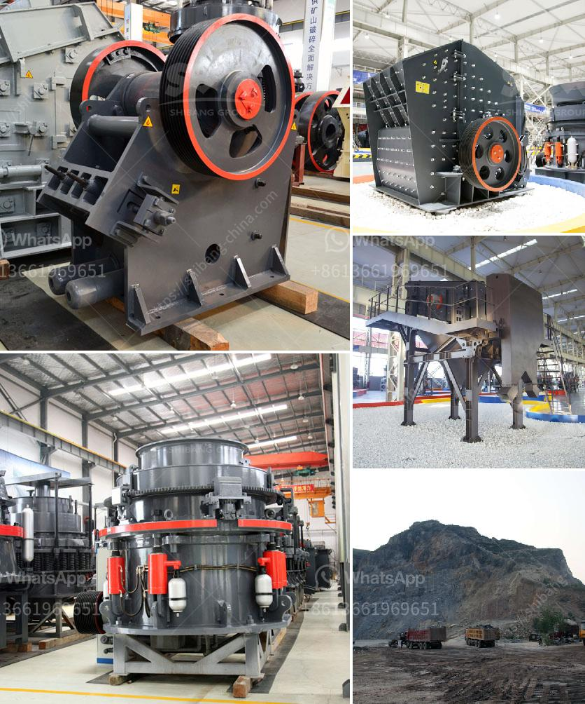

<h3>استفادة من خام الحديد بوسائل جافة</h3>
تعتبر صناعة الحديد من أهم الصناعات في العالم، حيث يعد خام الحديد المادة الأساسية التي يتم استخدامها في صناعة الحديد والصلب. وتوجد عدة طرق لاستخراج الحديد من خامه، بما في ذلك الاستخراج بواسطة الوسائل الجافة.

تعتبر الوسائل الجافة لاستخلاص الحديد من خامه الطريقة الأكثر تقليدية وشيوعاً، حيث تستخدم في العديد من المناجم والمصانع حول العالم. وتشمل العملية الأساسية للوسائل الجافة التي تُستخدم في استخراج الحديد الطرق التالية:

1. الطلبة الحرارية: تعتمد عملية الطلبة الحرارية على تعريض خام الحديد لدرجات حرارة عالية داخل فرن، حيث تقوم الحرارة بإزالة الأكسجين الموجود في الخام وتحويله إلى أكاسيد الحديد. يتم بعدها طحن الخام وفصل الأكاسيد عن المواد الأخرى والمنغنيز والكبريت والفوسفور الموجودة فيه.

2. الطرق المغناطيسية: تعتمد على خاصية الحديد في التفاعل مع المجال المغناطيسي. يتم خلط المساحيق المغناطيسية مع الخام المكرر وتمريرها عبر مجال مغناطيسي قوي يستخرج من خلاله الجسيمات المغناطيسية من المزيج. يتم بعدها إزالة الحديد النقي من الظروف المتبقية.

3. الكهرومغناطيسية: تستخدم في هذه العملية الأجهزة الكهرومغناطيسية المتطورة لاستخلاص الحديد من خامه. يتم خلط الخام مع مركبات كيميائية مغناطيسية، ثم يتم تحطيم الخام ومروره عبر حقل كهرومغناطيسي يقوم بجذب الحديد من المزيج، ثم يتم تجميعه وفصله عن المواد الأخرى.

توفر الوسائل الجافة في استخراج الحديد العديد من المزايا، منها:

1. كفاءة عالية: تعتبر الوسائل الجافة طرقاً فعالة وكفاءة في استخلاص الحديد من خامه بشكل سريع واقتصادي.

2. حماية البيئة: تساهم الوسائل الجافة في تقليل التلوث البيئي، حيث لا تستخدم مواد كيميائية ضارة ولا تتسبب في تشكيل مخلفات سامة.

3. مرونة في الاستخدام: تسمح الوسائل الجافة باستخراج الحديد في مواقع مختلفة، حيث لا حاجة للتكيف مع ظروف البيئة المائية.

4. توفير الطاقة: تعتبر الوسائل الجافة طرقاً فعالة في استغلال الطاقة، حيث تستخدم كميات أقل من الوقود والمياه لاستخلاص الحديد.

لذا، يمكن القول بأن استفادة من خام الحديد باستخدام الوسائل الجافة تعتبر طريقة فعالة واقتصادية وصديقة للبيئة لاستخلاص الحديد وإنتاج الصلب. وتساهم في تحقيق أهداف التنمية المستدامة وتحسين جودة الحياة للمجتمعات في جميع أنحاء العالم.
<h3>Contact us</h3><ul><li><strong>Whatsapp:&nbsp;<a href="https://wa.me/8613661969651">+8613661969651</a></strong></li><li><a href="https://swt.shibang-china.com/?git&amp;zhl&amp;استفادة من خام الحديد بوسائل جافة"><strong>Online Service(chat now)</strong></a></li></ul><h3>Related</h3><ul><li><a href='المواصفات الفنية لمطحنة الكرة.md'>المواصفات الفنية لمطحنة الكرة</a></li><li><a href='تصميم مصنع تكسير وتخطيطه.md'>تصميم مصنع تكسير وتخطيطه</a></li><li><a href='مصنع غسيل الرمل المستخدم للبيع في تكساس.md'>مصنع غسيل الرمل المستخدم للبيع في تكساس</a></li><li><a href='مطحنة الضغط العالي.md'>مطحنة الضغط العالي</a></li><li><a href='تقدير تكلفة مصنع تعدين النحاس.md'>تقدير تكلفة مصنع تعدين النحاس</a></li></ul>