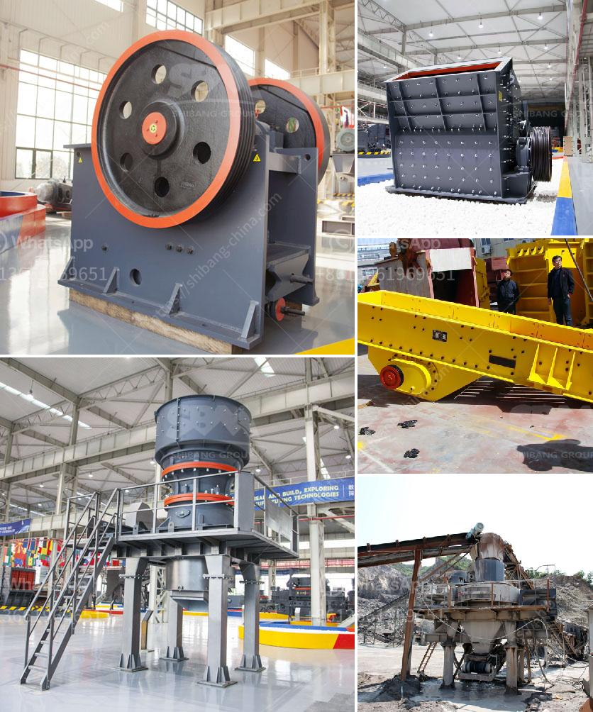

<h3>استفسار حول آلة السحق</h3>
تعد آلة السحق أحد الأدوات الهامة في عملية تحويل المواد الخام إلى حجم أصغر. تستخدم هذه الآلة في العديد من الصناعات مثل صناعة البناء والتعدين والكيماويات وغيرها. قد يكون لدي العديد من الاستفسارات حول هذه الآلة، وفي هذه المقالة سنجيب على بعض الأسئلة الشائعة حول آلة السحق.

تعمل آلة السحق على سحق المواد الخام إلى حجم صغير تسهل عملية المعالجة والاستفادة منها في الصناعات المختلفة. تتكون الآلة من جزء سحق يضغط على المادة الخام بقوة لتحطيمها إلى حجم أصغر، ثم يتم فصل الجزء الناتج من هذه العملية بشكل يتناسب مع متطلبات العملية الإنتاجية.

تعتمد عملية السحق على تطبيق قوة عالية على المادة الخام لتحطيمها. يتم استخدام آلة السحق بواسطة محرك يدور عندما يتم تشغيله. يتم تحميل المادة الخام في فتحة الدخول المخصصة وتنقل إلى المنطقة التي يتم فيها السحق. يتم ضغط المادة الخام بواسطة قوة الضغط المولدة من الغرفة الداخلية للآلة، مما يؤدي إلى تحطيمها. تختلف عملية السحق وفقًا لنوع المادة الخام ومتطلبات الإنتاج.

تحمل آلة السحق العديد من الفوائد. أولاً، تسهل عملية التعامل مع المواد الخام وتحويلها إلى حجم صغير، مما يجعلها أكثر سهولة في النقل والتخزين. ثانيًا، تزيد قدرة الإنتاج وتحسن كفاءة العملية الإنتاجية. ثالثًا، تحسن جودة المنتج النهائي وتضمن توحيد الحجم والشكل. أخيراً، تساعد في تقليل تكاليف الإنتاج وتحسين الاستدامة البيئية.

باختصار، آلة السحق هي أداة أساسية في عملية تحويل المواد الخام إلى حجم أصغر في الصناعات المختلفة. توفر العديد من الفوائد مثل تحسين الكفاءة وتحقيق توحيد الحجم وتقليل التكاليف. إذا كنت تفكر في استخدام آلة السحق، فإن استشارة خبراء الصناعة وتحديد متطلباتك الدقيقة ستكون خطوة هامة لاختيار الآلة المناسبة لاحتياجاتك.
<h3>Contact us</h3><ul><li><strong>Whatsapp:&nbsp;<a href="https://wa.me/8613661969651">+8613661969651</a></strong></li><li><a href="https://swt.shibang-china.com/?git&amp;zhl&amp;استفسار حول آلة السحق"><strong>Online Service(chat now)</strong></a></li></ul><h3>Related</h3><ul><li><a href='كسارة محمولة للكوبالت.md'>كسارة محمولة للكوبالت</a></li><li><a href='آلة طحن الرخام للبيع.md'>آلة طحن الرخام للبيع</a></li><li><a href='آلة تصنيع الجبس.md'>آلة تصنيع الجبس</a></li><li><a href='تصميم مصنع الإسمنت بتنسيق PDF.md'>تصميم مصنع الإسمنت بتنسيق PDF</a></li><li><a href='أنواع كسارات الحجر الجيري.md'>أنواع كسارات الحجر الجيري</a></li></ul>