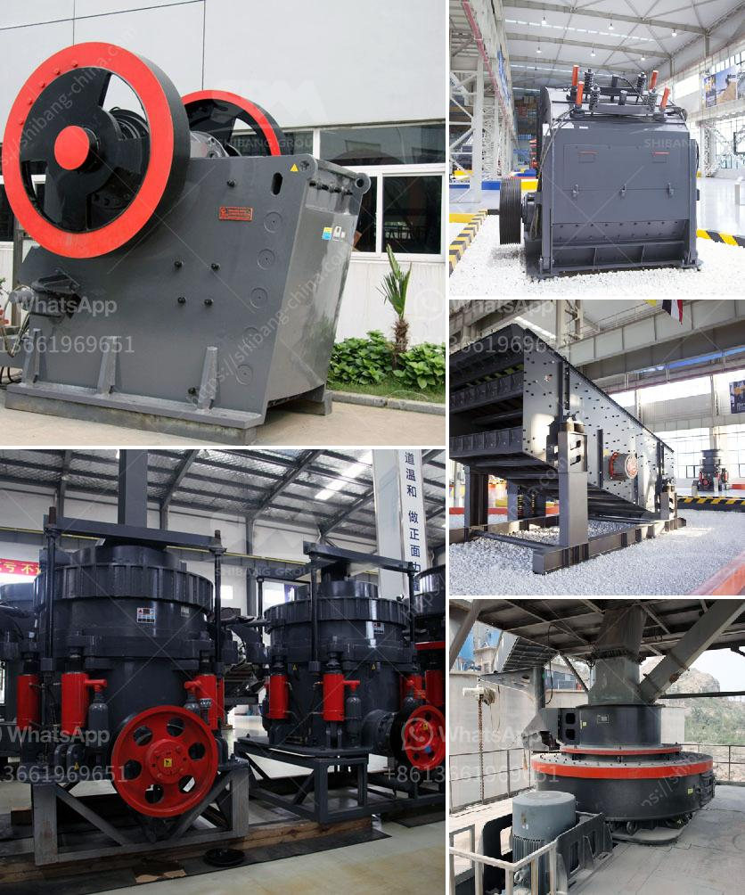

<h3>استفسار حول الكسارة</h3>
يعتبر مصطلح "الكسارة" من المصطلحات الهامة في عدة مجالات وقطاعات، بدءًا من الهندسة الصناعية وحتى البناء والمقاولات. نستخدم الكسارة لسحق وطحن المواد الخام المختلفة، سواء كانت صخور أو أحجار أو حصى، لتحويلها إلى مواد أصغر الحجم ومناسبة للاستخدام في تصنيع منتجات أخرى.

عند البحث عن الكسارة، يرجى ملاحظة أن هناك عدة أنواع مختلفة تتفاوت في الحجم والقدرة وطريقة التشغيل. تشمل الأنواع الشائعة مراحل متعددة من الكسارات، بدءًا من الكسارة الأولية وحتى الثانوية والتصادمية. كل نوع يستخدم لغرض معين وله ميزاته وعملياته الفريدة.

من الجوانب الأساسية التي يجب النظر فيها عند البحث عن كسارة هي القدرة، والكفاءة، والمتانة، وفعالية التكلفة، وسهولة الصيانة. يجب أيضًا مراعاة الاحتياجات الخاصة بالمواد المراد سحقها، مثل الحجم الأقصى للمواد والرطوبة والقوة التي تحتاجها للكسر.

علاوة على ذلك، ينبغي أيضًا النظر في معايير السلامة المطبقة على الكسارة. يجب أن تتوفر إجراءات وتجهيزات السلامة المناسبة لتقليل مخاطر الحوادث التي قد تحدث أثناء عملية الكسر.

بالإضافة إلى ذلك، فيما يتعلق بالكسارة المستعملة، يجب أخذ بعين الاعتبار الحالة العامة للمعدة واحتمالية الحصول على قطع الغيار في المستقبل. فإذا كانت الكسارة بحالة جيدة وتتوفر قطع الغيار بشكل مستدام، فيمكن أن تكون بديلاً اقتصاديًا جيدًا للكسارة الجديدة.

في الختام، عند البحث عن الكسارة، ينبغي التأكد من دراسة الاحتياجات بعناية ومقارنة الخيارات المتاحة في السوق. يجب أن يكون استفسارك محددًا بشكل جيد وأن تراعي المتطلبات التي ترغب في تحقيقها من الكسارة. ولا تتردد في استشارة الخبراء في هذا الشأن للحصول على المشورة المناسبة.
<h3>Contact us</h3><ul><li><strong>Whatsapp:&nbsp;<a href="https://wa.me/8613661969651">+8613661969651</a></strong></li><li><a href="https://swt.shibang-china.com/?git&amp;zhl&amp;استفسار حول الكسارة"><strong>Online Service(chat now)</strong></a></li></ul><h3>Related</h3><ul><li><a href='شراء محطة غسيل الفحم في ألمانيا.md'>شراء محطة غسيل الفحم في ألمانيا</a></li><li><a href='كسارة الفك هي.md'>كسارة الفك هي</a></li><li><a href='آلة كسارة الحجر 250 400.md'>آلة كسارة الحجر 250 400</a></li><li><a href='كسارة مخروطية قياسية.md'>كسارة مخروطية قياسية</a></li><li><a href='قائمة أسعار كسارة الفك.md'>قائمة أسعار كسارة الفك</a></li></ul>