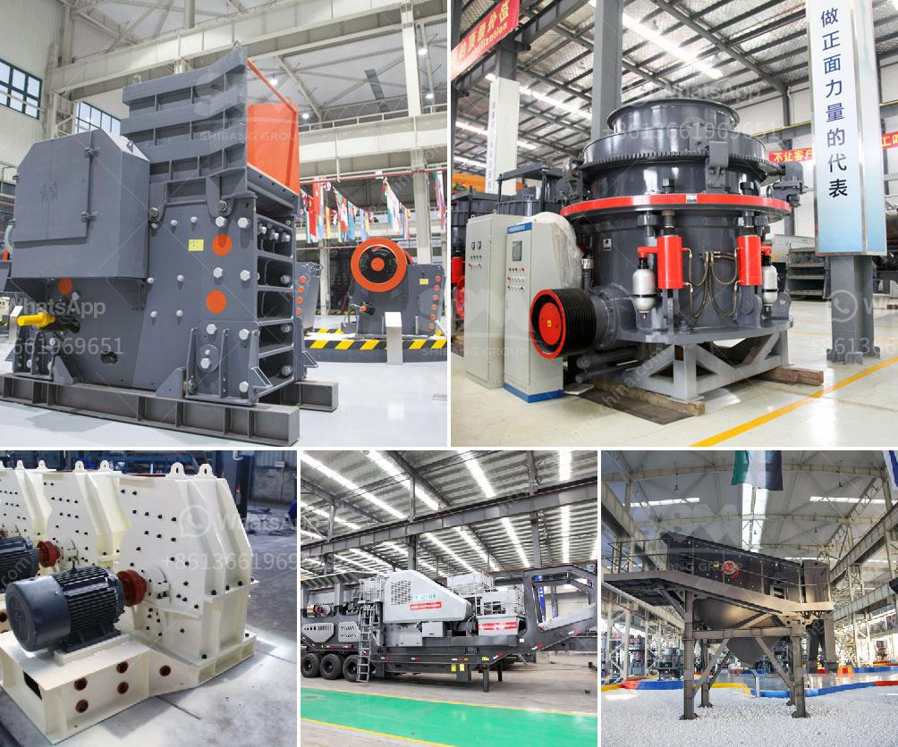

<h3>استفسار حول كسارة الصدم</h3>
الكسارة بالصدم هي أحد التجهيزات الهندسية المستخدمة في صناعة البناء والتعدين. تعتبر الكسارة بالصدم هي من أكثر أنواع الكسارات استخدامًا وشهرةً في عملية تكسير المواد الخام. في هذه المقالة سنتحدث عن بعض الاستفسارات الشائعة حول كسارة الصدم.

الكسارة بالصدم هي عبارة عن آلة تستخدم لتكسير المواد الخام بواسطة الصدمة الناتجة عن الطاقة الحركية لجسم يتحرك بسرعة عالية. تتميز الكسارة بالصدم بقدرتها على تحويل الصخور الكبيرة إلى قطع صغيرة من الحجم المطلوب.

تتكون الكسارة بالصدم من تصميم هندسي متقدم يتضمن غرفة تكسير مع واجهة مفتوحة. عندما يتم تشغيل الكسارة، يجب أن تتحرك الصخور أو المواد الخام إلى داخل الغرفة عبر مدخل التغذية. بمجرد دخول المواد الخام داخل الغرفة، يتم تحطيمها بواسطة صفائح تدور بسرعة عالية على شكل أشرطة. ومع استمرار تدحرج المواد الخام في الداخل، يتم تكسيرها بواسطة الصدمات المتتالية التي يتعرض لها من الأشرطة. 

ثالثاً، ما هي الفوائد الرئيسية لاستخدام الكسارة بالصدم؟

1- توفير الوقت والجهد: حيث تتميز الكسارة بالصدم بقدرتها على تكسير الصخور الكبيرة بسرعة فائقة، مما يوفر الكثير من الوقت والجهد المبذول في عملية التكسير.

2- جودة المنتج النهائي: تعمل الكسارة بالصدم على تكسير المواد الخام بشكل أكثر دقة، مما يؤدي إلى الحصول على منتج نهائي ذو جودة عالية وحجم مطلوب.

3- قابلية التكيف: تضم الكسارة بالصدم نظامًا قابلاً للتعديل يمكن تغييره وتعديله وفقًا لاحتياجات ومتطلبات العملاء.

تختلف تكلفة كسارة الصدم بناءً على الحجم والسعة والمواصفات المطلوبة. وبشكل عام، تتراوح تكلفة الكسارة بالصدم بين مبلغ منخفض ومبلغ مرتفع. يجب على الشخص الراغب في شراء كسارة الصدم الاتصال بشركات تصنيع وتوريد المعدات الهندسية للحصول على تقدير تكلفة محدد.

ختامًا، تمثل كسارة الصدم إضافة هامة لصناعة البناء والتعدين. تعتبر تكنولوجيا الكسارة بالصدم تقنية حديثة تحسن من كفاءة عمليات التكسير وتوفر الوقت والموارد. قبل شراء كسارة الصدم، يجب على الشخص الاطلاع على المواصفات والتكلفة والأداء المتوقع من أجل اتخاذ قرار مستنير وشراء الجهاز الذي يلبي احتياجاته.
<h3>Contact us</h3><ul><li><strong>Whatsapp:&nbsp;<a href="https://wa.me/8613661969651">+8613661969651</a></strong></li><li><a href="https://swt.shibang-china.com/?git&amp;zhl&amp;استفسار حول كسارة الصدم"><strong>Online Service(chat now)</strong></a></li></ul><h3>Related</h3><ul><li><a href='مصنع استخراج النحاس الصغير.md'>مصنع استخراج النحاس الصغير</a></li><li><a href='سعر آلة طحن في الهند.md'>سعر آلة طحن في الهند</a></li><li><a href='كيفية حساب كفاءة الكسارة.md'>كيفية حساب كفاءة الكسارة</a></li><li><a href='خط إنتاج التلك.md'>خط إنتاج التلك</a></li><li><a href='معدات تعدين الرمال في ماليزيا.md'>معدات تعدين الرمال في ماليزيا</a></li></ul>