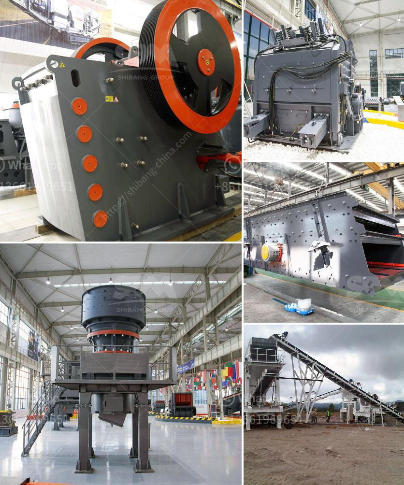

<h3>استيراد كسارة الفك الصين في باكستان</h3>
يعتبر الاستيراد من الصين إلى باكستان أمرًا شائعًا في السنوات الأخيرة، وذلك بسبب كفاءة وجودة المنتجات الصينية وتكلفتها المناسبة. ومن بين تلك المنتجات المستوردة، تتصدر كسارة الفك الصينية قائمة المنتجات الأكثر طلبًا.

تعتبر كسارة الفك الصينية إحدى المعدات الأساسية المستخدمة في عمليات التكسير والطحن في صناعات مختلفة مثل التعدين والبناء والبناء الطرق والمياه والكهرباء والكيميائية وغيرها. فهي تستخدم في سحق المواد الخام بحجم واحدة إلى قطع أصغر قبل تطبيقها في العمليات الصناعية الأخرى. وتتميز كسارة الفك الصينية ببنائها الصلب وقوتها التحملية العالية وكسارة فعالية في استخراج المواد الصلبة.

توجد العديد من الفوائد التي يمكن لباكستان الاستفادة من استيراد كسارة الفك الصينية. أولاً وقبل كل شيء، يعني استيراد المعدات من الصين وجودة وكفاءة المواد المستخدمة فيها أن المستخدمين الباكستانيين سيحصلون على معدات عالية الأداء تمتاز بالتحمل والمرونة للتعامل مع أصعب الظروف. بالإضافة إلى ذلك، يمكن لكسارة الفك الصينية زيادة إنتاجية الشركات في صناعة التعدين وذلك بفضل سحق وطحن المواد الأكثر صلابة بسهولة وفعالية.

بالإضافة إلى ذلك، يأتي استيراد كسارة الفك الصينية بفوائد اقتصادية كبيرة. تكلفة المعدات الصينية عادةً ما تكون أقل من تلك المنتجة محلياً في باكستان. هذا يعني أن شركات التعدين والبناء المحلية في باكستان يمكنها توفير المال والوقت عند شراء المعدات من الصين. بالإضافة إلى ذلك، يمكن أيضًا لأصحاب الأعمال في باكستان استخدام هذا الفائض المالي للاستثمار في تحديث وتحسين البنية التحتية وتطوير عملياتهم الأخرى.

مع ذلك، يجب على الشركات الباكستانية أخذ بعض الاحتياطات قبل الشروع في استيراد كسارة الفك الصينية. أولاً وقبل كل شيء، يجب أن يتعاملوا فقط مع البائعين الموثوق بهم والذين لديهم تاريخ طويل من توريد المعدات ذات الجودة العالية. يجب أيضًا أن يتم توفير الضمان وخدمة ما بعد البيع الجيدة للمنتجات المستوردة لضمان الأداء الأمثل وتوفير قطع الغيار عند الحاجة.

خلاصة القول، يمكن للاستيراد من الصين إلى باكستان أن يكون خيارًا مفيدًا لشركات التعدين والبناء في باكستان. فكسارة الفك الصينية تتميز بالجودة والكفاءة والتحمل العالي، بالإضافة إلى توفير التكاليف الاقتصادية. ومن المهم أن تتعامل الشركات الباكستانية مع البائعين الموثوق بهم لضمان الحصول على المنتجات المناسبة لاحتياجاتهم وضمان الدعم الفني المستدام.
<h3>Contact us</h3><ul><li><strong>Whatsapp:&nbsp;<a href="https://wa.me/8613661969651">+8613661969651</a></strong></li><li><a href="https://swt.shibang-china.com/?git&amp;zhl&amp;استيراد كسارة الفك الصين في باكستان"><strong>Online Service(chat now)</strong></a></li></ul><h3>Related</h3><ul><li><a href='كسارات Canica 1200 VSI المستعملة.md'>كسارات Canica 1200 VSI المستعملة</a></li><li><a href='مصنع كامل لاستخراج النحاس للبيع.md'>مصنع كامل لاستخراج النحاس للبيع</a></li><li><a href='كسارات كوبي في سنغافورة، الموردين.md'>كسارات كوبي في سنغافورة، الموردين</a></li><li><a href='مطاحن الكرة للمواد.md'>مطاحن الكرة للمواد</a></li><li><a href='مصنع الكرة لمصنع الكالسيت.md'>مصنع الكرة لمصنع الكالسيت</a></li></ul>