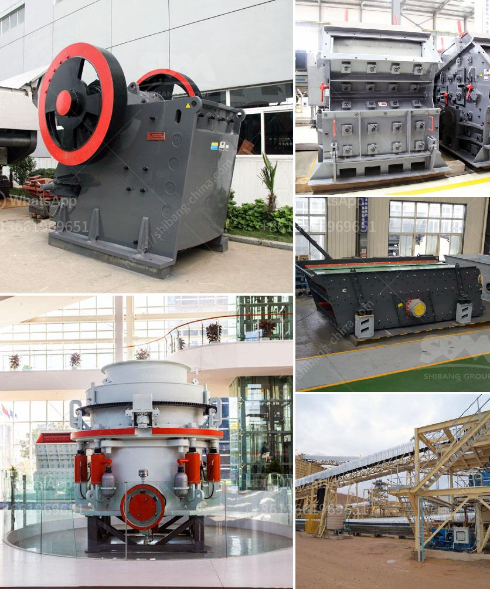

<h3>اشتقاق السرعة الحرجة في مطحنة كرات PDF</h3>
مطحنة الكرات (Ball Mill) هي أحد الأجهزة المستخدمة في صناعة الطحن والتكسير، وتهدف إلى طحن المواد الخام بواسطة كرات من الفولاذ المقاوم للصدأ داخل جهاز الطحن. تعتمد عملية الطحن في هذا الجهاز على تدوير الأسطوانة الموجودة في المطحنة بسرعة محددة، ويجب أن تكون سرعة الأسطوانة أعلى من سرعة الكرات الموجودة بداخلها لتمكين عملية الطحن الفعالة.

تعتبر سرعة الأسطوانة المطلوبة لتحقيق الطحن الفعال هي السرعة الحرجة للمطحنة، والتي يمكن اشتقاقها باستخدام المعادلات المتعلقة بالمدي النسبي للكرات داخل المطحنة وقطر المطحنة. تحتوي الأسطوانة على العديد من الكرات التي تقوم بالتحرك بالتزامن مع دوران الأسطوانة، ووجود الكرات يؤدي إلى توليد قوة سحق وطحن قوية على المواد الخام.

لحساب السرعة الحرجة للمطحنة، يمكننا استخدام المعادلة التالية:

يتم استخدام العديد من المصطلحات المختلفة في المعادلة للتعبير عن الوحدات المستخدمة، وقد يتطلب ذلك إجراء بعض التحويلات البسيطة للواحدات قبل استخدام المعادلة.

تُعد سرعة الأسطوانة المطلوبة معاملًا حاسمًا في عملية الطحن حيث تؤثر مباشرة على كفاءة العملية وجودة الأداء. يتعين على المشغلين والمهندسين في صناعة الطحن فهم السرعة الحرجة وحسابها بشكل صحيح للحفاظ على أداء المطحنة المثلى.

بالنهاية، فإن اشتقاق السرعة الحرجة في مطحنة الكرات يعتبر جوانب هامة في تصميم وتطوير هذه الأجهزة الحديثة. من خلال فهم هذه المفاهيم واستيعابها، يمكن للمهندسين والعاملين في هذا المجال تحسين كفاءة العملية وتحقيق النتائج المطلوبة في صناعة الطحن.
<h3>Contact us</h3><ul><li><strong>Whatsapp:&nbsp;<a href="https://wa.me/8613661969651">+8613661969651</a></strong></li><li><a href="https://swt.shibang-china.com/?git&amp;zhl&amp;اشتقاق السرعة الحرجة في مطحنة كرات PDF"><strong>Online Service(chat now)</strong></a></li></ul><h3>Related</h3><ul><li><a href='شاشة جريزلي للبيع نيوزيلندا.md'>شاشة جريزلي للبيع نيوزيلندا</a></li><li><a href='خطة عمل لإنتاج الطوب.md'>خطة عمل لإنتاج الطوب</a></li><li><a href='تقدير لعمليات تكسير الحجر.md'>تقدير لعمليات تكسير الحجر</a></li><li><a href='سعر كسارة الحجر في السوق.md'>سعر كسارة الحجر في السوق</a></li><li><a href='سعر كسارة مخروط محمولة من تركيا.md'>سعر كسارة مخروط محمولة من تركيا</a></li></ul>