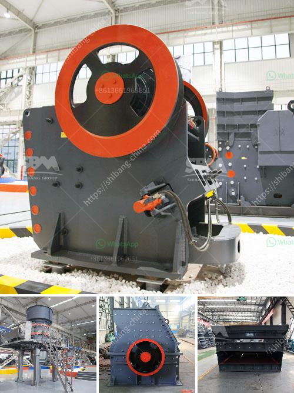

<h3>اقتباس لكسارة vsi</h3>
تعد كسارة VSI (كسارة الصدم العمودية) من التقنيات الحديثة المبتكرة في صناعة التكسير والتحطيم. تقوم هذه المعدة الهندسية بتحويل الصخور الكبيرة إلى جسيمات أصغر وأكثر قيمة بواسطة استخدام قوة الصدمة العالية. يتم استخدامها على نطاق واسع في مجالات مختلفة مثل صناعة البناء وصناعة الرمال.

يتم استخدام كسارة VSI بشكل رئيسي لتحويل الصخور إلى رمال صناعية ذات جودة عالية. العملية تعتمد على قوة الصدمة التي تتعرض لها الصخور عند اصطدامها بطبقة الحجر الداخلية في المعدة. هذا الاصطدام يؤدي إلى تحطيم الصخرة إلى جزيئات أصغر تكون أكثر قيمة ومنتظمة الشكل. يتم توليد الرمال المستخدمة في البناء والتشييد من هذه الحبيبات الصغيرة المحطمة.

توفر كسارة VSI مزايا كبيرة في صناعة الرمال والحصى. أولاً، فإنها تسمح بإنتاج رمال عالية الجودة وخالية من الشوائب. بالإضافة إلى ذلك، تقلل كسارات VSI من اعتماد الصناعة على الرمال الطبيعية، والتي تنفد بسرعة وتهدد البيئة. كما أنها تساهم في تقليل تكلفة البناء وتشجع على اعتماد مواد مستدامة وصديقة للبيئة.

تتميز كسارة VSI بأنها قابلة للتعديل وسهلة الاستخدام. يمكن تنظيم إعدادات الصدم وفقًا لمتطلبات العميل، مما يسمح بتحقيق أعلى معدل إنتاجية وجودة ممكنة. بالإضافة إلى ذلك، تتميز بتوافر أنظمة التحكم الذكية التي تجعل عملية التشغيل أكثر فعالية وأمانًا.

باختصار، فإن استخدام كسارة VSI يعتبر خيارًا مثاليًا لصناعة البناء وصناعة الرمال. تعمل هذه المعدة على تحويل الصخور الكبيرة إلى رمال عالية الجودة وخالية من الشوائب. يضمن استخدامها الاستدامة البيئية وتقليل التكاليف. إنها توفر حلاً فعالًا ومبتكرًا لتلبية احتياجات صناعة البناء المتزايدة والمتطلبات البيئية.
<h3>Contact us</h3><ul><li><strong>Whatsapp:&nbsp;<a href="https://wa.me/8613661969651">+8613661969651</a></strong></li><li><a href="https://swt.shibang-china.com/?git&amp;zhl&amp;اقتباس لكسارة vsi"><strong>Online Service(chat now)</strong></a></li></ul><h3>Related</h3><ul><li><a href='عملية سحق الصخور في الركام.md'>عملية سحق الصخور في الركام</a></li><li><a href='مشروع كسارة الحجر في الولايات المتحدة.md'>مشروع كسارة الحجر في الولايات المتحدة</a></li><li><a href='آلة طحن السلاغ الفرن العالي في الهند.md'>آلة طحن السلاغ الفرن العالي في الهند</a></li><li><a href='بائع أحزمة الناقلات في الفلبين.md'>بائع أحزمة الناقلات في الفلبين</a></li><li><a href='كفاءة الشاشة الاهتزازية.md'>كفاءة الشاشة الاهتزازية</a></li></ul>