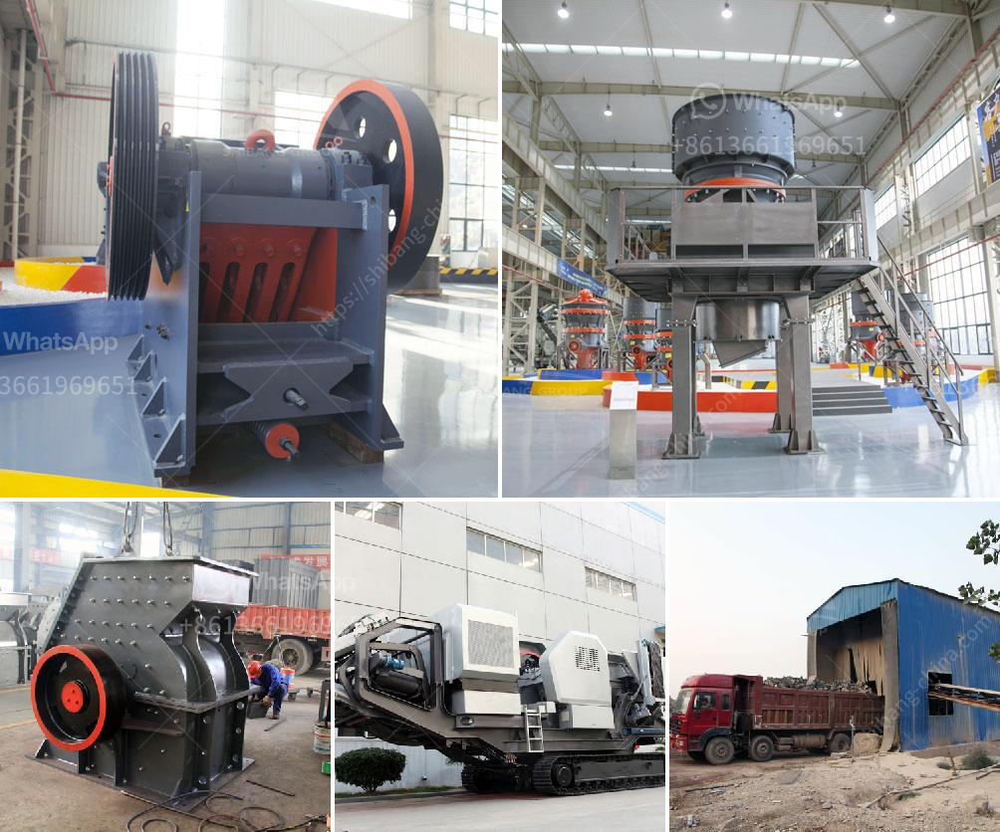

<h3>اقتباسات مطحنة الكرة</h3>
تُعد مطحنة الكرة أحد الأدوات الرئيسية في عملية الطحن في صناعة الألغام والبناء والكيميائية والخزف والصناعات المماثلة. إنها آلة تعمل بنظام دوراني حيث يتم إدخال المادة الخام في الجسم المطحون من خلال فتحة التغذية وتُفرم بواسطة كرات الصلب ضمن الجسم، بينما يتم طحنها وسحقها بفعل حركة دوران الطاحونة.

اقتباس مطحنة الكرة هو المسؤول عن طحن وسحق المواد الخام لإنتاج مسحوق ناعم. تُستخدم الكرات الصلب بشكل رئيسي للطحن، حيث يتم تكسير وطحن المواد الخام بين الكرات الصلب وجسم المطحنة. هنا يكمن دور الاقتباسات في مطحنة الكرة؛ فهي تحدد سرعة الطحن وحجم المواد المطحونة.

تتراوح اقتباسات مطحنة الكرة بين 200-400 كلمة، وتعتمد على عدة عوامل مثل نوع المواد الخام، وحجم الكرات، وسرعة الدوران. ولكن بشكل عام، يُفضل استخدام اقتباسات مطحنة الكرة الأعلى في حجم للحصول على جسيمات ناعمة ومطحونة بشكل أفضل.

تعتبر مطاحن الكرة المغلقة النوع الأكثر استخدامًا في صناعة الطحن. فهي تتميز بالتحكم الدقيق في الحجم والتوزيع الجسيمي للمنتج المطحون. كما أنها توفر كفاءة عالية في الطحن وتقلل من فاقد الطحن.

في الختام، فإن مطحنة الكرة تُعد آلة حيوية في صناعة الطحن. وتلعب اقتباساتها دورًا حاسمًا في جودة المنتج المطحون وتحكمها في حجمه وخصائصه. بفضل تقنيات التصنيع المتقدمة والتطور في تصميم وأداء مطاحن الكرة، فإنها تكمن في القمة كأداة للتحقيق في صناعة الطحن والتكسير.
<h3>Contact us</h3><ul><li><strong>Whatsapp:&nbsp;<a href="https://wa.me/8613661969651">+8613661969651</a></strong></li><li><a href="https://swt.shibang-china.com/?git&amp;zhl&amp;اقتباسات مطحنة الكرة"><strong>Online Service(chat now)</strong></a></li></ul><h3>Related</h3><ul><li><a href='معدات ترقية خام الحديد.md'>معدات ترقية خام الحديد</a></li><li><a href='كسارة الحجر في الفلبين للبيع.md'>كسارة الحجر في الفلبين للبيع</a></li><li><a href='تكلفة إعداد مصنع طحن الكلنكر في الهند.md'>تكلفة إعداد مصنع طحن الكلنكر في الهند</a></li><li><a href='كسارات ستاملر الأمريكية لكسر المغذية.md'>كسارات ستاملر الأمريكية لكسر المغذية</a></li><li><a href='عملية تدمير صخور الحجر الجيري آلة كسارة الحجر.md'>عملية تدمير صخور الحجر الجيري آلة كسارة الحجر</a></li></ul>