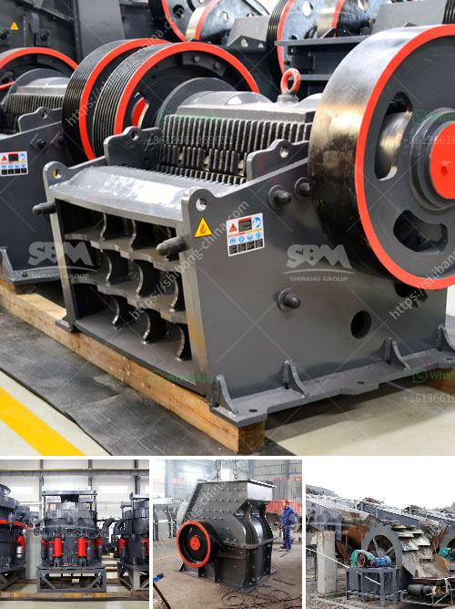

<h3>اقتراح مشروع تجاري لكسارة الحجر</h3>
تعتبر صناعة البناء والتشييد من الصناعات الحيوية في العديد من البلدان حول العالم. ومع زيادة الطلب على المواد الإنشائية، يتزايد الاهتمام بصناعة تكسير الحجر. لذا، فإن اقتراح المشروع لإنشاء مشروع تجاري لكسارة الحجر يعتبر فرصة استثمارية مربحة.

تقوم كسارة الحجر بتكسير الصخور الكبيرة وتحويلها إلى قطع صغيرة من الأحجار المستخدمة في مشاريع البناء والتشييد. وتتمتع هذه الصناعة بطلب مرتفع ومستمر، نظرًا لاستخدامها في بناء المنازل، والمدارس، والمستشفيات، والمباني التجارية والصناعية، والطرق والجسور، وغيرها الكثير من المشاريع الإنشائية.

من بين الفوائد الرئيسية لتأسيس مشروع كسارة الحجر هو وفرة الموارد الطبيعية من الحجر في العديد من البلدان. بالإضافة إلى ذلك، فإن عملية تجهيز الحجر سهلة وبسيطة، وتتطلب نسبة قليلة من الطاقة والمهارات التقنية. كما أن تكنولوجيا تكسير الحجر قد تقدمت في السنوات الأخيرة، مما يمكن من توفير معدات حديثة وفعالة تسهل عملية الكسارة.

لتنفيذ مشروع تجاري لكسارة الحجر، يجب عليك القيام بخطوات عدة. أولاً، يجب تحديد الموقع المثالي لتأسيس الكسارة بالنظر إلى احتياجات سوقك المحلية وإمكانية الوصول إلى الموارد الطبيعية. ثم، يجب شراء المعدات اللازمة للكسارة، مثل الكسارات الفكية والكسارات الصدمية وأدوات التكسير الأخرى.

لا يقتصر دورك في هذا المشروع على تصميم وتشغيل الكسارة فقط، بل عليك أيضًا تسويق المنتجات والعثور على عملاء لها. يمكنك التعاقد مع شركات البناء والمقاولين والحكومة المحلية لبيع المنتجات المتاحة في الكسارة. يمكنك أيضًا إنشاء علاقات جيدة مع المستثمرين والشركات الأخرى المتعاملة في صناعة البناء والتشييد.

قبل أخذ القرار النهائي، يجب دراسة جميع الجوانب المالية، بدءًا من تكاليف المشروع وحجم الاستثمارات اللازمة لبناء الكسارة، والتكاليف اليومية لتشغيلها وصيانتها. من الجدير بالذكر أن العوائد المالية يمكن أن تكون مرتفعة في هذا المشروع بناءً على معدل الطلب على منتجاتك وأسعار البيع في السوق.

باختصار، فإن اقتراح مشروع تجاري لكسارة الحجر يعتبر استثمارًا مربحًا في صناعة البناء والتشييد. تحتاج فقط إلى دراسة السوق المحلية واحتياجاتها، وتوفير الموارد اللازمة، وتسويق المنتجات بشكل جيد. قد تنجح في بناء مشروع ناجح ومربح في هذه الصناعة الحيوية.
<h3>Contact us</h3><ul><li><strong>Whatsapp:&nbsp;<a href="https://wa.me/8613661969651">+8613661969651</a></strong></li><li><a href="https://swt.shibang-china.com/?git&amp;zhl&amp;اقتراح مشروع تجاري لكسارة الحجر"><strong>Online Service(chat now)</strong></a></li></ul><h3>Related</h3><ul><li><a href='مطحنة الكرة مع محول mercadolibre.md'>مطحنة الكرة مع محول mercadolibre</a></li><li><a href='مصنع تكسير في ماليزيا.md'>مصنع تكسير في ماليزيا</a></li><li><a href='مصنع سيور الفحم في ألمانيا.md'>مصنع سيور الفحم في ألمانيا</a></li><li><a href='مطحنة أسطوانية عمودية للفحم.md'>مطحنة أسطوانية عمودية للفحم</a></li><li><a href='هل هناك طاحونة فائقة الدقة عمودية للأسطوانة.md'>هل هناك طاحونة فائقة الدقة عمودية للأسطوانة</a></li></ul>