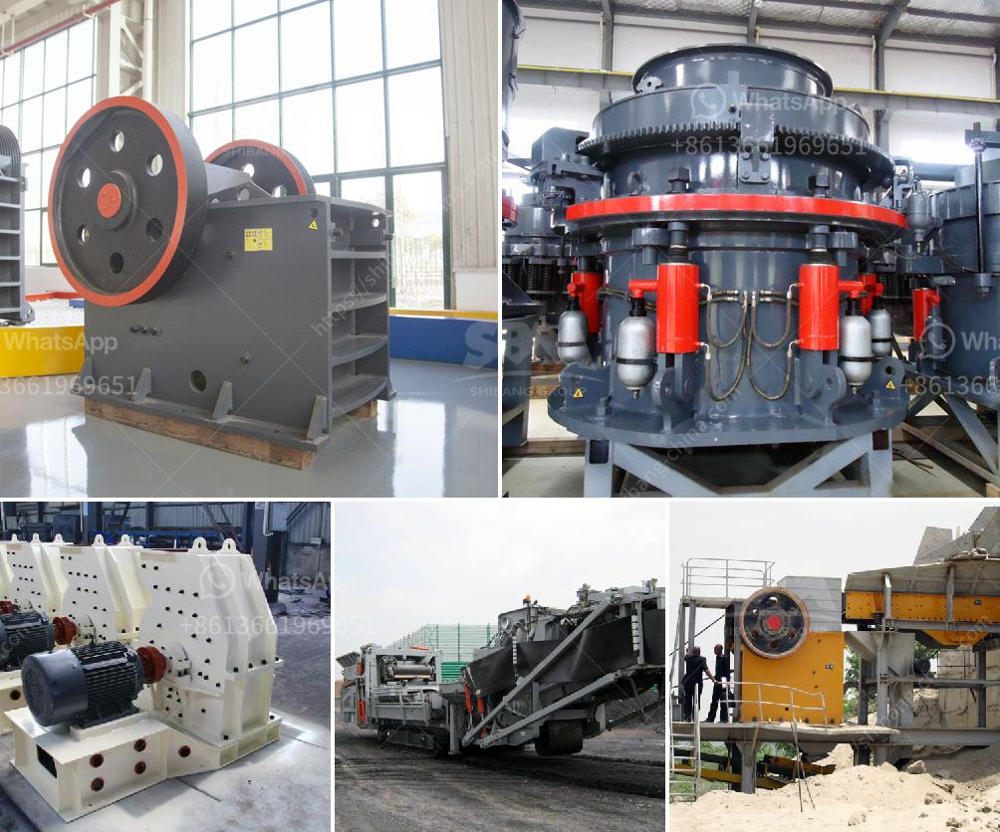

<h3>الآلات المستخدمة في تصنيع الأسمنت</h3>
تعتبر صناعة الأسمنت من أهم الصناعات في العالم، حيث يستخدم الأسمنت في العديد من المجالات مثل البناء والإنشاءات. ولتصنيع الأسمنت بشكل فعال، يتم استخدام مجموعة واسعة من الآلات المتخصصة.

أحد الآلات الرئيسية المستخدمة في صناعة الأسمنت هو الفرن الدوار. يتم استخدام هذا الفرن للتحول الحراري للخامات المستخدمة في صناعة الأسمنت، وذلك بوضعها في درجات حرارة عالية تصل إلى حوالي 1500 درجة مئوية. يتم تحريك الفرن الدوار ببطء لضمان تسخين الخامات بشكل متساوٍ وإتمام عملية التحول الحراري بكفاءة. يتم خلال هذه العملية التخلص من الرطوبة والمواد العضوية بتفاعلات كيميائية تحدث في الفرن.

بجانب الفرن الدوار، تستخدم مطاحن الأسطوانة في عملية طحن الخامات الخشنة. يتم وضع الخامات الخشنة في المطحنة، ويتم طحنها بواسطة أسطوانات متحركة بسرعة عالية. يحدث طحن الخامات لتصبح مسحوق ناعم الحبيبات، وهو المطلوب في عملية تصنيع الأسمنت.

عملية الطحن تليها عملية الخلط، حيث يتم خلط الخامات المطحونة مع الألومنيا والحديد الزهر، وهما المواد المضافة للأسمنت للحصول على خواص تسهم في تقوية الأسمنت ومقاومته. تتم هذه العملية في مزيجات خاصة للحفاظ على التركيبة المناسبة للأسمنت.

بعد ذلك يتم نقل الخليط إلى الفرن الدوار لتنفيذ عملية التحول الحراري كما ذكرنا سابقًا. وبعد الانتهاء من هذه العملية، يتم تبريد الكلنكر - وهو اسم المنتج النهائي- وطحنه إلى مسحوق ناعم.

تستخدم مصانع الأسمنت أيضًا العديد من الآلات الأخرى مثل الكسارات والمحاجر وناقلات الحزام والمجففات ومصافي الغبار. كل هذه الآلات تعمل بتناغم لتحقيق إنتاج أسمنت عالي الجودة.

بإستخدام هذه الآلات المتخصصة والمتطورة في صناعة الأسمنت، يتم تحقيق كفاءة عالية وجدوى اقتصادية في العملية الإنتاجية. كما أن هذه الآلات تساعد على ضمان الجودة وتحقيق مزايا الأسمنت المطلوبة في الاستخدامات المختلفة في البناء والإنشاءات.
<h3>Contact us</h3><ul><li><strong>Whatsapp:&nbsp;<a href="https://wa.me/8613661969651">+8613661969651</a></strong></li><li><a href="https://swt.shibang-china.com/?git&amp;zhl&amp;الآلات المستخدمة في تصنيع الأسمنت"><strong>Online Service(chat now)</strong></a></li></ul><h3>Related</h3><ul><li><a href='كيفية صنع آلة كسارة خام الحديد.md'>كيفية صنع آلة كسارة خام الحديد</a></li><li><a href='سعر مصنع التكسير.md'>سعر مصنع التكسير</a></li><li><a href='كسارات الثانية الفلبين.md'>كسارات الثانية الفلبين</a></li><li><a href='معدات إنتاج الأسمنت في ألمانيا.md'>معدات إنتاج الأسمنت في ألمانيا</a></li><li><a href='اتصالات أحزمة الناقلات.md'>اتصالات أحزمة الناقلات</a></li></ul>