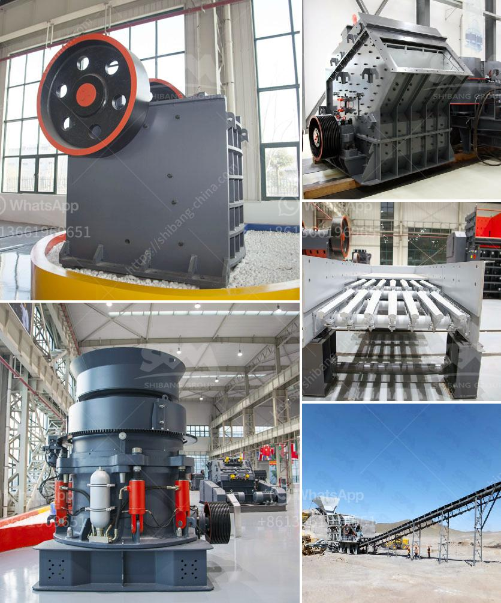

<h3>الأحجار الكريمة الموجودة في نيجيريا</h3>
نيجيريا، بلدٌ يقع في غرب أفريقيا، يحتضن العديد من الثروات الطبيعية والثقافية الفريدة. ومن بين هذه الثروات، تتعدد الأحجار الكريمة التي تتواجد في أراضيه. تعتبر هذه الأحجار الكريمة جواهر نيجيريا الثمينة التي تجذب العديد من المشترين والمستثمرين.

الأحجار الكريمة في نيجيريا لها تاريخ طويل يعود للعصور القديمة، حيث استُخدمت في الزخرفة وصناعة المجوهرات، ولها أيضًا قيمة رمزية وروحية في بعض الثقافات المحلية.

أحد الأحجار الكريمة الشهيرة في نيجيريا هو الزمرد. يتم اكتشاف الزمرد في عدة مناطق في نيجيريا، وخاصة في ولاية أبوجا. تشتهر أحجار الزمرد في نيجيريا بجودتها وجمالها الفريد، حيث يعتبر التلوين الأخضر الداكن للازمرالاً جميلاً وجذاباً. تتوفر أيضًا العديد من الأحجار الكريمة الأخرى في نيجيريا مثل الياقوت والأمبرالد واليشب، إلى جانب الكوارتز الوردي والأسود.

تعتبر صناعة المجوهرات والأحجار الكريمة من القطاعات الرئيسية في نيجيريا، حيث تلعب دورًا مهمًا في تعزيز الاقتصاد المحلي وتوفير فرص العمل. تتواجد العديد من ورش صناعة المجوهرات في البلاد، حيث يتداول المحترفون تقنيات صقل وتشكيل الأحجار الكريمة بأساليب تقليدية وحديثة.

تعد الأحجار الكريمة الموجودة في نيجيريا فرصة للاستثمار والتجارة العالمية، حيث يجذب العديد من التجار والمستثمرين الأثرياء من جميع أنحاء العالم. تشتهر مدينة جوس في ولاية بلاتو بأكبر سوق للأحجار الكريمة في نيجيريا، حيث يتم عرض وبيع الأحجار الكريمة المختلفة لجميع الزبائن والمشترين الراغبين في جودة وروعة هذه الأحجار.

بصفة عامة، الأحجار الكريمة في نيجيريا تتجاوز مجرد القيمة الجمالية والثقافية، فهي تسهم في تنمية الاقتصاد وتوفير فرص العمل للعديد من النيجيريين. ومن المتوقع أن تستمر هذه الصناعة في النمو والازدهار في السنوات القادمة بفضل التوجهات العالمية نحو شراء الأحجار الكريمة الطبيعية والفريدة في المجوهرات. إن نيجيريا تمتلك كنزًا في أرضها بتواجد هذه الأحجار الكريمة وتحتاج فقط إلى استثمارات ودعم لتعزيز صناعتها وجذب المزيد من الاهتمام بالثروة الطبيعية التي تتواجد في أراضيها.
<h3>Contact us</h3><ul><li><strong>Whatsapp:&nbsp;<a href="https://wa.me/8613661969651">+8613661969651</a></strong></li><li><a href="https://swt.shibang-china.com/?git&amp;zhl&amp;الأحجار الكريمة الموجودة في نيجيريا"><strong>Online Service(chat now)</strong></a></li></ul><h3>Related</h3><ul><li><a href='خطة المشروع حول آلة تحطيم الحجر.md'>خطة المشروع حول آلة تحطيم الحجر</a></li><li><a href='أسعار وحدات طحن الكلنكر.md'>أسعار وحدات طحن الكلنكر</a></li><li><a href='تقرير مشروع تعدين الكاولين الصغير.md'>تقرير مشروع تعدين الكاولين الصغير</a></li><li><a href='عملية تعدين الكوارتز في ولاية أندرا براديش.md'>عملية تعدين الكوارتز في ولاية أندرا براديش</a></li><li><a href='تصنيع محطم المحمولة في ألمانيا.md'>تصنيع محطم المحمولة في ألمانيا</a></li></ul>