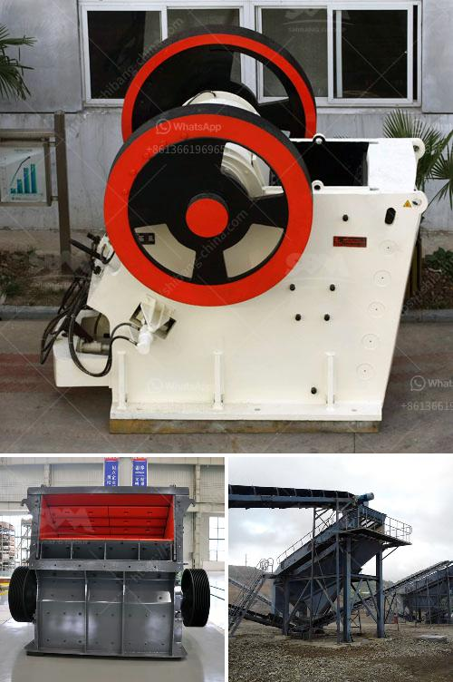

<h3>البحث عن آلات معالجة الكاولين</h3>
إن البحث عن آلات معالجة الكاولين هو مجال هام في صناعة التعدين والمعالجة. يعتبر الكاولين مادة خام تستخدم في العديد من الصناعات مثل الورق، البلاستيك، الطلاءات والصناعات الكيميائية. وبناءً على أهمية الكاولين في هذه الصناعات، تسعى الشركات الى تطوير آلات تعمل على معالجة الكاولين بطرق فعالة وبأقل تكلفة ممكنة.

تشتمل عملية معالجة الكاولين على عدة خطوات، تبدأ بعملية التعدين والتي تشمل انتقاء الكاولين الخام من المناجم وإزالة الأتربة والشوائب الأخرى. بعد ذلك يجب تكسير الكاولين الخام إلى حجم مناسب للمعالجة اللاحقة. وتشمل الخطوة التالية تركيز الكاولين وفصله عن الشوائب الضارة من خلال عمليات مثل التعويم أو الطفو.

بعد التركيز يتم تجفيف الكاولين باستخدام آلات التجفيف المختلفة حسب المتطلبات ونوعية الكاولين المعالج. قد تشمل التجهيزات الأخرى كذلك عمليات التكسير، والطحن، والفصل الكهرومغناطيسي، والتصفية وغيرها من العمليات.

تلعب الآلات المعالجة للكاولين دوراً حاسماً في جودة المنتج النهائي. فعملية التعدين والتجهيز تحتاج إلى معدات متخصصة قادرة على معالجة الكاولين بكفاءة وفعالية. وتشمل هذه المعدات الكسارات، والغرابيل، والمخارط، والمطاحن، وآلات التصفية والفرز وغيرها.

تتطلب آلات معالجة الكاولين تقنيات متقدمة وابتكارات لتحقيق نتائج أفضل وتحسين كفاءة العملية. وفي هذا الصدد، تعمل الشركات المصنعة على تطوير آلات جديدة تعتمد على أحدث التقنيات مثل التحكم الآلي وتكنولوجيا المعلومات. وتهدف هذه الابتكارات إلى زيادة إنتاجية الآلات وتحسين دقة وجودة المعالجة.

باختصار، يمثل البحث عن آلات معالجة الكاولين جزءاً هاماً في صناعة التعدين والمعالجة. تسعى الشركات المصنعة إلى تطوير آلات فعالة وكفاءة تعمل على تحقيق أعلى جودة للكاولين المعالج وبأقل تكلفة ممكنة. وتستخدم التقنيات المتقدمة والابتكارات لتحقيق هذه الأهداف، مع التركيز على زيادة الإنتاجية وتحسين جودة المعالجة.
<h3>Contact us</h3><ul><li><strong>Whatsapp:&nbsp;<a href="https://wa.me/8613661969651">+8613661969651</a></strong></li><li><a href="https://swt.shibang-china.com/?git&amp;zhl&amp;البحث عن آلات معالجة الكاولين"><strong>Online Service(chat now)</strong></a></li></ul><h3>Related</h3><ul><li><a href='مطحنة الأسطوانة للسائل.md'>مطحنة الأسطوانة للسائل</a></li><li><a href='كسارة الجبس الحجر الجيري.md'>كسارة الجبس الحجر الجيري</a></li><li><a href='كم عدد شركات تصنيع كسارات الفك في الهند.md'>كم عدد شركات تصنيع كسارات الفك في الهند</a></li><li><a href='آلات معالجة الجير.md'>آلات معالجة الجير</a></li><li><a href='عملية سحق الكسارة.md'>عملية سحق الكسارة</a></li></ul>