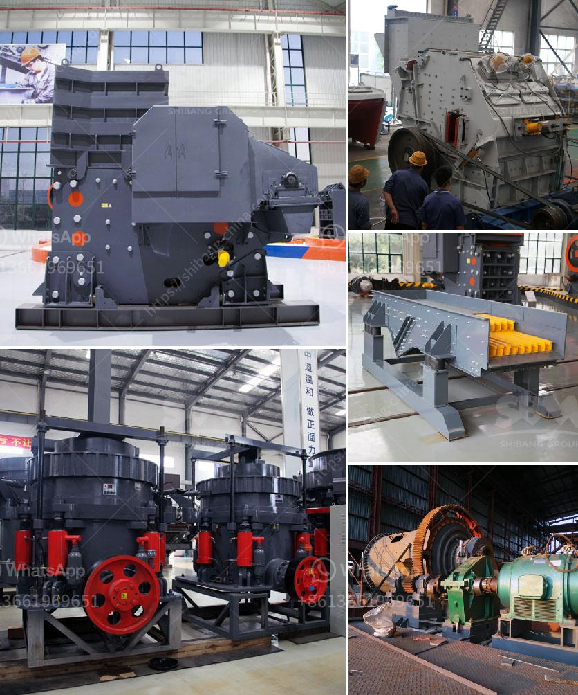

<h3>البحث عن شريك لكسارة الآلات</h3>
يعد البحث عن شريك لكسارة الآلات مهمة حاسمة للعديد من الشركات التي تعمل في صناعة البناء والمقاولات. فالكسارات تعد جزءًا أساسيًا في عملية تكسير الأحجار والصخور لإنتاج الركام المستخدم في الإنشاءات، وتساعد في توفير الكمية اللازمة من المواد الخام لتلبية احتياجات السوق المتزايدة.

عند البحث عن شريك لكسارة الآلات، يجب وضع عدة عوامل في الاعتبار لضمان الاختيار الأمثل. أولاً وقبل كل شيء، يجب أن تكون الشركة المرغوبة شريكًا قويًا وموثوقًا. ينبغي التحقق من سمعتها وتاريخها في هذا المجال، وكذلك من الخدمات والمنتجات التي تقدمها. يمكن الاستعانة بالمراجعات والتوصيات من المشترين السابقين للإطلاع على تجربتهم ورضاهم عن الشركة.

ثانيًا، يجب أن يتوافق شريكك المحتمل مع احتياجاتك الفنية والتكنولوجية. يجب أن تضمن أن الكسارة التي يقدمها الشريك تتوافق مع المتطلبات الخاصة بك وتستوفي المعايير الصحية والبيئية المطلوبة. عليك أن توضح تفاصيل القدرات والمواصفات التقنية التي تبحث عنها في الكسارة وتختار شريكًا يقدم هذا التطابق.

ثالثًا، يهم المسائل المالية والاقتصادية. ينبغي أن تتأكد من أن التكلفة المتوقعة للشراكة مع الشريك المحتمل مناسبة لميزانيتك. يجب أن يوفر لك الشريك خيارات مرنة للدفع وأنظمة تمويل ملائمة. قد ترغب أيضًا في مناقشة تفاصيل المساعدة الفنية والصيانة المستقبلية التي قد يقدمها الشريك.

أخيرًا، يجب أن تنظر في العوامل اللوجستية كذلك. يجب أن يكون الشريك معروفًا بالجودة والسرعة في توصيل المنتجات وتقديم الخدمة. يمكنك النظر في سجلات الشريك المحتمل لقياس مدى فعاليته في التوريد والتسليم وتلبية مواعيدك الضرورية.

في الختام، يجب أن تقوم بدراسة ومقارنة العديد من الشركات المحتملة قبل اتخاذ القرار النهائي. يمكن أن تكون البحوث عبر الإنترنت والمقابلات الشخصية والمشورة من المتخصصين في هذا المجال أدوات قيمة لمساعدتك في اتخاذ القرار الأمثل. عندما تجد الشريك المثالي، ستتمكن من الاعتماد عليه لتوفير الكسارة المناسبة لاحتياجاتك والمساهمة في نجاح عملك في صناعة البناء والمقاولات.
<h3>Contact us</h3><ul><li><strong>Whatsapp:&nbsp;<a href="https://wa.me/8613661969651">+8613661969651</a></strong></li><li><a href="https://swt.shibang-china.com/?git&amp;zhl&amp;البحث عن شريك لكسارة الآلات"><strong>Online Service(chat now)</strong></a></li></ul><h3>Related</h3><ul><li><a href='كسارة الفك 400 ×.md'>كسارة الفك 400 ×</a></li><li><a href='شركة تصنيع آلات الكسارة في زامبيا.md'>شركة تصنيع آلات الكسارة في زامبيا</a></li><li><a href='مطاحن الكرة للتعدين.md'>مطاحن الكرة للتعدين</a></li><li><a href='تكلفة معدات سحق الجرانيت.md'>تكلفة معدات سحق الجرانيت</a></li><li><a href='آخر خط إنتاج مسحوق الجبس.md'>آخر خط إنتاج مسحوق الجبس</a></li></ul>