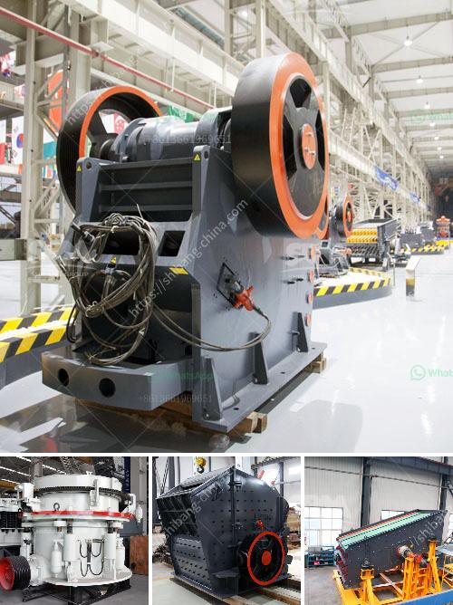

<h3>البحث عن كسارة الحجر</h3>
تُعدّ كسارة الحجر أحد الأدوات الهامة في صناعة البناء والبنية التحتية، حيث تقوم بسحق الصخور والحجارة لإعدادها للإستخدام في المجالات المختلفة. فإذا كنت تبحث عن كسارة الحجر، فإنه من المهم تخصيص بعض الوقت للبحث والتحقق من جميع العوامل الرئيسية التي يجب أخذها في الاعتبار. سوف نستعرض في هذه المقالة بعض النقاط التي يجب النظر فيها عند البحث عن كسارة الحجر.

أولاً، يجب أن تحدد الاحتياجات الخاصة بك. ما هي المواد التي ترغب في سحقها؟ هل تحتاج إلى كسارة صغيرة الحجم للاستخدام المنزلي، أم تحتاج إلى كسارة صناعية لمشروع تجاري كبير؟ تحديد الاحتياجات الخاصة بك سيساعدك في تحديد نوع الكسارة المناسبة.

ثانياً، يجب أن تنظر في ميزانيتك. تشتمل أسعار كسارات الحجر على تكاليف مختلفة. قبل الشروع في البحث، قم بتحديد الميزانية التي يمكنك تخصيصها لشراء الكسارة. ستتوفر العديد من الخيارات التي تلبي ميزانيتك.

ثالثاً، يجب أن تفحص جودة وكفاءة الكسارة. ابحث عن المعلومات والمراجعات حول الكسارة والشركة المصنِّعة للتحقق من نوعية المنتج. قد تحتاج إلى النظر في المواصفات الفنية للكسارة مثل قوة المحرك وقدرة الإنتاج. كما ينبغي أن تتأكد من موثوقية الشركة المصنعة وخدمة العملاء.

رابعاً، يجب أن تقارن الأسعار والعروض. بعد تحديد النوع المناسب والشركة المصنِّعة، قارن الأسعار والعروض المختلفة المتاحة في السوق. راجع عدة موردين وتأكد من أنك تحصل على أفضل قيمة مقابل المال الذي تستثمره في الكسارة.

ختاماً، يجب أن تضع في اعتبارك موقع الشراء. هل ستشتري الكسارة محليًا، أم سوف تستوردها من الخارج؟ تأكد من التأكيد على الشروط والضمانات المتاحة في حالة الشراء من الخارج. قد يؤثر موقع الشراء على تكلفة الكسارة ووقت التسليم.

باختصار، البحث عن كسارة الحجر يتطلب وقتًا وجهودًا للتأكد من الحصول على المنتج المناسب بأفضل قيمة. يجب أخذ الاحتياجات الخاصة بك وميزانيتك وجودة الكسارة والعروض المتاحة وموقع الشراء في الاعتبار عند اتخاذ قرارك النهائي.
<h3>Contact us</h3><ul><li><strong>Whatsapp:&nbsp;<a href="https://wa.me/8613661969651">+8613661969651</a></strong></li><li><a href="https://swt.shibang-china.com/?git&amp;zhl&amp;البحث عن كسارة الحجر"><strong>Online Service(chat now)</strong></a></li></ul><h3>Related</h3><ul><li><a href='كسارة صخور لخام الكروم أو الكروميت.md'>كسارة صخور لخام الكروم أو الكروميت</a></li><li><a href='مطحنة هامر 7 في 8 للذهب والكوارتز.md'>مطحنة هامر 7 في 8 للذهب والكوارتز</a></li><li><a href='كسارات محمولة.md'>كسارات محمولة</a></li><li><a href='آلات كسارة الحجر في ماليزيا.md'>آلات كسارة الحجر في ماليزيا</a></li><li><a href='مطحنة طحن الحجر من ألمانيا.md'>مطحنة طحن الحجر من ألمانيا</a></li></ul>