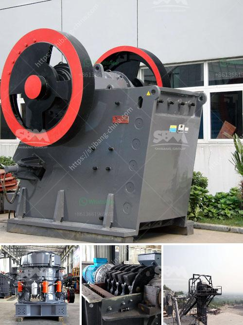

<h3>البحث عن مطحنة الهامر</h3>
يُعتبر البحث عن مطحنة الهامر من العمليات التقنية المُهمة في صناعة المواد الغذائية والأعلاف. تُستخدم مطاحن الهامر لطحن المواد الصلبة والكربونية بشكل دقيق وفعال. تم تطوير هذه المطاحن خصيصًا لتحقيق نقلة نوعية في عملية الطحن من خلال التقليل من حجم المواد بشكل أكبر وتحسين جودة المنتج النهائي. يُمكن استخدام مطاحن الهامر في العديد من الصناعات مثل صناعة الأعلاف والأغذية والمنتجات الكيميائية وغيرها.

تتكون مطاحن الهامر من جزئين رئيسيين: الجزء الجامد والجزء الدوار. يتم تحميل المادة المراد طحنها في الجزء الجامد، ومن ثم تنفذ القوة الميكانيكية عن طريق الدوران السريع للجزء الدوار. يتم اصطدام المواد المطحونة بالمطرقة الدوارة، ما يؤدي إلى تحويلها إلى حبيبات صغيرة ودقيقة.

ميزة أساسية لمطاحن الهامر هي قدرتها على التعامل مع مجموعة متنوعة من المواد المختلفة، مثل الفول السوداني والأرز والحبوب والتوابل والأعشاب والأخشاب والأعلاف وغيرها. كما أنها تعتبر عملية سهلة وسريعة واقتصادية.

يوفر استخدام مطحنة الهامر العديد من الفوائد للمزارعين والشركات المصنعة في صناعة الأعلاف. فعلى سبيل المثال، يمكن استخدام هذه المطاحن لتقطيع الحبوب والأعشاب بدقة عالية، مما يزيد من امتصاص الحيوانات للمغذيات ويحسن أداء الحيوانات. كما تُساهم المطاحن في تحسين جودة الأعلاف من حيث القيمة الغذائية وتوحيد الحجم والتحكم في الجودة.

عند البحث عن مطحنة الهامر المثالية، من المهم مراعاة العوامل التالية: القدرة على التعامل مع مجموعة متنوعة من المواد، سرعة الطحن وفعاليته، القوة والمتانة، تكاليف التشغيل، والصيانة وسهولة التنظيف.

لخلاصة القول، يُعتبر البحث عن مطحنة الهامر أمرًا حاسمًا في صناعة الأعلاف والأغذية وغيرها من الصناعات. يقدم استخدام مطاحن الهامر العديد من المزايا التي تُحسن جودة المواد المطحونة وتحسن الأداء العام للمنتج النهائي. لذلك، فإن تحقيق الاستدامة وتحقيق الربحية العالية يكمن في استخدام تلك المطاحن الحديثة والفعالة في العمليات التقنية لصناعة المواد الغذائية.
<h3>Contact us</h3><ul><li><strong>Whatsapp:&nbsp;<a href="https://wa.me/8613661969651">+8613661969651</a></strong></li><li><a href="https://swt.shibang-china.com/?git&amp;zhl&amp;البحث عن مطحنة الهامر"><strong>Online Service(chat now)</strong></a></li></ul><h3>Related</h3><ul><li><a href='محطات الكسارات في الكويت.md'>محطات الكسارات في الكويت</a></li><li><a href='مطحنة الكرة مع محول mercadolibre.md'>مطحنة الكرة مع محول mercadolibre</a></li><li><a href='كسارة الحجر في أوغندا.md'>كسارة الحجر في أوغندا</a></li><li><a href='كسارة حجر في الهند.md'>كسارة حجر في الهند</a></li><li><a href='كسارات الحجر الرئيسية.md'>كسارات الحجر الرئيسية</a></li></ul>