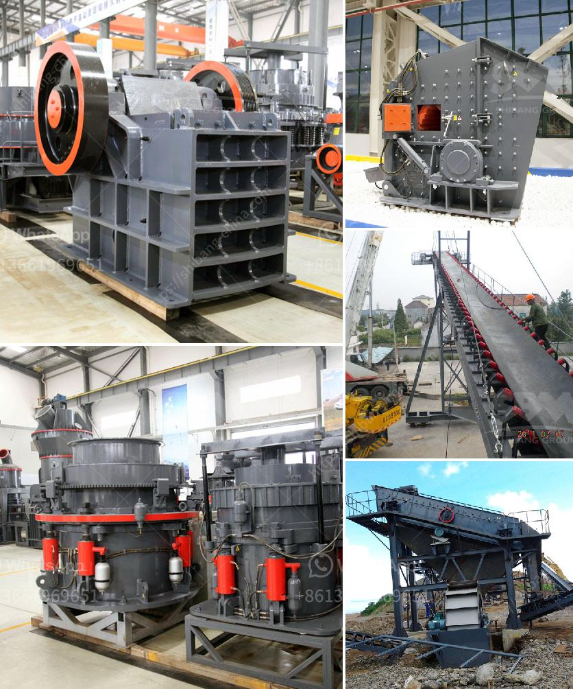

<h3>البحث عن معدات تجهيز الفحم الصغيرة</h3>
تعتبر معدات تجهيز الفحم الصغيرة أدوات أساسية لعمليات استخلاص الفحم وتجهيزه للاستخدام. يعتمد البحث عن هذه المعدات على الحاجة المتزايدة للفحم كمصدر للطاقة في العالم. في هذه المقالة، سنلقي الضوء على أهمية البحث عن معدات تجهيز الفحم الصغيرة ومزاياها.

تعدّ الفحم من أحد الموارد الرئيسية للطاقة حول العالم. ومع ذلك، فإن معظم الدول معتمدة على التعدين التقليدي الكبير للاستفادة من هذه المادة الحافظة على الحياة. ومع ذلك، فإن الفحم الصغير يشهد مطالبة متزايدة في عمليات الاحتراق المنزلي وإنتاج الطاقة في الصناعة الصغيرة والمزارع والمنازل الريفية.

تعمل معدات تجهيز الفحم الصغيرة على استخلاص الفحم من الرواسب والأتربة والشوائب المختلفة. وتُستخدم هذه المعدات لغرض تحسين جودة الفحم وزيادة عائداته التجارية. وتتضمن هذه المعدات عادة الكسارات والغرابيل والغسالات والمجففات المزودة بتقنيات تجهيز حديثة.

تصاحب تطور التكنولوجيا تحسينًا مستمرًا في معدات تجهيز الفحم الصغيرة. فتقنيات الكسارات الحديثة تسمح بتحقيق نسبة استخراج عالية من الفحم في عملية واحدة. وتضمن الغرابيل الحديثة فصل الفحم عن الشوائب بدقة وفعالية. كما تعزز التقنيات المتقدمة في المجففات عملية تجفيف الفحم بشكل أسرع وأكثر كفاءة.

فوائد البحث عن معدات تجهيز الفحم الصغيرة عديدة. فهي تساهم في تحسين جودة الفحم المستخرج وتجهيزه، مما يرفع قيمته التجارية ويزيد من الإيرادات للمنتجين. وتعزز زيادة محتملة في إنتاج الفحم الصغير منظومة الطاقة الكلية في الدولة، وتقلل الاعتماد على الفحم الكبير.

علاوة على ذلك، فإن بحث معدات تجهيز الفحم الصغيرة يسهم في التطوير التكنولوجي في هذا القطاع. وتعمل التقنيات المتطورة على تعزيز الإنتاجية وتقليل تكاليف الإنتاج واستهلاك الطاقة. يمكن تصميم وتطوير معدات تجهيز الفحم الصغيرة المستدامة وفقًا للمعايير البيئية، ما يعزز الاستدامة البيئية لصناعة الفحم.

في الختام، فالبحث عن معدات تجهيز الفحم الصغيرة يلعب دورًا هامًا في تعزيز صناعة الفحم وتحسين كفاءتها وإنتاجيتها، مما يعزز الاعتماد على الفحم الصغير كمصدر طاقة مستدام. كما يساهم في زيادة العائدات وتقليل الاعتماد على الفحم الكبير. لذا، يجب تشجيع البحث والابتكار في مجال معدات تجهيز الفحم الصغيرة لتعزيز التقدم التكنولوجي وتحقيق التنمية المستدامة في هذا القطاع.
<h3>Contact us</h3><ul><li><strong>Whatsapp:&nbsp;<a href="https://wa.me/8613661969651">+8613661969651</a></strong></li><li><a href="https://swt.shibang-china.com/?git&amp;zhl&amp;البحث عن معدات تجهيز الفحم الصغيرة"><strong>Online Service(chat now)</strong></a></li></ul><h3>Related</h3><ul><li><a href='تكلفة إعداد مصنع طحن الكلنكر في الهند.md'>تكلفة إعداد مصنع طحن الكلنكر في الهند</a></li><li><a href='مطاحن للبيع في الفلبين.md'>مطاحن للبيع في الفلبين</a></li><li><a href='كسارة الحصى للبيع في كينيا.md'>كسارة الحصى للبيع في كينيا</a></li><li><a href='تكلفة تعدين الفحم في جنوب أفريقيا للطن الواحد.md'>تكلفة تعدين الفحم في جنوب أفريقيا للطن الواحد</a></li><li><a href='آلات كسارة الصخور.md'>آلات كسارة الصخور</a></li></ul>