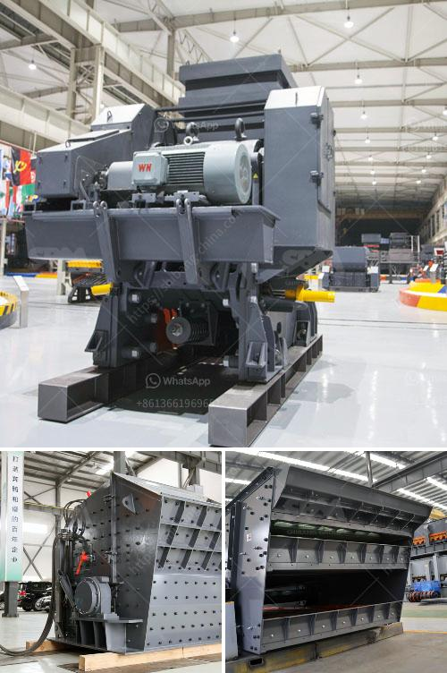

<h3>البوكسيت من مصانع الأسمنت في الهند</h3>
تعد الهند واحدة من أكبر دول العالم من حيث إنتاج الأسمنت، وتمتلك العديد من المصانع التي تنتج خام الأسمنت، بما في ذلك مصانع البوكسيت. يُعرف البوكسيت باسم خام الألومنيوم، وهو المكون الأساسي لإنتاج الألومنيوم.

تتميز مصانع البوكسيت في الهند بتكلفة إنتاج منخفضة، إذ تحتوي الهند على واحدة من أكبر احتياطيات البوكسيت في العالم. وتتراوح كمية الاحتياطات الكلية للبوكسيت في الهند بين 3.5 إلى 4.5 مليار طن. يتم استخراج البوكسيت من المناطق الجبلية في ولايات أوديشا وجهارخاند وغيرها من الولايات.

تعتبر مصانع البوكسيت في الهند محورًا مهمًا في صناعة الألومنيوم في البلاد. إنها تعمل على تحويل البوكسيت إلى أكسيد الألومنيوم النقي، والذي بدوره يُصهر لإنتاج الألومنيوم. تتمتع الهند ببعض المصافي العملاقة لإنتاج الألومنيوم، والتي تعتبر أكبر منتج في الهند وتساهم بشكل كبير في تلبية احتياجات السوق المحلية والعالمية.

تواجه صناعة البوكسيت في الهند بعض التحديات، بما في ذلك الأثر البيئي لعمليات استخراج البوكسيت وتصنيعه. يتطلب استخراج البوكسيت التغلب على التضاريس الصعبة وتدمير الغطاء النباتي والتأثير على الأنهار والمياه الجوفية. يتطلب تصنيع البوكسيت استهلاكًا كبيرًا من الموارد الطبيعية والطاقة، مما يؤدي إلى انبعاثات ضارة للبيئة.

ومع ذلك، فإن صناعة البوكسيت مهمة للاقتصاد الهندي، حيث توفر فرص عمل للعديد من الأشخاص وتساهم في النمو الاقتصادي. يهدف قطاع الألومنيوم في الهند إلى تحسين الكفاءة البيئية لعملياته من خلال استخدام تقنيات تنظيف جديدة وزيادة الوعي البيئي. على سبيل المثال، تم استخدام التقنيات الحديثة مثل فحم الكوك الأخضر والاحتراق النظيف للحد من تلوث الهواء.

باختصار، تعد مصانع البوكسيت في الهند أساسية لصناعة الألومنيوم في البلاد. وبالرغم من التحديات البيئية، يجري العمل على تحسين الكفاءة البيئية للعمليات بما في ذلك استخدام التقنيات الحديثة. إن هذه الصناعة المهمة تلعب دورًا حاسمًا في توفير الوظائف وتحقيق النمو الاقتصادي في الهند.
<h3>Contact us</h3><ul><li><strong>Whatsapp:&nbsp;<a href="https://wa.me/8613661969651">+8613661969651</a></strong></li><li><a href="https://swt.shibang-china.com/?git&amp;zhl&amp;البوكسيت من مصانع الأسمنت في الهند"><strong>Online Service(chat now)</strong></a></li></ul><h3>Related</h3><ul><li><a href='كوماتسو بي آر كسارة للبيع.md'>كوماتسو بي آر كسارة للبيع</a></li><li><a href='كسارات مخروط هيدروليكية.md'>كسارات مخروط هيدروليكية</a></li><li><a href='عملية الطحن الرطب.md'>عملية الطحن الرطب</a></li><li><a href='آلة سحق في الفلبين.md'>آلة سحق في الفلبين</a></li><li><a href='مسحوق الدولوميت 200 شبكة.md'>مسحوق الدولوميت 200 شبكة</a></li></ul>