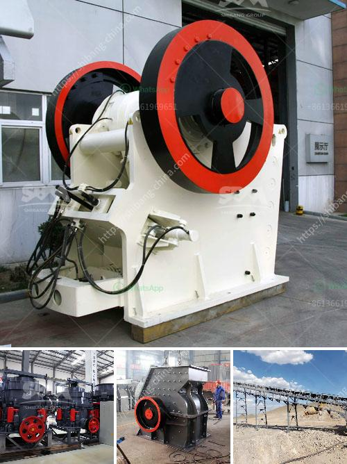

<h3>التحكم الهيدروليكي لكسارة الفك</h3>
تعتبر كسارات الفك أحد الأدوات الرئيسية في صناعة التعدين والبناء ، حيث تُستخدم لسحق المواد الخام وتحويلها إلى قطع صغيرة قابلة للتعامل. ولكي تعمل كسارة الفك بكفاءة وسلاسة ، يتطلب الأمر العديد من المكونات والتقنيات المتطورة، بما في ذلك التحكم الهيدروليكي.

يعتبر التحكم الهيدروليكي أحد المكونات الرئيسية التي تساهم في تشغيل كسارة الفك بكفاءة. يتم استخدام الهيدروليك من أجل تحريك فك الكسارة العلوي والسفلي ، مما يمكنها من سحق المواد بشكل أكثر دقة وتحكم. يستخدم النظام الهيدروليكي الضغط الهيدروليكي لتشغيل الأسطوانات الهيدروليكية المثبتة في الكسارة ، والتي تعمل على تحريك فك الكسارة في جميع الاتجاهات.

إحدى المزايا الرئيسية للتحكم الهيدروليكي في كسارة الفك هي قدرتها على ضبط حجم الفتحة بسرعة ودقة. يمكن للمشغل ضبط حجم الفتحة بسهولة باستخدام أزرار التحكم المخصصة ، مما يتيح لها السيطرة على كمية المواد المسحوقة المنتجة. هذا يعني أنه يمكن تحقيق أفضل أداء سحق للمواد المطلوبة ، مما يسمح بإنتاج نهائي أكثر دقة ومناسبة للاستخدام.

علاوة على ذلك ، يتميز النظام الهيدروليكي بقدرته على توفير قوة تحكم قوية وكفاءة عالية. يتم تطبيق ضغط هيدروليكي على الأسطوانات الهيدروليكية ، مما يوفر سرعة عالية وقوة قوية لفك الكسارة. هذا يعني أنه يمكن سحق المواد الصعبة والمتينة بكفاءة عالية.

بالإضافة إلى ذلك ، يساهم التحكم الهيدروليكي في زيادة متانة وكفاءة كسارة الفك. بفضل التقدم التقني في هذا المجال ، يمكن تجنب الاهتزازات والخلل الناتجة عن استخدام النظم الهيدروليكية. يمكن تركيب أجهزة استشعار وأنظمة التحكم الآلي للتأكد من عملية التشغيل السلسة والتحكم الدقيق.

باختصار ، فإن التحكم الهيدروليكي يلعب دورًا حاسمًا في تحسين أداء كسارة الفك. من خلال توفير قوة تحكم قوية ودقة في الضبط ، يمكن لكسارة الفك أن تعمل بكفاءة أعلى وتساهم في إنتاج أعلى درجة من الجودة للمواد المسحوقة. وباستخدام التكنولوجيا الهيدروليكية المتقدمة ، يمكن تحقيق تشغيل سلس ومستقر للكسارة ، مما يضمن زيادة الإنتاجية وتحسين فعالية عملية التعدين والبناء.
<h3>Contact us</h3><ul><li><strong>Whatsapp:&nbsp;<a href="https://wa.me/8613661969651">+8613661969651</a></strong></li><li><a href="https://swt.shibang-china.com/?git&amp;zhl&amp;التحكم الهيدروليكي لكسارة الفك"><strong>Online Service(chat now)</strong></a></li></ul><h3>Related</h3><ul><li><a href='معلمات كسارة 250 طن في الساعة.md'>معلمات كسارة 250 طن في الساعة</a></li><li><a href='سعر آلة طحن الحجر الرخامي والجرانيت.md'>سعر آلة طحن الحجر الرخامي والجرانيت</a></li><li><a href='تقرير المشروع حول وحدة تكسير الحجر.md'>تقرير المشروع حول وحدة تكسير الحجر</a></li><li><a href='مطحنة طحن في الولايات المتحدة الأمريكية.md'>مطحنة طحن في الولايات المتحدة الأمريكية</a></li><li><a href='كتلة الآلات وكسارة في AutoCAD.md'>كتلة الآلات وكسارة في AutoCAD</a></li></ul>