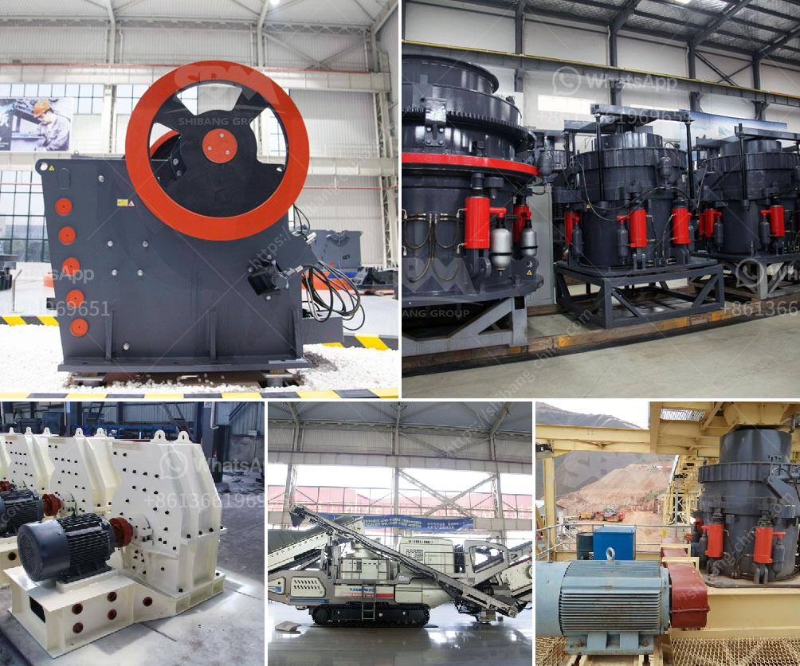

<h3>التدفق النموذجي لمحجر الجرانيت</h3>
تعتبر صناعة الجرانيت من الصناعات الرئيسية في مجال التعدين والبناء. ويعدّ محجر الجرانيت من أهم المواقع التي يتم فيها استخراج الجرانيت بشكل كبير. وتعتبر العمليات المتوالية في محجر الجرانيت منظومة معقدة تستخدم لاستخلاص وتجهيز الجرانيت، ويتضمن ذلك عددًا من الخطوات الأساسية.

تبدأ عملية تدفق الجرانيت النموذجي بالتخطيط والمسح الأرضي؛ حيث يتم تحديد موقع المحجر وتحديد مناطق الاستخراج المحتملة. ثم يتم القيام بعمليات التفجير والحفر، حيث تستخدم المعدات الثقيلة لاستخراج كتل الجرانيت الضخمة من الأرض.

بعد استخراج الجرانيت، يتم نقل الكتل إلى منطقة المعالجة حيث تتم عملية التقسيم وتنقية الجرانيت. ثم يتم قطع الجرانيت باستخدام المناشير الخاصة لإنتاج البلاط المختلفة واللوحات المقاسة الأخرى.

تلي ذلك عملية اللمس وإعطاء الجرانيت المظهر النهائي المرغوب. حيث يتم استخدام المعدات الخاصة مثل قواطع وقوالب وجلاخات لإعطاء الجرانيت الشكل والتصميم المطلوب.

وأخيرًا، يتم وضع الجرانيت في عبوات خاصة ونقله إلى المواقع البنائية للاستخدام في تصميم الأرضيات والحوائط والطرق والكثير من التطبيقات الأخرى.

على الرغم من أن التدفق النموذجي لمحجر الجرانيت يمثل عملية دقيقة ومعقدة، إلا أنها تؤمن إنتاجية عالية وجودة عالية للمنتجات النهائية. وتعتمد فاعلية وسلامة عملية التدفق النموذجي على توفر الموظفين المهرة والتدريب المناسب، بالإضافة إلى استخدام التكنولوجيا الحديثة والمعدات المتطورة.

في الختام، يُعد محجر الجرانيت من أهم المصادر لاستخراج الجرانيت، وتحقيق عملية التدفق النموذجي يعزز الإنتاجية والكفاءة ويضمن جودة المنتجات. إنها صناعة رئيسية تسهم في تطوير الاقتصاد المحلي وتلبية الطلب المتزايد على الجرانيت في قطاع البناء والديكور.
<h3>Contact us</h3><ul><li><strong>Whatsapp:&nbsp;<a href="https://wa.me/8613661969651">+8613661969651</a></strong></li><li><a href="https://swt.shibang-china.com/?git&amp;zhl&amp;التدفق النموذجي لمحجر الجرانيت"><strong>Online Service(chat now)</strong></a></li></ul><h3>Related</h3><ul><li><a href='سعات مطحنة الأسطوانة العمودية.md'>سعات مطحنة الأسطوانة العمودية</a></li><li><a href='آلة طحن الطين المستخدمة للبيع.md'>آلة طحن الطين المستخدمة للبيع</a></li><li><a href='شركة تصنيع كسارة في جوجارات.md'>شركة تصنيع كسارة في جوجارات</a></li><li><a href='كسارات مزدوجة التبديل.md'>كسارات مزدوجة التبديل</a></li><li><a href='مصنع كسارة الحجر التلقائي.md'>مصنع كسارة الحجر التلقائي</a></li></ul>