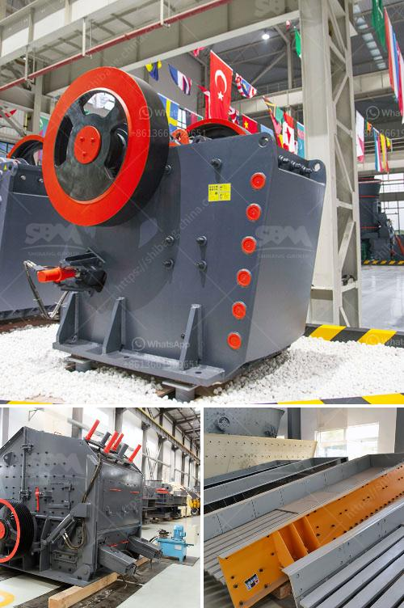

<h3>التكسير الصخور للبيع</h3>
يعد التكسير الصخور ظاهرة هامة في عالم التعدين والبناء، حيث يتم استخدامها في عدة تطبيقات مثل استخراج النفط والغاز والتعدين وبناء الطرق. يتم تحقيق هذه الظاهرة عن طريق تطبيق قوة هائلة على الصخور للتفكيكها إلى قطع صغيرة. يتم بيع التكسير الصخور على نطاق واسع لأغراض مختلفة، وبشكل عام فإن سعر البيع لهذه الخدمة يتراوح بين 200-400 لألف.

أحد التطبيقات الرئيسية للتكسير الصخور هي في صناعة استخراج النفط والغاز الطبيعي. يتم استخدام التكسير لزيادة تدفق السوائل الطبيعية من داخل الصخور الجيولوجية. يتم ذلك من خلال إدخال مواد تكسير الصخور إلى الآبار المنشأة وتطبيق ضغط عالي لكسر الصخور وسماح بانسياب النفط والغاز إلى الآبار. هذه العملية تمكن من استخلاص المزيد من النفط والغاز من الصخور ذات الكثافة العالية، وهو ما يؤدي إلى زيادة إنتاجية الآبار وتحقيق ربحية أعلى لشركات النفط والغاز.

بالإضافة إلى ذلك، يستخدم التكسير الصخور في صناعة التعدين. يتم استخدامها لاستخراج المعادن من الصخور الصلبة، مثل الذهب والفضة والنحاس والحديد. يتم تطبيق قوة التكسير لتكسير الصخور الصلبة وتفتيتها إلى جسيمات أصغر، مما يسهل عملية استخلاص المعادن منها. تقدم هذه التقنية فوائد اقتصادية كبيرة لشركات التعدين، حيث تساعد في زيادة إنتاج المعادن وتخفيض تكاليف التنقيب.

علاوة على ذلك، يتم استخدام التكسير الصخور في صناعة بناء الطرق والبنية التحتية. يتم تطبيق هذه التقنية لتحطيم الصخور الكبيرة وتجهيزها كخامات بناء لتعبيد الطرق وبناء المنشآت التحتية. يؤدي استخدام التكسير الصخور في هذه الحالة إلى توفير وقت وجهد في عملية إعداد المواد البنائية، إلى جانب الحصول على نوعية أفضل من المواد.

باختصار، يعتبر التكسير الصخور ظاهرة هامة في عالم التعدين والبناء. يتم تطبيقها في استخراج النفط والغاز والتعدين وبناء الطرق. توفر هذه التقنية فوائد اقتصادية كبيرة للصناعات المعنية، ولذا فإن سعر البيع يتراوح ما بين 200-400 لألف. يمكن القول إن التكسير الصخور هو تقنية حديثة وفعالة يتم الاعتماد عليها في العديد من الصناعات لتحقيق أهدافها بكفاءة عالية.
<h3>Contact us</h3><ul><li><strong>Whatsapp:&nbsp;<a href="https://wa.me/8613661969651">+8613661969651</a></strong></li><li><a href="https://swt.shibang-china.com/?git&amp;zhl&amp;التكسير الصخور للبيع"><strong>Online Service(chat now)</strong></a></li></ul><h3>Related</h3><ul><li><a href='مصانع المعالجة في الصين للحجر الجيري.md'>مصانع المعالجة في الصين للحجر الجيري</a></li><li><a href='مطحنة رطبة في الصين.md'>مطحنة رطبة في الصين</a></li><li><a href='مورد مصنع التكسير والفرز في الصين.md'>مورد مصنع التكسير والفرز في الصين</a></li><li><a href='كسارة الكرة للحديد فقط الشركة.md'>كسارة الكرة للحديد فقط الشركة</a></li><li><a href='عملية تعدين الكوارتز في ولاية أندرا براديش.md'>عملية تعدين الكوارتز في ولاية أندرا براديش</a></li></ul>