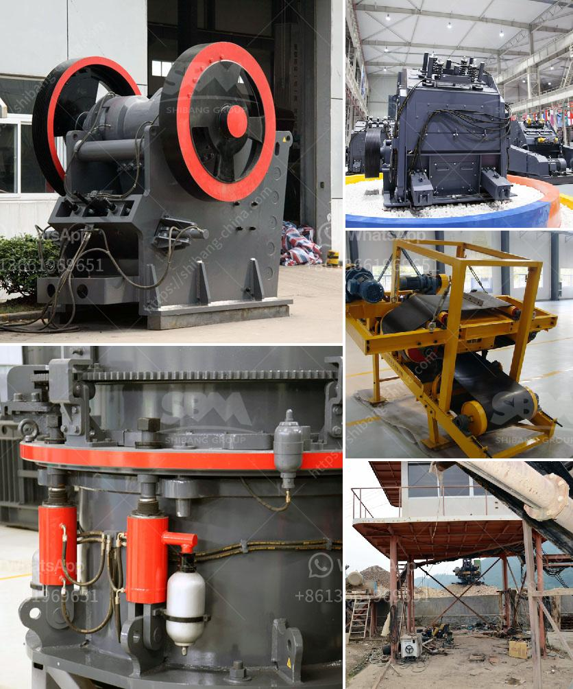

<h3>التكسير والفرز المحمول</h3>
تكسير وفرز المواد هو عملية هامة في صناعة البناء والهدم وإعادة التدوير. تستخدم هذه العملية لتحويل المواد الخام إلى مواد نهائية قابلة للاستخدام. في الأعوام الأخيرة، ظهرت تقنية التكسير والفرز المحمولة كبديل مرن وفعال لتلك العمليات التقليدية. في هذه المقالة، سنتناول الفوائد المتعددة التي تقدمها هذه التقنية وإلقاء نظرة على كيفية عملها.

يتم استخدام أجهزة التكسير والفرز المحمولة لكسر المواد الصلبة مثل الخرسانة والأسفلت والأحجار الطبيعية، وتمزج المواد المكسورة بشكل فعال لإنتاج مواد جديدة. واحدة من أفضل الميزات لهذه التقنية هي أنها يمكن تنفيذها في موقع العمل، مما يقلل من الحاجة إلى نقل المواد ويوفر الكثير من الوقت والجهد. تستخدم الشاحنات المحمولة والمعدات للتكسير والفرز المحمول، حيث يتم تجهيزها بآلات تكسير مثل كسارة الفك والكسارة المخروطية لتكسير المواد الصلبة.

تعتبر التكسير والفرز المحمولة أسلوبًا مستدامًا لإعادة التدوير، حيث يمكن إعادة استخدام المواد المكسورة في العديد من التطبيقات الأخرى. تتيح هذه التقنية إمكانية استخدام المواد الناتجة في بناء الطرق والجسور والأساسات. كما أنها تقلل من استخدام الموارد الطبيعية وتقلل من تكاليف التخلص من المواد البنائية القديمة.

واحدة من أكبر الفوائد التي توفرها تلك التقنية هي مرونتها. يمكن ضبط أجهزة التكسير والفرز المحمولة لمعالجة مواد محددة وتحقيق النتائج المرغوبة. يمكن تعديل إعدادات الآلات ومعادلة الحجم والشكل والنقاوة المطلوبة للمواد النهائية. يمكن أيضًا تحميل الآلات بأنواع مختلفة من الأدوات للتكيف مع المواد المختلفة.

بشكل عام، تقدم التكنولوجيا المحمولة للتكسير والفرز العديد من المزايا. تساهم في تقليل النفايات وتحسين إعادة التدوير والاستدامة البيئية. كما أنها تساهم في تقليل التكاليف وزيادة الكفاءة في عمليات البناء والهدم. وبفضل مرونتها، يمكن استخدام هذه التقنية في العديد من المواقف المختلفة وتكيفها وفقًا لاحتياجات المشروع.

باختصار، التكسير والفرز المحمولة هي تقنية مهمة تسهم في إعادة التدوير وتحسين الاستدامة في صناعة البناء والهدم. توفر هذه التقنية العديد من الفوائد، مثل توفير الوقت والجهد وتقليل التكاليف. بالإضافة إلى ذلك، فإن مرونتها تجعلها خيارًا مرنًا وملائمًا لمجموعة متنوعة من التطبيقات.
<h3>Contact us</h3><ul><li><strong>Whatsapp:&nbsp;<a href="https://wa.me/8613661969651">+8613661969651</a></strong></li><li><a href="https://swt.shibang-china.com/?git&amp;zhl&amp;التكسير والفرز المحمول"><strong>Online Service(chat now)</strong></a></li></ul><h3>Related</h3><ul><li><a href='شركة تصنيع كسارة الفك في إيطاليا.md'>شركة تصنيع كسارة الفك في إيطاليا</a></li><li><a href='كسارة حجرية للبيع.md'>كسارة حجرية للبيع</a></li><li><a href='آلة تعدين الذهب.md'>آلة تعدين الذهب</a></li><li><a href='كسارة الفك تيرميناتور.md'>كسارة الفك تيرميناتور</a></li><li><a href='سعر مطحنة طاحونة عمودية.md'>سعر مطحنة طاحونة عمودية</a></li></ul>