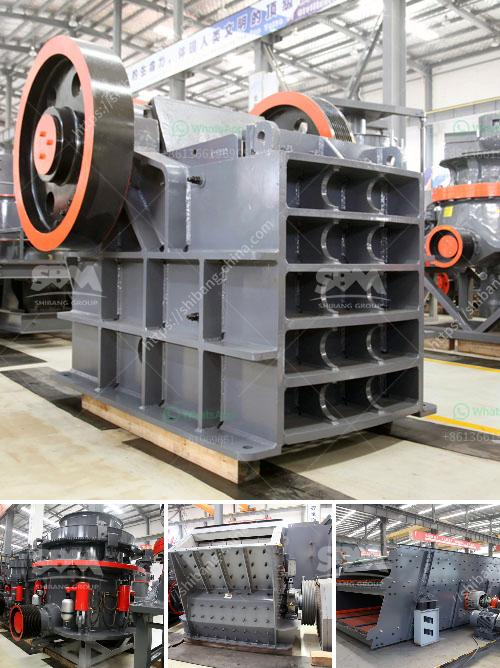

<h3>التكلفة الرأسمالية لمصنع تحسين خام الكروم</h3>
إن مصنع تحسين خام الكروم يعتبر منشأة حيوية لإنتاج الكروم المحسن والتي يمكن استخدامها في مجموعة واسعة من الصناعات، مثل صناعة الفولاذ والسيارات والصناعات الكيماوية الأخرى. ولكن بناء وتشغيل مصنع تحسين خام الكروم يتطلب النظر في التكلفة الرأسمالية المرتبطة بهذه العملية.

يتكون التكلفة الرأسمالية من جميع المصاريف والنفقات التي تتطلبها إقامة المصنع وتجهيزه بالمعدات والتقنيات الأساسية اللازمة لتحسين خام الكروم. تتضمن هذه التكاليف قطع الأرض والبناءات والنقل والتوريدات الفنية والعمالة والبحوث والتطوير والمقومات الأخرى ذات الصلة.

قد يتباين حجم المصنع وتكنولوجيا المعالجة المستخدمة ونوعية خام الكروم المُستخدمة، وبالتالي فإن التكلفة الرأسمالية قد تتفاوت بين مصانع تحسين خام الكروم المختلفة. ينبغي أن يتمتع المصنع بالقدرة على إدارة تكاليف استخلاص الكروم بفعالية وفاعلية مع الأخذ في الاعتبار الأساليب المستدامة وتقنيات الحفاظ على البيئة.

أما بالنسبة للبنية التحتية والمعدات، فمن المهم استخدام تكنولوجيا حديثة وكفاءة في مصنع تحسين خام الكروم للحصول على أعلى جودة وكفاءة إنتاجية. قد تتطلب التقنيات المتقدمة استثمارات رأسمالية أكبر، ولكنها تعطي أيضاً نتائج أفضل وتقلل من التكاليف التشغيلية على المدى الطويل.

من المهم أيضًا النظر في التكاليف اليومية لتزويد المصنع بالخام والطاقة والمواد الكيميائية والمواد الاستهلاكية الأخرى. قد تكون هذه التكاليف متغيرة وتتأثر بأسعار السوق وتوافر الموارد، وتحديات توفير هذه الموارد بأسعار معقولة ومستدامة للمصنع هي حاسمة.

بشكل عام، من المهم التخطيط بعناية وإعداد تحليل تكلفة فعال وشامل قبل بناء وتشغيل مصنع تحسين خام الكروم. يجب النظر في مصادر التمويل المختلفة وطرق تحسين الكفاءة وتقليل النفقات لتحقيق التوازن المثلى بين التكلفة الرأسمالية وأهداف الإنتاج المستهدفة.
<h3>Contact us</h3><ul><li><strong>Whatsapp:&nbsp;<a href="https://wa.me/8613661969651">+8613661969651</a></strong></li><li><a href="https://swt.shibang-china.com/?git&amp;zhl&amp;التكلفة الرأسمالية لمصنع تحسين خام الكروم"><strong>Online Service(chat now)</strong></a></li></ul><h3>Related</h3><ul><li><a href='سعر كسارة الصخور في منجم بيرو.md'>سعر كسارة الصخور في منجم بيرو</a></li><li><a href='تبيع شاشات الاهتزاز للحصى والرمل.md'>تبيع شاشات الاهتزاز للحصى والرمل</a></li><li><a href='كسارة أولية للبيع.md'>كسارة أولية للبيع</a></li><li><a href='كسارات الحجر في بوكارامانجا.md'>كسارات الحجر في بوكارامانجا</a></li><li><a href='استخدام آلة مطحنة الكرة في إندونيسيا.md'>استخدام آلة مطحنة الكرة في إندونيسيا</a></li></ul>