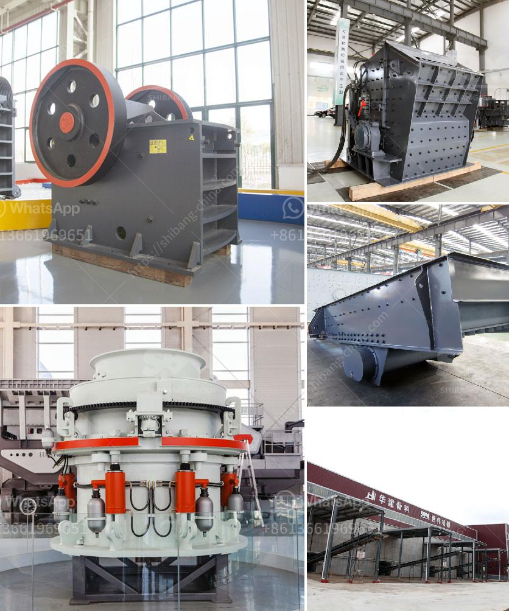

<h3>التكلفة المتوسطة لمصنع تعدين الجرافيت</h3>
تعتبر صناعة تعدين الجرافيت من الصناعات المهمة في العالم، حيث تستخدم الجرافيت في تصنيع البطاريات، والأقلام، والكتب الإلكترونية، والمواد المضادة للحرارة، والعديد من التطبيقات الصناعية الأخرى. وبسبب الطلب المتزايد على الجرافيت، أصبح إقامة المصانع التعدينية للجرافيت مربحة ومجدياً.

تتكون تكلفة إقامة مصنع تعدين الجرافيت من عدة جوانب رئيسية. أولاً، تأتي تكاليف الأرض والرخص والأذونات اللازمة لبناء المصنع. بالإضافة إلى ذلك، تشمل التكاليف الأخرى تكلفة الآلات والمعدات المستخدمة في عمليات التعدين والتصنيع، وتكاليف التشغيل اليومية، بما في ذلك تكلفة العمالة والطاقة والمواد الكيميائية، وتكاليف الصيانة والتشغيل.

عادةً ما يتطلب إنشاء مصنع تعدين الجرافيت استثماراً مهماً من حيث التكاليف الرأسمالية، حيث يمكن أن يبلغ التكلفة المتوسطة لمصنع تعدين الجرافيت ما بين 200 إلى 400 مليون دولار. ومع ذلك، يعتمد ذلك بشكل كبير على حجم الإنتاج المتوقع ونطاق العمليات التعدينية والمصنعية.

تعد مصانع تعدين الجرافيت عملية معقدة تتطلب معرفة تقنية وخبرة في مجال التعدين والتصنيع الصناعي. كما يجب الانتباه إلى الجوانب البيئية والاجتماعية لعمليات التعدين، وتكاليف التخلص من النفايات والحفاظ على البيئة وصحة العاملين.

تتحمل شركة المصنع التكلفة الكاملة لإقامة مصنع تعدين الجرافيت، ولذلك قد تحتاج إلى استثمارات مالية هائلة وتوفر التمويل اللازم لهذا المشروع. ومع ذلك، يمكن أن يكون المصنع مربحاً على المدى الطويل بسبب الطلب المتنامي على الجرافيت.

باختصار، تكلفة إقامة مصنع تعدين الجرافيت تتأثر بعدة عوامل مثل حجم الإنتاج المتوقع، والمكونات التقنية المطلوبة، والتشريعات والتراخيص الحكومية، وتكاليف التشغيل اليومية. على الرغم من تكاليف البناء العالية، فإن الصناعة تعتبر مربحة ومجدياً في المدى البعيد نظراً للطلب المستمر على الجرافيت وتطبيقاته المتعددة.
<h3>Contact us</h3><ul><li><strong>Whatsapp:&nbsp;<a href="https://wa.me/8613661969651">+8613661969651</a></strong></li><li><a href="https://swt.shibang-china.com/?git&amp;zhl&amp;التكلفة المتوسطة لمصنع تعدين الجرافيت"><strong>Online Service(chat now)</strong></a></li></ul><h3>Related</h3><ul><li><a href='كسارة الكرةست في كينيا صنعت في الصين.md'>كسارة الكرةست في كينيا صنعت في الصين</a></li><li><a href='سعر كسارة الفك في نيجيريا.md'>سعر كسارة الفك في نيجيريا</a></li><li><a href='مطحنة الأسطوانة للحجر.md'>مطحنة الأسطوانة للحجر</a></li><li><a href='مورد آلة طحن التنتالوم على نطاق صغير.md'>مورد آلة طحن التنتالوم على نطاق صغير</a></li><li><a href='مصنع كسارة الصخور الذهبية المحمولة.md'>مصنع كسارة الصخور الذهبية المحمولة</a></li></ul>