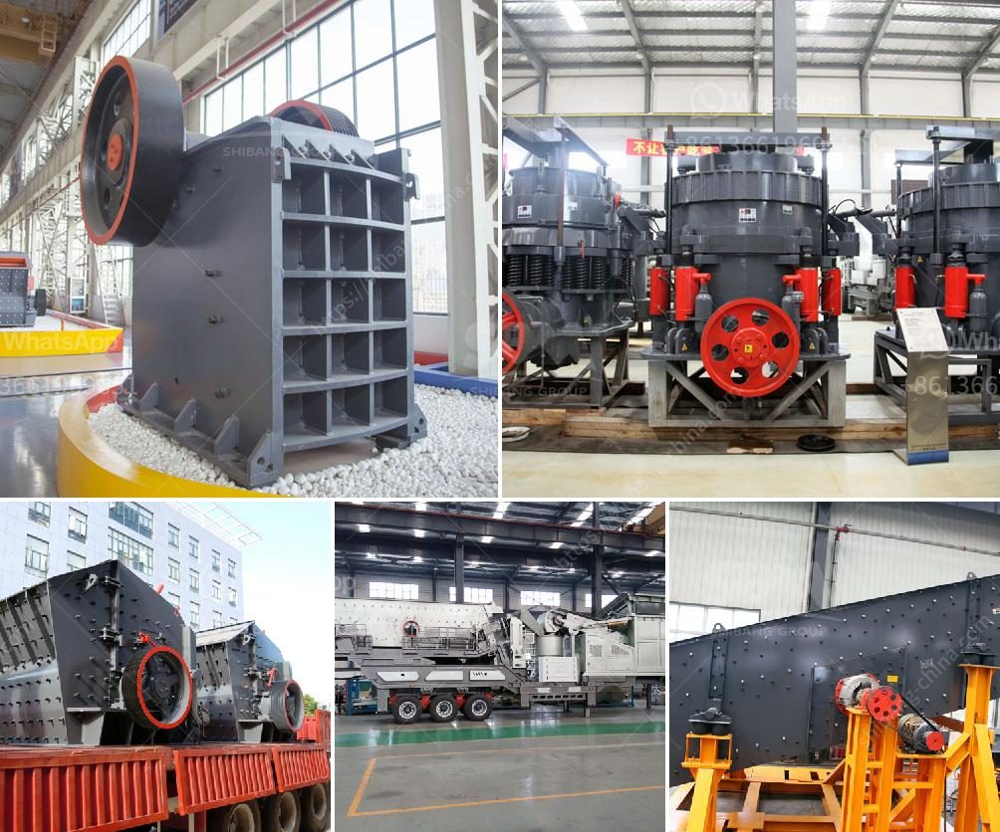

<h3>التكلفة المقدرة لإنشاء محجر</h3>
يُعتبر إنشاء محجر من أهم المشروعات الاقتصادية والصناعية التي تساهم في تنمية البنية التحتية وتوفير الموارد الطبيعية الأساسية، ولكن تحديد التكلفة المقدرة لإنشاء محجر يعتبر مهمة صعبة ومعقدة، حيث يعتمد ذلك على العوامل العديدة التي تتضمن الموقع المختار ونوعية الصخور الموجودة في المنطقة وتكنولوجيا الإنتاج المستخدمة.

أحد العوامل الرئيسية التي تؤثر على تكلفة إنشاء المحجر هو الموقع المختار. يتم اختيار الموقع استنادًا إلى قربه من مصادر الصخور وسهولة الوصول إليها ، وكذلك قربه من الأسواق والمناطق المطلوبة. قد يتطلب البعض من المحاجر العمل على مسافات طويلة لإيصال الحصى والرمل إلى أماكن الاستخدام المطلوبة، وهذا يرفع تكلفة المواصلات والوقود، وبالتالي يؤثر على التكلفة الإجمالية للمشروع.

تكون تكلفة إقامة المحجر أيضًا تحت تأثير نوعية الصخور الموجودة في المنطقة المراد استخراجها، حيث تكون تكاليف استخراج وتكسير بعض الصخور أعلى من الأخرى. يمكن أن تكون الأصوات الحجرية الصلبة أكثر صعوبة في الحصول عليها ومعالجتها، مما يتسبب في زيادة في تكاليف المعدات المطلوبة وتكلفة المواد الكيميائية والطاقة.

بالإضافة إلى ذلك، تعتمد تكلفة المحجر على التكنولوجيا المستخدمة في عمليات التعدين والتكسير والفرز. يمكن أن تكون استخدام التكنولوجيا المتقدمة تكلفة عالية في بداية المشروع، ولكنها قد تقلل من تكاليف التشغيل على المدى الطويل. بالمقابل، يمكن أن يكون تحديث المعدات وتطبيق التكنولوجيا الحديثة تحديًا ماليًا، وتستدعي تخصيص ميزانية إضافية للمشروع.

النفقات العامة الأخرى التي يجب مراعاتها عند تحديد التكلفة المقدرة لإقامة المحجر تشمل تراخيص البناء والزوايا القانونية والمالية وتكاليف تدريب وتأهيل العمالة وتأمين المحجر. بالإضافة إلى ذلك، يجب إجراء دراسة اقتصادية تعتمد على تقديرات الطلب المستقبلي على المواد الخام المنتجة من المحجر وتقدير الأرباح المتوقعة.

بشكل عام، يمكن أن تتراوح تكلفة إنشاء محجر بين 200000 دولار و 1000000 دولار أمريكي أو أكثر، وذلك حسب حجم ونطاق المشروع والعوامل المذكورة أعلاه. ومع ذلك، يجب أن يتم إجراء تقديرات دقيقة للتكلفة المقدرة مع الأخذ بعين الاعتبار كل العوامل المحتملة ومدى تأثيرها على التكلفة الإجمالية لإقامة المحجر.
<h3>Contact us</h3><ul><li><strong>Whatsapp:&nbsp;<a href="https://wa.me/8613661969651">+8613661969651</a></strong></li><li><a href="https://swt.shibang-china.com/?git&amp;zhl&amp;التكلفة المقدرة لإنشاء محجر"><strong>Online Service(chat now)</strong></a></li></ul><h3>Related</h3><ul><li><a href='قائمة أسعار إعادة تدوير زجاج كونسول للطن.md'>قائمة أسعار إعادة تدوير زجاج كونسول للطن</a></li><li><a href='كيفية صنع كسارة فك صغيرة لنفسك.md'>كيفية صنع كسارة فك صغيرة لنفسك</a></li><li><a href='آلة الجبس في ألمانيا.md'>آلة الجبس في ألمانيا</a></li><li><a href='آلات تصنيع الجبس.md'>آلات تصنيع الجبس</a></li><li><a href='موردين للرمل والحصى في سيبو.md'>موردين للرمل والحصى في سيبو</a></li></ul>