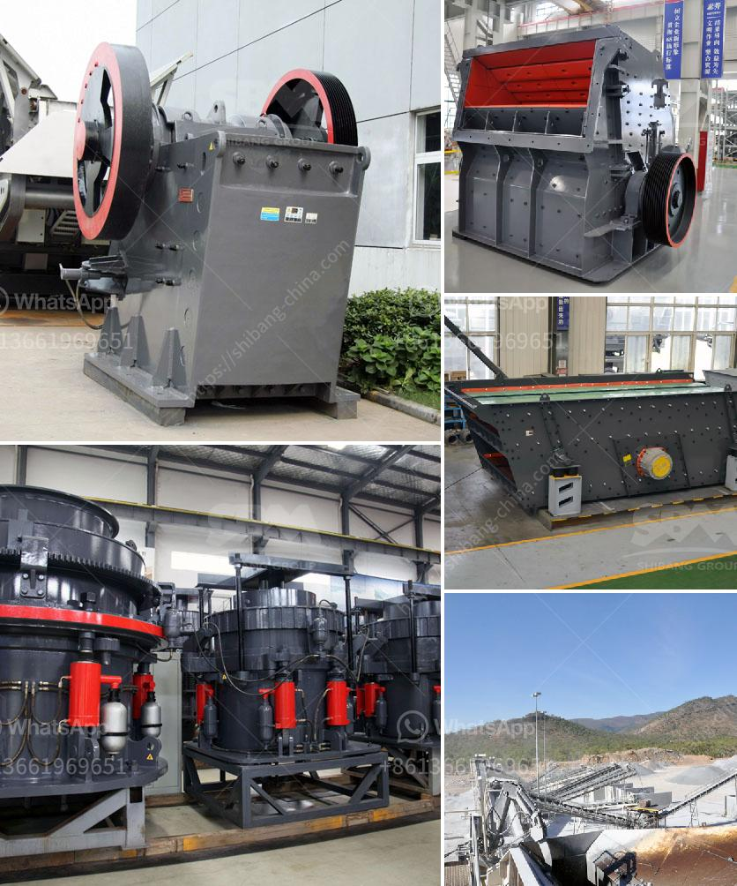

<h3>التكلفة المقدرة لإنشاء مصنع أسمنت في الهند</h3>
تعد صناعة الأسمنت من أهم الصناعات في الهند، حيث تشهد البلاد نمواً اقتصادياً مطرداً وتنمية مستمرة في قطاع البناء والتشييد. ومن هنا تظهر أهمية إنشاء مصنع أسمنت جديد في الهند.

إن التكلفة المقدرة لإنشاء مصنع أسمنت في الهند تعتمد على العديد من العوامل، بدءًا من المساحة والموقع المطلوب للمصنع، وصولًا إلى التكنولوجيا المستخدمة والسعة الإنتاجية. تختلف تكلفة إنشاء المصنع حسب الموقع، حيث تكون التكاليف أعلى في المناطق الحضرية وأقل في المناطق الريفية.

في المتوسط، يمكن أن تتراوح تكلفة إنشاء مصنع أسمنت في الهند ما بين 200 إلى 400 مليون روبية هندية. ومع ذلك، قد تتغير هذه الأرقام اعتماداً على المميزات المحددة للمصنع المطلوب، مثل سعة الإنتاج وتكنولوجيا الفرن المستخدمة والمعدات اللازمة.

من المهم أن يتم احتساب جميع التكاليف المحتملة عند تقدير تكلفة إنشاء مصنع الأسمنت، مثل تكلفة الأرض والبناء، وتكلفة شراء المعدات والآلات، وتوصيل الكهرباء والمياه، وتكاليف العمالة والتخلص من النفايات، وتكاليف التصميم والهندسة، والضرائب والرسوم.

يجب أن يتم إعداد دراسة جدوى دقيقة لتحديد التكلفة المتوقعة وتحليل الأرباح والخسائر المتوقعة للمصنع. يمكن الحصول على المساعدة من مستشارين متخصصين في صناعة الأسمنت لتقدير التكلفة بشكل صحيح وتطبيق المعايير الفنية والبيئية اللازمة.

مصانع الأسمنت في الهند تعد مصدراً هاماً للوظائف والنمو الاقتصادي. وتستجيب الحكومة الهندية بشكل إيجابي لتطوير هذا القطاع الحيوي، حيث توفر التسهيلات والإعفاءات الضريبية للشركات الراغبة في الاستثمار في صناعة الأسمنت.

في الختام، إن إنشاء مصنع أسمنت في الهند يتطلب دراسة دقيقة للتكلفة والفوائد المتوقعة. إن الاستثمار في هذا القطاع يُعَدّ فرصة مثيرة للنمو الاقتصادي وتحقيق الأرباح في الهند، وسيكون له تأثير إيجابي على القطاع البنائي والتنمية الاقتصادية في البلاد.
<h3>Contact us</h3><ul><li><strong>Whatsapp:&nbsp;<a href="https://wa.me/8613661969651">+8613661969651</a></strong></li><li><a href="https://swt.shibang-china.com/?git&amp;zhl&amp;التكلفة المقدرة لإنشاء مصنع أسمنت في الهند"><strong>Online Service(chat now)</strong></a></li></ul><h3>Related</h3><ul><li><a href='معدات سحق الجرانيت.md'>معدات سحق الجرانيت</a></li><li><a href='آلة كسارة الباريت.md'>آلة كسارة الباريت</a></li><li><a href='مطرقة الذهب المستخدمة للبيع في زيمبابوي.md'>مطرقة الذهب المستخدمة للبيع في زيمبابوي</a></li><li><a href='مصنع غسيل رمل الذهب.md'>مصنع غسيل رمل الذهب</a></li><li><a href='كيفية صنع مسحوق التلك.md'>كيفية صنع مسحوق التلك</a></li></ul>