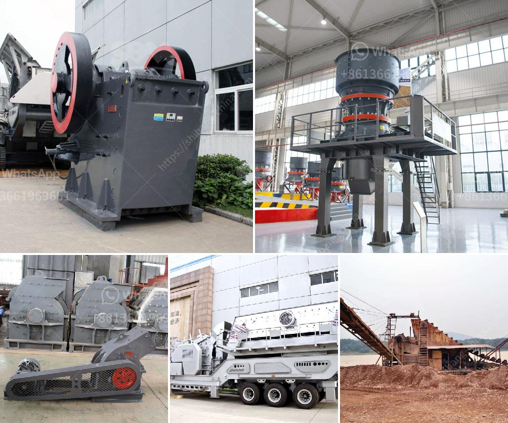

<h3>الجيوكيمياء التطبيقية لمعالجة اللميكا</h3>
تعتبر الجيوكيمياء التطبيقية أحد فروع علوم الأرض التي تركز على دراسة التفاعلات الكيميائية التي تحدث في القشرة الأرضية. في هذا السياق، تُعدّ اللميكا من المعادن الهامة التي يتم استخراجها لاستخدامات مختلفة في الصناعة والزراعة والبناء. إلا أن استخراج اللميكا يتطلب عمليات معالجة معقدة لتحويلها إلى مادة ذات جودة عالية.

يتضمن التطبيق العملي للجيوكيمياء في معالجة اللميكا العديد من الخطوات. أولاً، يتم تحديد تركيز اللميكا في العينات الأرضية باستخدام تقنيات تحليل العينات. ثم يتم اختيار طريقة معالجة مناسبة لاستخلاص اللميكا من الخامات الأرضية وتفتيتها إلى جسيمات صغيرة.

بعد الاستخلاص، يتم تطبيق تقنيات الجيوكيمياء في معالجة اللميكا لتحسين خواصها. فمن الممكن إزالة الملوثات المعدنية مثل الحديد والبوتاسيوم من خلال عمليات تبادل الأيونات والترشيح. يتم أيضًا تفعيل السطح اللميكا باستخدام مركبات كيميائية لربط الماء بالجزيئات المعدنية، مما يزيد من قدرتها على امتصاص الرطوبة.

بعد عمليات المعالجة، تُستخدم تقنيات متقدمة مثل التحليل الجيوكيميائي لتقييم جودة اللميكا المعالجة. يتم قياس تركيز العناصر الرئيسية والعناصر الملوثة الممكنة في اللميكا ومقارنتها مع المعايير الصناعية.

وفي النهاية، تستخدم اللميكا المعالجة في العديد من التطبيقات. فهي تستخدم في الصناعة السيراميكية لتحسين خواص المواد الخزفية وزيادة مرونتها ومقاومتها للحرارة. كما تستخدم في صناعة الدهانات ومواد العزل لتحسين قوة التصاقها ومقاومتها للتآكل. تُستخدم أيضًا في الصناعة الزراعية لتحسين تربة الأراضي الزراعية وزيادة قدرتها على الاحتفاظ بالماء.

باختصار، تظهر الجيوكيمياء التطبيقية أهميتها في مجال معالجة اللميكا. من خلال تحليل وتطبيق التقنيات الكيميائية المختلفة، يمكن تحسين صفات اللميكا وجعلها أكثر فعالية في استخداماتها المختلفة.
<h3>Contact us</h3><ul><li><strong>Whatsapp:&nbsp;<a href="https://wa.me/8613661969651">+8613661969651</a></strong></li><li><a href="https://swt.shibang-china.com/?git&amp;zhl&amp;الجيوكيمياء التطبيقية لمعالجة اللميكا"><strong>Online Service(chat now)</strong></a></li></ul><h3>Related</h3><ul><li><a href='كم تكلفة مصنع الكرة؟.md'>كم تكلفة مصنع الكرة؟</a></li><li><a href='سعر تشغيل المطحنة للطن في ماليزيا.md'>سعر تشغيل المطحنة للطن في ماليزيا</a></li><li><a href='كسارة مخروطية لنيجيريا.md'>كسارة مخروطية لنيجيريا</a></li><li><a href='غسيل الذهب وآلة الألماس.md'>غسيل الذهب وآلة الألماس</a></li><li><a href='عملية غسيل الرمل.md'>عملية غسيل الرمل</a></li></ul>