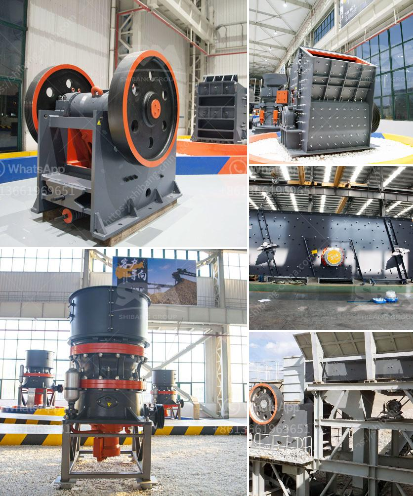

<h3>الحجر الجيري اللازم لإنتاج طن واحد من الأسمنت</h3>
يعد الحجر الجيري أحد المكونات الأساسية لإنتاج الأسمنت. فهو يشكل نسبة كبيرة في الحصى المستخدم في صناعة الإسمنت. تتراوح نسبة الحجر الجيري المستخدمة في إنتاج طن واحد من الأسمنت عادة بين 200 و 400 كيلوجرام. سنتعرف في هذه المقالة على أهمية الحجر الجيري وكيفية استخدامه في صناعة الأسمنت.

يتكون الحجر الجيري في الغالب من معدن الكالسيت ومعادن أخرى مثل الدولوميت والأرجونيت. يتم استخراج الحجر الجيري عن طريق التعدين ، حيث يتم حفر الأرض وتكسير الصخور ، ثم نقلها إلى الموقع الذي يتم فيه إنتاج الأسمنت.

عند استخلاص الحجر الجيري ، يتم وضعه في كسارة لتكسيره إلى أجزاء صغيرة. ثم ينقل إلى طاحونة الكرات حيث يتم طحنه وخلطه مع المواد الأخرى المستخدمة في إنتاج الأسمنت. تتضمن هذه المواد الأخرى الطين والسيليكا والألومينا والأكسيدات المعدنية والحديد والألومنيوم.

بعد طحن الحجر الجيري وخلطه مع المواد الأخرى ، يتم إضافة الماء لتشكيل خليط رمادي يُعرف بالطين الأسمنتي. يتم الآن نقل هذا الخليط إلى فرن الأسمنت الدوار حيث يتم تسخينه إلى درجة حرارة تصل إلى حوالي 1450 درجة مئوية.

تتم عملية التسخين في فرن الأسمنت الدوار بهدف تفاعل المواد الكيميائية المختلفة الموجودة في الخليط وتحويلها إلى مادة صلبة تُعرف بالكلنكر الأسمنتي. يتم نقل الكلنكر إلى طاحونة الأسمنت حيث يتم طحنه بالبنية الدقيقة للحصول على مسحوق الأسمنت النهائي.

بعد طحن الكلنكر ، يتم تخزين الأسمنت في أكياس أو صوامع خاصة استعدادًا للتوزيع والاستخدام في البناء والمشاريع الأخرى. يتم إزالة الحجر الجيري من الموقع الذي يتم فيه إنتاج الأسمنت بواسطة الشاحنات والناقلات الأخرى.

بصفة عامة ، يمكن القول بأن الحجر الجيري هو مادة أساسية في إنتاج الأسمنت. فهو يساعد في توليد المزيد من الحرارة أثناء التسخين في فرن الأسمنت ، وبالتالي يزيد من كفاءة عملية الإنتاج. يعمل الحجر الجيري أيضًا كعازل حراري ومادة امتصاصية للرطوبة ، مما يجعل الأسمنت أكثر دوامًا وقوة.

بالإضافة إلى ذلك ، فإن استخدام الحجر الجيري يعتبر بديلاً مستداماً للمواد الأخرى المستخدمة في صناعة الأسمنت ، مثل الصخر الزيتي والطين ، حيث يتوفر الحجر الجيري في كميات كبيرة ويستخدم بنسب معتدلة في عملية الإنتاج.

في الختام ، يعد الحجر الجيري أحد المكونات الأساسية واللازمة لإنتاج الأسمنت. حجم استخدام الحجر الجيري يتراوح عادة بين 200 و 400 كيلوجرام لإنتاج طن واحد من الأسمنت. يعمل الحجر الجيري على تعزيز كفاءة وجودة الأسمنت المُنتَج ويُعتَبَر بديلاً مستدامًا أكثر للمواد الأخرى المستخدمة في صناعة الأسمنت.
<h3>Contact us</h3><ul><li><strong>Whatsapp:&nbsp;<a href="https://wa.me/8613661969651">+8613661969651</a></strong></li><li><a href="https://swt.shibang-china.com/?git&amp;zhl&amp;الحجر الجيري اللازم لإنتاج طن واحد من الأسمنت"><strong>Online Service(chat now)</strong></a></li></ul><h3>Related</h3><ul><li><a href='كسارة فكية في بتسوانا.md'>كسارة فكية في بتسوانا</a></li><li><a href='كسارة حجر ثالثية.md'>كسارة حجر ثالثية</a></li><li><a href='آلة كسارة الحجر للبيع في نيوزيلندا.md'>آلة كسارة الحجر للبيع في نيوزيلندا</a></li><li><a href='سعر مطحنة الكرة ريموند الفائقة الدقة.md'>سعر مطحنة الكرة ريموند الفائقة الدقة</a></li><li><a href='تصميم آلة تكسير الحجر.md'>تصميم آلة تكسير الحجر</a></li></ul>