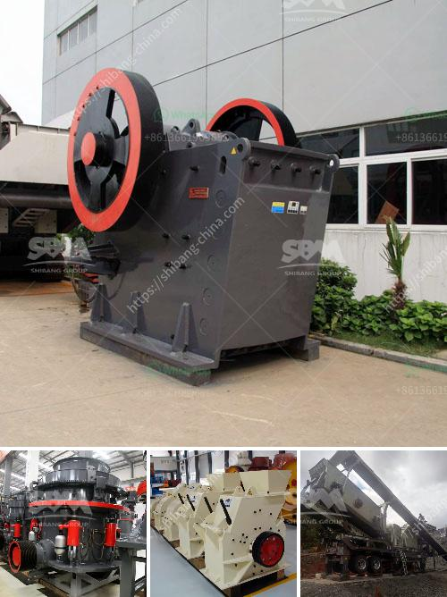

<h3>الحجر الجيري المستخدم لصنع الزجاج</h3>
يعتبر الحجر الجيري من المواد الهامة في صناعة الزجاج، حيث يستخدم كمادة خام رئيسية في عملية إنتاجه. يعد الحجر الجيري من الصخور الرسوبية التي تتكون بفعل تراكم بقايا المحيطات والبحار على مرِّ العصور. يتميز هذا الحجر بتركيبه الكيميائي الغني بنسبة عالية من أكسيد الكالسيوم (CaO) والمعروف أيضًا بالجير.

تُعتبر صناعة الزجاج من الصناعات القديمة التي تعود إلى العصور البدائية، وقد تم استخدام الحجر الجيري في عملية صنع الزجاج منذ آلاف السنين. يتم استخدام الحجر الجيري كمادة خام أساسية في عملية تصنيع الزجاج، حيث تتكون نسبة كبيرة من مكونات الزجاج من حجر الجير.

تبدأ عملية تصنيع الزجاج باختيار نوعية من الحجر الجيري ذات نسبة عالية من أكسيد الكالسيوم. يتم طحن الحجر الجيري ثم خلطه مع مواد أخرى مثل الرمل وأكسيد الصوديوم وأكسيد البوتاسيوم. يتم تسخين هذا الخليط في فرن عالي الحرارة لدرجات حرارة تصل إلى حوالي 1500 درجة مئوية.

بعد تسخين الخليط، يتم ذوبانه تحت تأثير الحرارة المرتفعة. ثم يتم تصب الزجاج الساخن في قوالب لتشكيله على شكل القطع المطلوبة. يتم تبريده سريعًا للحصول على الزجاج الصلب والشفاف.

وتعد صناعة الزجاج من الصناعات الهامة في العديد من القطاعات مثل العمارة وصناعة السيارات والإلكترونيات. يتم استخدام الزجاج في النوافذ والأبواب والشاشات التلفزيونية والأجهزة المنزلية وحتى في صناعة الهواتف المحمولة وأجهزة الكمبيوتر.

يتميز الزجاج المصنوع من الحجر الجيري بمقاومته للتآكل والتأثيرات البيئية، كما يتميز بشفافيته وقوته الميكانيكية. بالإضافة إلى ذلك، يعتبر الزجاج المصنوع من الحجر الجيري قابلًا لإعادة التدوير، مما يجعله صديقًا للبيئة ومستدامًا.

في الختام، يعد الحجر الجيري المستخدم في صناعة الزجاج مادة هامة وأساسية في عملية إنتاج الزجاج. يعتبر الزجاج منتجًا لا غنى عنه في العديد من الصناعات، ويتميز بخصائصه المميزة مثل الشفافية والقوة الميكانيكية. كما يعتبر الزجاج المصنوع من الحجر الجيري صديقًا للبيئة نظرًا لإمكانية إعادة تدويره واستدامته.
<h3>Contact us</h3><ul><li><strong>Whatsapp:&nbsp;<a href="https://wa.me/8613661969651">+8613661969651</a></strong></li><li><a href="https://swt.shibang-china.com/?git&amp;zhl&amp;الحجر الجيري المستخدم لصنع الزجاج"><strong>Online Service(chat now)</strong></a></li></ul><h3>Related</h3><ul><li><a href='آلة سحق نقاء الشورا.md'>آلة سحق نقاء الشورا</a></li><li><a href='عملية الحجر الجيري.md'>عملية الحجر الجيري</a></li><li><a href='منتجات آلات الكتل الطينية.md'>منتجات آلات الكتل الطينية</a></li><li><a href='مصنعو آلات تكسير الحجر.md'>مصنعو آلات تكسير الحجر</a></li><li><a href='كسارات فك متنقلة للبيع في المملكة المتحدة.md'>كسارات فك متنقلة للبيع في المملكة المتحدة</a></li></ul>