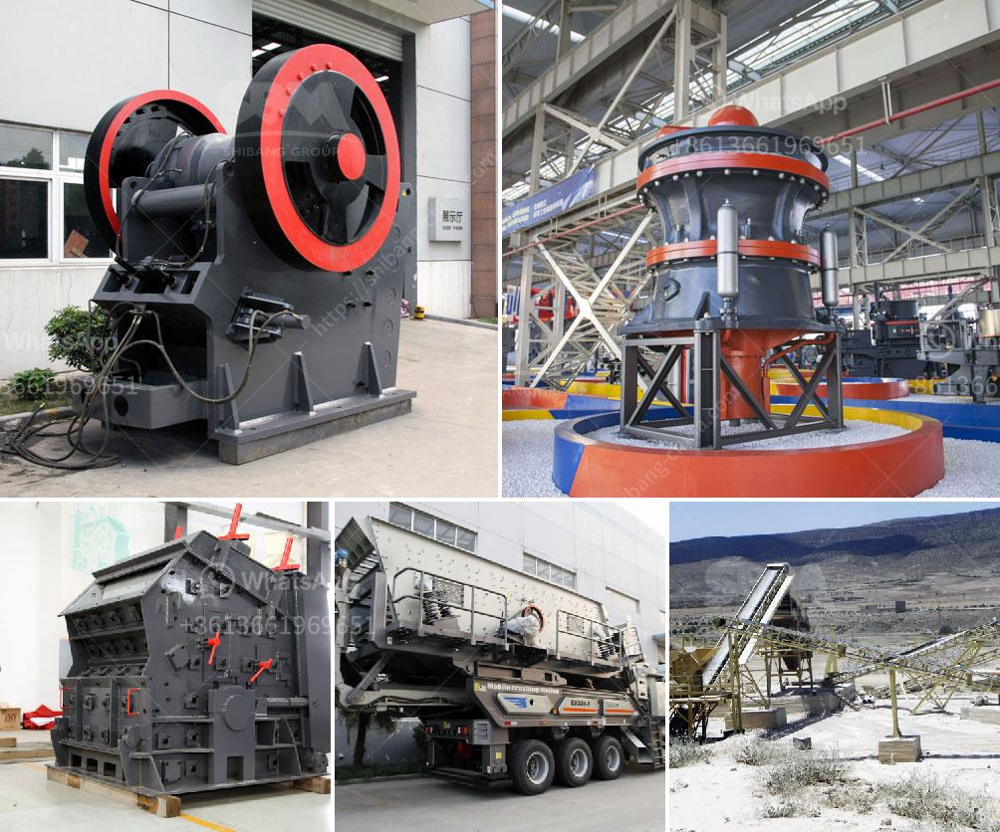

<h3>الحجم في مطاحن طحن الأسمنت</h3>
تعتبر مطاحن طحن الأسمنت من المحطات الهامة في صناعة البناء والإنشاء. ومن العوامل التي تؤثر على عملية الطحن هو الحجم الذي يتم استخدامه في المطحنة. يتم تحميل الأسمنت في المطحنة بواسطة الحجارة الكبيرة، وبعدها يتم طحنها للحصول على الحجم المطلوب.

تأثير الحجم في عملية طحن الأسمنت هو أمر حاسم. فالحجم الصحيح يجب أن يكون متوافقًا مع نوعية الأسمنت المراد إنتاجه واستخداماته المقترحة. على سبيل المثال، إذا كان هدفك إنتاج أسمنت عالي الجودة للاستخدام في البناء والهياكل الأساسية، فيجب أن يكون لديك حجم يكون وفقًا للمعايير الصناعية المعتمدة.

ويؤثر الحجم أيضًا على أداء المطحنة وكفاءتها. فإذا كان الحجم كبيرًا جدًا، فقد يؤثر ذلك سلبًا على قدرة المطحنة في طحن الأسمنت بشكل سلس ومتجانس. بالإضافة إلى ذلك، يجب أن يتم اختيار الحجم المناسب لتجنب تلف المطحنة وزيادة التكاليف التشغيلية.

عملية التحكم في الحجم بدقة هو أمر ضروري في مطاحن طحن الأسمنت. وتتم هذه العملية بواسطة عدة آليات متطورة تعمل على قياس ورصد وضبط حجم الأسمنت المطحون. فالتحكم الجيد في الحجم يساهم في تحسين جودة الأسمنت النهائي وضمان أداء عالي في المواد الإنشائية.

بصفة عامة، فإن الحجم المثلى لطحن الأسمنت يختلف حسب المواصفات الفنية الخاصة بالمشروع او الصناعة المطلوبة استخدام الأسمنت فيها، ويمكن للمهندسين المختصين في صناعة الأسمنت تقديم التوجيهات المناسبة حسب الحاجة والاستخدام المفترض للأسمنت.

في الختام، يمكن القول أن الحجم له دور حاسم في عملية طحن الأسمنت، حيث يؤثر على جودة الأسمنت وكفاءة المطحنة. وعلى الرغم من أنه ليس هناك حجم واحد يناسب جميع الأغراض، إلا أنه من الضروري اختيار الحجم المناسب وفقًا لمعايير الصناعة والاستخدام المطلوب.
<h3>Contact us</h3><ul><li><strong>Whatsapp:&nbsp;<a href="https://wa.me/8613661969651">+8613661969651</a></strong></li><li><a href="https://swt.shibang-china.com/?git&amp;zhl&amp;الحجم في مطاحن طحن الأسمنت"><strong>Online Service(chat now)</strong></a></li></ul><h3>Related</h3><ul><li><a href='سؤال حول عملية الطحن بالكرات.md'>سؤال حول عملية الطحن بالكرات</a></li><li><a href='طحن الفلدسبار للغراز.md'>طحن الفلدسبار للغراز</a></li><li><a href='كسارة فك الحجر الجيري للبيع.md'>كسارة فك الحجر الجيري للبيع</a></li><li><a href='مصنع معالجة أكسيد النحاس.md'>مصنع معالجة أكسيد النحاس</a></li><li><a href='آلة كسارة حجر الجرانيت في تايلاند.md'>آلة كسارة حجر الجرانيت في تايلاند</a></li></ul>