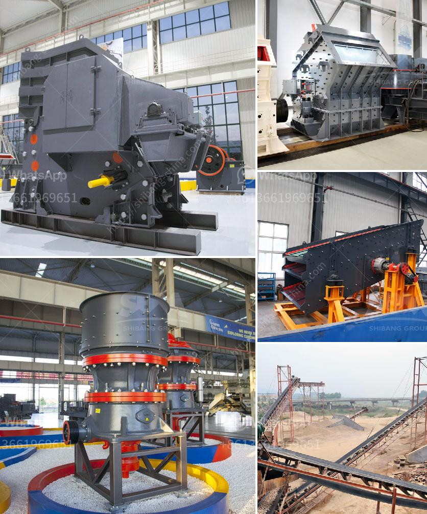

<h3>الدوران الروتوري لكسارة الحجر الجيري</h3>
تعد كسارة الحجر الجيري أحد الأدوات الرئيسية التي تستخدم في صناعة البناء والطرق لتكسير وطحن الحجارة الجيرية إلى حجم أصغر. ويعتبر الدوران الروتوري أحد العوامل المهمة في أداء كسارة الحجر الجيري.

يتميز الدوران الروتوري بتأثيره المباشر على عملية التكسير والطحن. يتمتع الروتوري بقدرته على توليد القوة والطاقة المطلوبة لتكسير الحجارة وتحويلها إلى حجم أصغر. يتم تحقيق ذلك عن طريق تشغيل الروتوري بسرعة محددة تساعد على ضرب الحجارة بشكل قوي وسريع عند مرورها من خلال الكسارة.

بالإضافة إلى ذلك، يعتبر الدوران الروتوري عاملاً مهمًا في تحقيق الكفاءة العالية لكسارة الحجر الجيري. فعندما يتحرك الروتوري بسرعة عالية، فإنه يقوم بتحطيم الحجارة الجيرية بشكل أكثر فعالية وسهولة. وبالتالي، يتمكن الروتوري من تحويل المواد الصلبة والكبيرة إلى حجم أصغر بسهولة وفعالية. هذا يقلل من تكاليف التشغيل وزمن التصنيع اللازم لتكسير الحجارة.

علاوة على ذلك، يُعتبر الدوران الروتوري محوريًا في تحقيق نسبة التكسير المطلوبة. بالنسبة للحجارة الجيرية، يجب أن يتم تكسيرها بحيث تتميز بحجم جيد وتحتوي على حبيبات صغيرة وموحدة. وبفضل الدوران الروتوري، يتمكن من تقديم قوة مستمرة ومنتظمة لتحقيق هذه النتيجة.

في النهاية، يمكن القول إن الدوران الروتوري لكسارة الحجر الجيري يلعب دورًا حاسمًا في أداء الكسارة والحصول على منتج نهائي ذو جودة عالية. يعمل الروتوري على تحويل الحجارة الجيرية الكبيرة إلى حجم أصغر بكفاءة عالية، ويقوم بتحطيمها وطحنها بسرعة وبشكل متساوٍ. كما يحقق الروتوري النسبة المثلى للتكسير من أجل الحصول على حجم هندسي مطلوب.
<h3>Contact us</h3><ul><li><strong>Whatsapp:&nbsp;<a href="https://wa.me/8613661969651">+8613661969651</a></strong></li><li><a href="https://swt.shibang-china.com/?git&amp;zhl&amp;الدوران الروتوري لكسارة الحجر الجيري"><strong>Online Service(chat now)</strong></a></li></ul><h3>Related</h3><ul><li><a href='محطة تكسير الصخور.md'>محطة تكسير الصخور</a></li><li><a href='إغلاق محطة الكسارة.md'>إغلاق محطة الكسارة</a></li><li><a href='شركة كسارة في دبي.md'>شركة كسارة في دبي</a></li><li><a href='مصانع فحص الركام.md'>مصانع فحص الركام</a></li><li><a href='مصنع مطحنة الكرة للأسطوانة.md'>مصنع مطحنة الكرة للأسطوانة</a></li></ul>