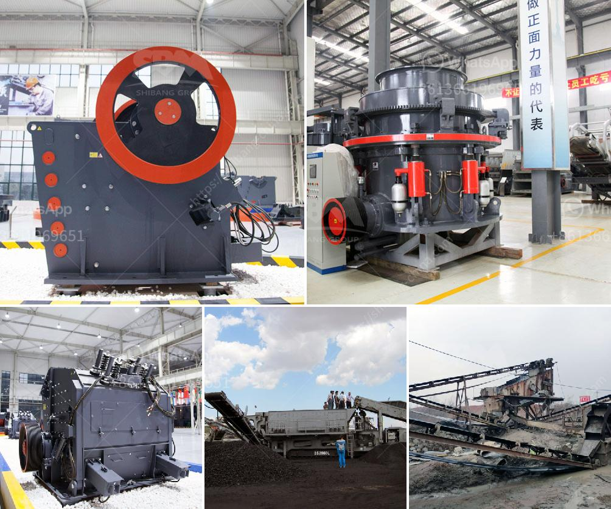

<h3>الديسيبلات التي تنشأ عن كسارة الفك هيبرو</h3>
تسبب كسارات الفك هايبرو في إنتاج الكثير من الديسيبلات التي تؤثر على البيئة وصحة الإنسان. يعد إنتاج الصوت عند تشغيل الكسارة من الأمور البارزة التي يجب أخذها في الاعتبار عند استخدام هذه الآلة.

تعتبر الديسيبلات وحدة قياس لكمية الضجيج أو الصوت التي تنتجها المعدات الثقيلة. وتحدد الديسيبلات مستوى الصوت المسموع من قبل الإنسان. عندما يصل مستوى الديسيبلات إلى ما بين 85 إلى 90 ديسيبل، فإنه يمكن أن يؤثر سلباً على الصحة ويتسبب في ضعف السمع والشعور بالتوتر والإرهاق.

تنبعث الديسيبلات من الكسارة نتيجة لحركة الكسارة واصطدام الصخور والحجارة مع بعضها البعض. وتزداد الديسيبلات كلما ارتفعت سرعة حركة الكسارة وحجم الصخور التي تتحطم. ويمكن أن تصل الديسيبلات إلى مستويات عالية جداً تصل إلى 115 ديسيبل وقد تسبب ضررا جسيما للإنسان والحيوانات والطيور المحيطة.

بالإضافة إلى ذلك، يجب النظر في تأثير الديسيبلات على البيئة المحيطة. فتزيد الديسيبلات من الإجهاد على الحيوانات وتؤثر سلباً على سلوكها وصحتها. وتتسبب الديسيبلات العالية أيضاً في إزعاج الطيور المحلية والتأثير على ممارساتها الحيوية مثل التكاثر والهجرة.

للحد من الديسيبلات الناتجة عن كسارات الفك هايبرو، يجب اتخاذ بعض الإجراءات الوقائية. يمكن تثبيت المجمعات الصوتية التي تعمل على امتصاص الصوت وتقليل الديسيبلات الصادرة من الكسارة. كما يمكن استخدام العوازل الصوتية لتقليل صدى الصوت وإحجام انتشاره في المناطق المحيطة.

علاوة على ذلك، يجب على المشغلين والعمال الذين يعملون بالقرب من كسارة الفك هايبرو ارتداء وسائل الوقاية الشخصية مثل ماعز وسدادات الأذن لتقليل تعرضهم للديسيبلات الضارة.

في الختام، يتطلب استخدام كسارة الفك هايبرو اتخاذ إجراءات ووسائل حماية للحد من إنتاج الديسيبلات العالية المؤذية للصحة والبيئة. يجب أن تتوافر الإرشادات اللازمة والتدريب المناسب للعمال لضمان تطبيق الاحتياطات اللازمة وتعزيز السلامة والحفاظ على الصحة للجميع.
<h3>Contact us</h3><ul><li><strong>Whatsapp:&nbsp;<a href="https://wa.me/8613661969651">+8613661969651</a></strong></li><li><a href="https://swt.shibang-china.com/?git&amp;zhl&amp;الديسيبلات التي تنشأ عن كسارة الفك هيبرو"><strong>Online Service(chat now)</strong></a></li></ul><h3>Related</h3><ul><li><a href='مصنع آلات كسارة الحجر الماسي في الهند.md'>مصنع آلات كسارة الحجر الماسي في الهند</a></li><li><a href='كسارة المحجر في الفلبين للبيع.md'>كسارة المحجر في الفلبين للبيع</a></li><li><a href='آلة طحن مطحنة الرمل السيليكا.md'>آلة طحن مطحنة الرمل السيليكا</a></li><li><a href='طاحونة الكرة 800 طن يومياً.md'>طاحونة الكرة 800 طن يومياً</a></li><li><a href='سعر آلة كسارة المحجر.md'>سعر آلة كسارة المحجر</a></li></ul>