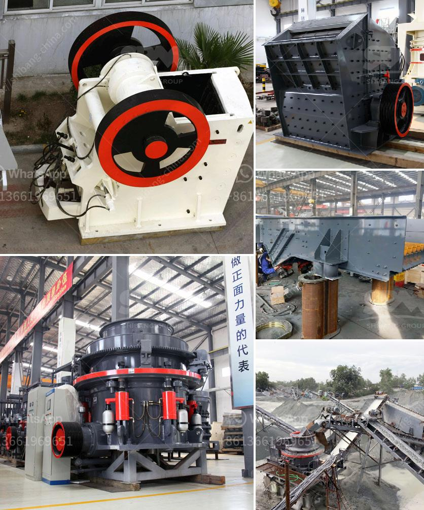

<h3>الرمل المصنع مقابل الرمل الطبيعي</h3>
الرمل محطة ضرورية في البناء، إذ يستخدم في الكثير من الأغراض مثل صنع الخرسانة والأسمنت وتمهيد الطرق والأعمال الحفرية والزراعة وتنظيف السطوح. وهناك نوعان رئيسيان من الرمال المستخدمة في هذه الأغراض: الرمل الطبيعي والرمل المصنع.

الرمل الطبيعي هو الرمل الذي يتم استخراجه من الأنهار أو البحار أو المحاجر. يتم فصله عن الأتربة والصخور الأخرى وتنقيته للحصول على حبيبات الرمل المناسبة للاستخدام في البناء. وعلى الرغم من كون الرمل الطبيعي قابل للاستخدام، فإنه يعاني من بعض المشاكل التي يمكن تفاديها باستخدام الرمل المصنع.

من السلبيات الرئيسية للرمل الطبيعي هو أنه يأخذ وقتًا طويلاً للعثور على مصدر مناسب للرمل واستخراجه، مما يؤدي إلى تأخر في مشاريع البناء. بالإضافة إلى ذلك، فإن استخراج الرمل الطبيعي قد يسبب تأثيرات بيئية سلبية على المنطقة القريبة من مصدر الاستخراج بسبب التحرك الأرضي وتدمير المواطن الطبيعية. وهذا يؤثر على النظام البيئي والحياة النباتية والحيوانية في المنطقة، ويترك الأراضي بدون موارد مناسبة للاستخدام المستقبلي.

ومع ذلك، يتم إنتاج الرمل المصنع من الصخور الصلبة مثل الجرانيت والحصى الطبيعية، ويتم تكسير هذه الصخور وفصل الرمال للحصول على حبيبات الرمل المناسبة للاستخدام في البناء. الرمل المصنع يمتلك حبيبات موحدة الحجم ومتجانسة، مما يعزز قوة الخرسانة ويسهم في تحسين تماسكها ومتانتها. كما أن الرمل المصنع قابل للتحكم في حجم الحبيبات والتركيبة الكيميائية، مما يساعد في ضمان أداء مثالي للخرسانة وتحقيق الخصائص المطلوبة لمشروع البناء.

بالإضافة إلى ذلك، يمكن الاعتماد على الرمل المصنع في أي وقت وفي أي مكان، مما يجعل العملية أكثر كفاءة وسرعة في مشاريع البناء. فلا حاجة للانتظار للعثور على مصادر الرمل الطبيعي أو لاستخراجه وتنقيته، بل يمكن توفير الرمل المصنع بشكل مستدام وفي الكمية المطلوبة.

وفي النهاية، يمكن القول أن الرمل المصنع يوفر حلاً مستداماً وفعالاً لاستخدام الرمل في مشاريع البناء. يمتاز بجودته وكفاءته وقابليته للتحكم، ويساهم في تقليل التأثيرات البيئية السلبية التي تنجم عن استخراج الرمل الطبيعي. لذا، يمكن اعتبار الرمل المصنع الخيار الأمثل لمشاريع البناء الحديثة.
<h3>Contact us</h3><ul><li><strong>Whatsapp:&nbsp;<a href="https://wa.me/8613661969651">+8613661969651</a></strong></li><li><a href="https://swt.shibang-china.com/?git&amp;zhl&amp;الرمل المصنع مقابل الرمل الطبيعي"><strong>Online Service(chat now)</strong></a></li></ul><h3>Related</h3><ul><li><a href='تصميم مصنع تكسير وتخطيطه.md'>تصميم مصنع تكسير وتخطيطه</a></li><li><a href='آلة صنع مسحوق الدولوميت لخط الإنتاج.md'>آلة صنع مسحوق الدولوميت لخط الإنتاج</a></li><li><a href='تصميم مصانع التكسير الصناعية.md'>تصميم مصانع التكسير الصناعية</a></li><li><a href='مصنعي كسارات التعدين.md'>مصنعي كسارات التعدين</a></li><li><a href='معدات فاصل المغناطيس للبيع.md'>معدات فاصل المغناطيس للبيع</a></li></ul>