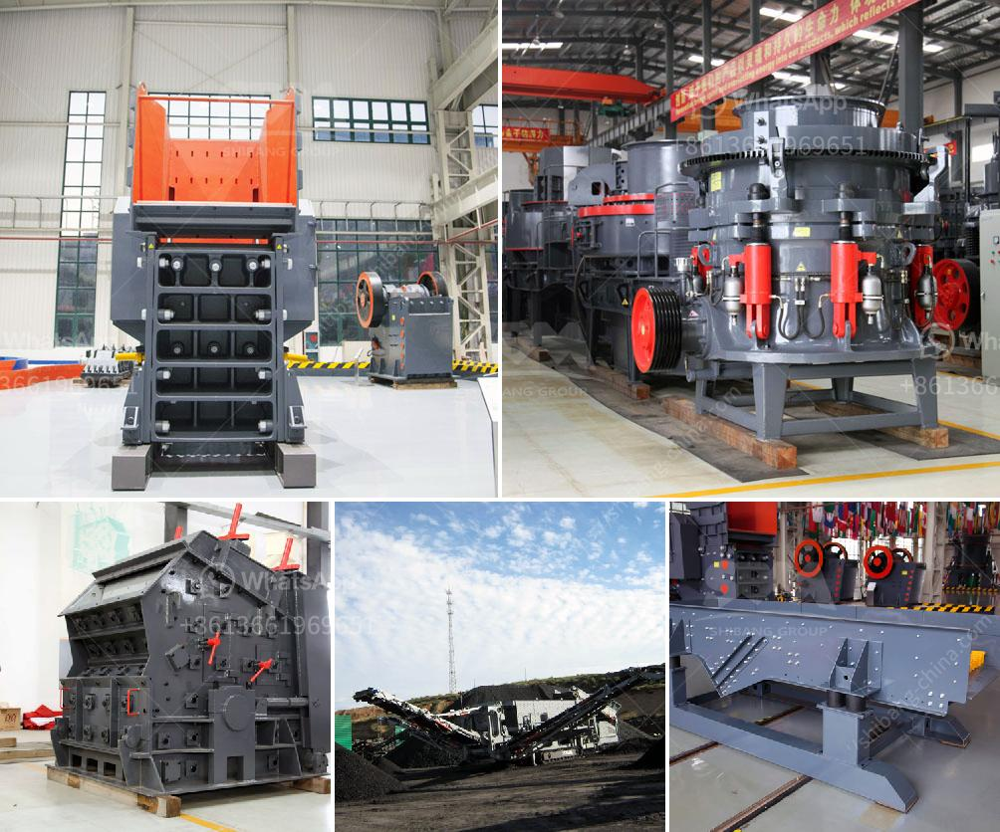

<h3>السحق النبات هو</h3>
يعتبر السحق النبات واحدًا من أكثر العمليات استخدامًا في صناعة المواد الغذائية والزراعة. فهو عبارة عن عملية تهدف إلى تكسير النباتات وتفتيتها إلى جزيئات صغيرة بغرض الحصول على منتج نهائي يمكن استخدامه بشكل فعال.

تُعتبر عملية السحق النبات من الخطوات الرئيسية في تصنيع العديد من المنتجات الغذائية مثل المعجنات والحلويات والشوكولاتة وغيرها. حيث يتم سحق المكونات الأساسية مثل الحبوب والبذور والتوابل وغيرها من المكونات لتحقيق قوام مطلوب. يمكن أن يكون السحق سطحيًا، حيث يؤدي إلى تكسير النباتات بشكل خشن، أو يمكن أن يكون عميقًا، حيث يؤدي إلى تحويل النباتات إلى مسحوق.

تُستخدم معدات السحق المتطورة في صناعة المواد الغذائية لتحقيق عملية سحق نباتات فعالة وسريعة. تُستخدم المطاحن والكسارات والخلاطات لتحويل النباتات إلى جزيئات صغيرة. يعتبر السحق عن طريق الفرم هو الطريقة الأكثر استخدامًا في صناعة المواد الغذائية حيث تؤدي إلى تكسير النباتات بشكل كافٍ وسريع.

توفر العديد من الفوائد لاستخدام السحق النبات في صناعة المواد الغذائية. فأولًا، يعزز السحق النبات من التوزيع المتساوي للمكونات النباتية في المنتج النهائي، مما يؤدي إلى تحسين جودة المنتج. ثانيًا، يساعد السحق على تحرير المواد القيمة من النباتات مثل العصير والزيوت والمواد الغذائية الأخرى الموجودة فيها. هذا يؤدي إلى زيادة قيمة التغذية للمنتج النهائي. ثالثًا، يزيد السحق النبات من مساحة سطح النباتات المتاحة للتفاعل وامتصاص المحاليل الكيميائية، مما يسهم في تسهيل وتحسين العمليات اللاحقة أثناء إجراءات التحلل الكيميائي.

وفي الختام، يُعَدّ سحق النبات عملية حاسمة في صناعة المواد الغذائية والزراعة. فهو يسهم في تحسين جودة المنتجات الغذائية، وزيادة قيمتها التغذوية، وتيسير العمليات اللاحقة. مع استمرار التطور في التكنولوجيا، فإن العديد من الابتكارات والتحسينات يتم إدخالها إلى صناعة السحق النبات، مما يعزز كفاءتها ويسهم في تحسين صحتنا وجودتنا المعيشية.
<h3>Contact us</h3><ul><li><strong>Whatsapp:&nbsp;<a href="https://wa.me/8613661969651">+8613661969651</a></strong></li><li><a href="https://swt.shibang-china.com/?git&amp;zhl&amp;السحق النبات هو"><strong>Online Service(chat now)</strong></a></li></ul><h3>Related</h3><ul><li><a href='مطاحن الكرة للتعدين.md'>مطاحن الكرة للتعدين</a></li><li><a href='عملية كولمان للطحن.md'>عملية كولمان للطحن</a></li><li><a href='مصانع مطاحن الأسمنت.md'>مصانع مطاحن الأسمنت</a></li><li><a href='البحث عن معدات تجهيز الفحم الصغيرة.md'>البحث عن معدات تجهيز الفحم الصغيرة</a></li><li><a href='آلات كسارة للبيع.md'>آلات كسارة للبيع</a></li></ul>