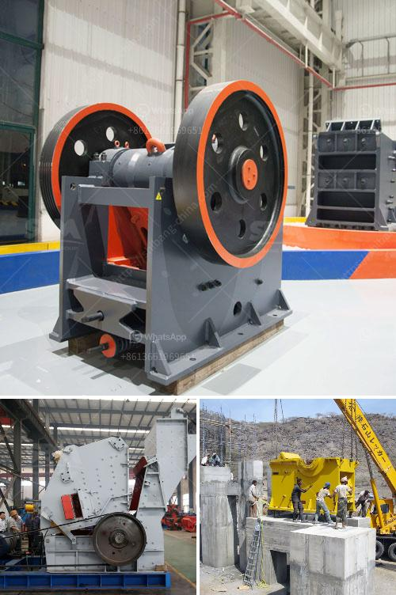

<h3>السعر على مطحنة التعدين 10 طن في الساعة</h3>
مطحنة التعدين هي جهاز مهم في صناعة التعدين، حيث تستخدم المطاحن لطحن الخامات وتحويلها إلى حبيبات صغيرة يسهل التعامل معها. واحدة من أهم العوامل التي ينبغي مراعاتها عند شراء مطحنة التعدين هي السعر.

تتراوح أسعار مطاحن التعدين من حيث السعة بين 200 و400 دولار للطن في الساعة، وهذا يعتمد على العديد من العوامل مثل العلامة التجارية، والجودة، والقوة العاملة، والتكنولوجيا المستخدمة.

يمكن أن تتراوح أسعار المطاحن ذات السعة الأكبر، التي تصل إلى 10 طن في الساعة، بين 200,000 و 400,000 دولار. هنا يتواجد الفرق الكبير في السعر وهذا يعود إلى قوة المحرك ومستوى التكنولوجيا المستخدمة والمواد المستخدمة في البناء.

عند اختيار مطحنة التعدين، يجب على المشتري أخذ بعين الاعتبار أهدافه وميزانيته. يمكن أن يكون سعر الطن في الساعة دليلاً على كفاءة المطحنة، لكن يجب مراعاة أيضًا جودة المنتج النهائي وكفاءة العملية بشكل عام. يمكن لمطحنة تعدين ذات سعر منخفض أن تكون أقل كفاءة وتستخدم تكنولوجيا قديمة، بينما يمكن أن تكلف مطاحن التعدين ذات السعر العالي أكثر، ولكنها توفر جودة وأداء أفضل.

بالنهاية، فإن الاختيار يعتمد على موارد المشتري واحتياجاته، حيث يتعين على المشتري تحديد ميزانيته وتحديد الأولويات. قد يكون الاستثمار في مطحنة تعدين ذات سعر عالٍ هو الخيار المناسب لمن يهدف إلى تحقيق أعلى كفاءة وجودة، بينما قد تكون مطاحن التعدين ذات السعر المنخفض مناسبة لأولئك الذين لديهم موارد محدودة ولا يشترون مطحنة للاستخدام المستمر والكثيف. إن استشارة خبراء المجال والحصول على النصائح المناسبة يمكن أن تساعد المشتري في اتخاذ القرار الأفضل والأكثر استدامة.
<h3>Contact us</h3><ul><li><strong>Whatsapp:&nbsp;<a href="https://wa.me/8613661969651">+8613661969651</a></strong></li><li><a href="https://swt.shibang-china.com/?git&amp;zhl&amp;السعر على مطحنة التعدين 10 طن في الساعة"><strong>Online Service(chat now)</strong></a></li></ul><h3>Related</h3><ul><li><a href='كسارة الحجر في المغرب.md'>كسارة الحجر في المغرب</a></li><li><a href='كسارات تأجير.md'>كسارات تأجير</a></li><li><a href='مطحنة الكرة الثقيلة الوزن في الهند.md'>مطحنة الكرة الثقيلة الوزن في الهند</a></li><li><a href='مصنع تكسير الكروم.md'>مصنع تكسير الكروم</a></li><li><a href='قائمة مصانع حبيبات خام الحديد في الهند.md'>قائمة مصانع حبيبات خام الحديد في الهند</a></li></ul>