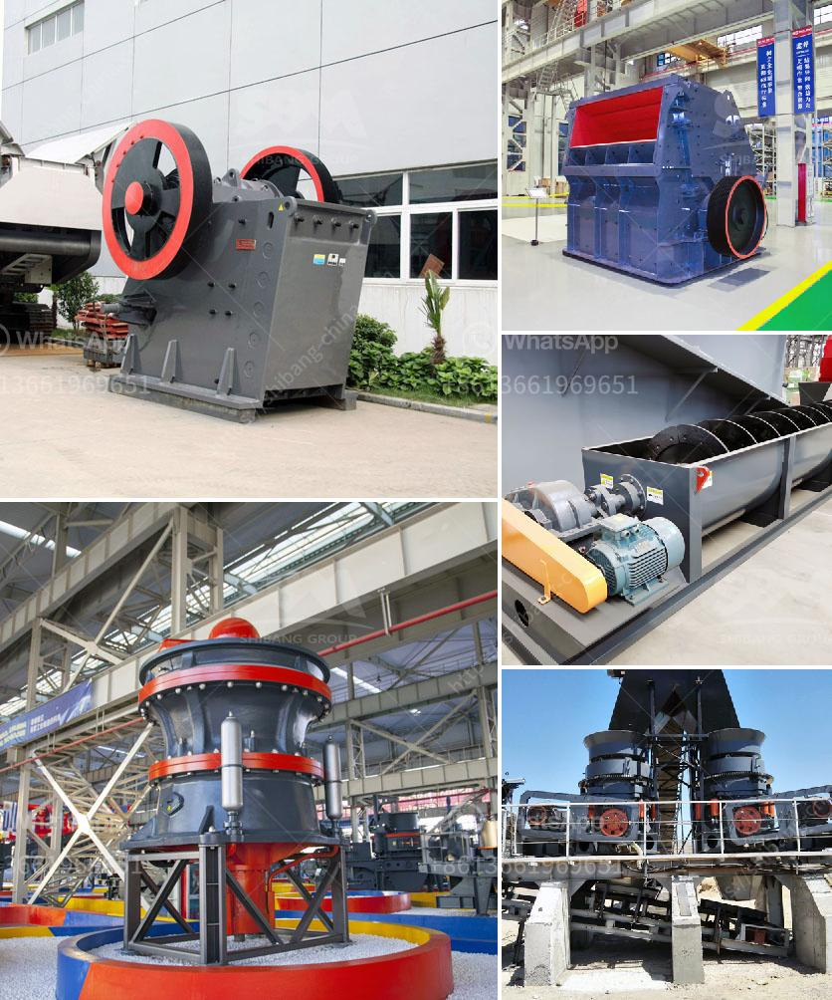

<h3>الشاشات الاهتزازية في إيطاليا</h3>
تُعتبر الشاشات الاهتزازية في إيطاليا واحدة من المعالم السياحية البارزة التي تجذب الزوار من جميع أنحاء العالم. توفر هذه الشاشات تجربة فريدة وممتعة للسياح والزائرين، حيث يمكنهم الاستمتاع بمشاهدة أفلام مدهشة وإحساس بالحركة والتشويق.

تعتبر المدينة الإيطالية "بيرجامو" واحدة من أبرز الوجهات التي تتميز بالشاشات الاهتزازية. تم تأسيس هذه الشاشات في منتصف القرن العشرين، وتم تحديثها وتطويرها بشكل مستمر لتلبية متطلبات الزوار.

تتميز الشاشات الاهتزازية بتقنية عرض ثلاثية الأبعاد وأصوات محيطية واقعية، مما يخلق تجربة سينمائية فريدة. وبالإضافة إلى ذلك، تتماشى الشاشات الاهتزازية مع حركة الفيلم المعروض، وتعمل على نقل الجمهور إلى عالم الفيلم الذي يبدو وكأنه حقيقة.

يمكن للزوار الاستمتاع بمجموعة متنوعة من الأفلام والبرامج التي تعرض على هذه الشاشات الاهتزازية. تشمل هذه الأفلام الأكشن والمغامرات والأفلام الهوليودية الأخرى ذات المؤثرات الخاصة المبهرة. بفضل التقنية المتطورة والتجارب الممتعة، تحظى الشاشات الاهتزازية بشعبية كبيرة بين الشباب والعائلات ومحبي الأفلام.

تعد الاستعراضات المجسمة من أعمال فنية ومشاهد تاريخية شائعة أيضًا في الشاشات الاهتزازية. حيث يمكن للزوار الحصول على لمحة أفضل وأوضح عن الأماكن التاريخية والثقافية الموجودة في إيطاليا. وتعمل هذه الشاشات الاهتزازية على تجسيد القصص والتاريخ المتعلق بتلك المعالم بشكل وثيق وحماسي.

تعتبر الشاشات الاهتزازية في إيطاليا تحفة فنية تسحر الزوار من خلال التكنولوجيا المتطورة والتجارب السينمائية الواقعية. توفر هذه الشاشات تجربة تفاعلية لا تنسى للزوار، حيث يستطيعون أن يشعروا بالحركة والإثارة وكأنهم يعيشون في عالم الفيلم نفسه. إذا كنت تخطط لزيارة إيطاليا في المستقبل، فإن الشاشات الاهتزازية يجب أن تكون في قائمة الأماكن التي يجب عليك زيارتها.
<h3>Contact us</h3><ul><li><strong>Whatsapp:&nbsp;<a href="https://wa.me/8613661969651">+8613661969651</a></strong></li><li><a href="https://swt.shibang-china.com/?git&amp;zhl&amp;الشاشات الاهتزازية في إيطاليا"><strong>Online Service(chat now)</strong></a></li></ul><h3>Related</h3><ul><li><a href='كسارة محمولة مستعملة للبيع في جنوب أفريقيا.md'>كسارة محمولة مستعملة للبيع في جنوب أفريقيا</a></li><li><a href='مواصفات كسارة المخروط.md'>مواصفات كسارة المخروط</a></li><li><a href='تكلفة كسارة السيليكا.md'>تكلفة كسارة السيليكا</a></li><li><a href='استشاريو تحسين خام الحديد في الهند.md'>استشاريو تحسين خام الحديد في الهند</a></li><li><a href='مصنع تكسير خام البوكسيت.md'>مصنع تكسير خام البوكسيت</a></li></ul>