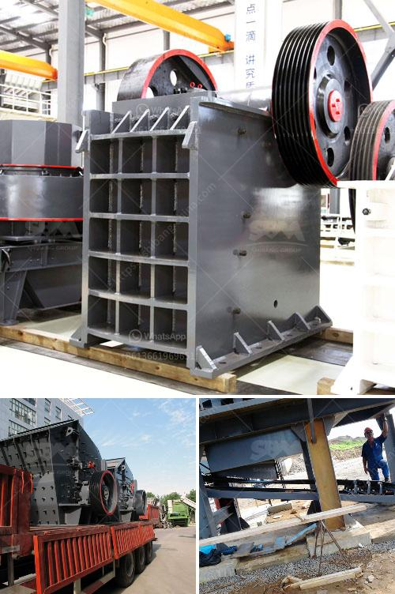

<h3>الشركات التي تبيع كسارة الفك في كينيا</h3>
كسارة الفك هي أحد أهم الأدوات في صناعة التعدين والبناء. تستخدم لسحق المواد الخام إلى حجم أصغر قبل استخدامها في عمليات الإنتاج. في كينيا، هناك العديد من الشركات التي تبيع كسارات الفك بجودة عالية وأسعار مناسبة.

إحدى الشركات الرائدة في هذا المجال في كينيا هي شركة "كسارات كينيا". تعتبر الشركة واحدة من أكبر الشركات المتخصصة في تصنيع وبيع كسارات الفك في البلاد. توفر الشركة مجموعة واسعة من الكسارات، وتطور بشكل مستمر تقنيات التصنيع لتوفير كسارات عالية الجودة وفعالة في أداء عمليات السحق.

تعتبر كسارات كينيا وسيلة فعالة لتحقيق الإنتاجية العالية لعملائها. تستخدم تقنيات حديثة لتصميم وتصنيع كساراتها، مما يسمح بتكسير المواد الخام بكفاءة عالية وسرعة. كما تلتزم الشركة بتقديم خدمات ما بعد البيع الممتازة لضمان رضا العملاء وتلبية احتياجاتهم.

تهتم شركة كسارات كينيا أيضًا بمساهمة في حماية البيئة وتنفيذ ممارسات الإنتاج المستدام. تستخدم تكنولوجيا حديثة للتحكم في انبعاثات الغبار والضوضاء الناتجة عن عمليات السحق. هذا يضمن تقليل التأثير البيئي السلبي والحفاظ على الصحة العامة في المناطق المجاورة لمواقع التشغيل.

بالإضافة إلى ذلك، تقدم شركة كسارات كينيا خيارات متنوعة للعملاء فيما يتعلق بحجم وقدرة الكسارات. تباع كسارات الفك بأحجام مختلفة وتستخدم لعمليات سحق مختلفة، مثل سحق خامات المعادن والحجارة وغيرها. تغطي الشركة أيضًا المجال الزراعي وتوفر كسارات خاصة بسحق المواد الزراعية مثل الحبوب وقش الأرز.

بالنظر إلى الأسعار، فإن كسارات كينيا توفر مجموعة متنوعة من المنتجات بأسعار تتراوح بين 200 و400 دولار. يمكن للعملاء اختيار الطراز الملائم وفقًا لاحتياجاتهم وميزانيتهم.

باختصار، شركات بيع كسارات الفك في كينيا تلعب دورًا مهمًا في تزويد القطاعات المختلفة بأدوات سحق عالية الجودة. وتعتبر شركة كسارات كينيا أحد الرواد في هذا المجال، حيث توفر كسارات متنوعة، بأسعار مناسبة، وبجودة عالية.
<h3>Contact us</h3><ul><li><strong>Whatsapp:&nbsp;<a href="https://wa.me/8613661969651">+8613661969651</a></strong></li><li><a href="https://swt.shibang-china.com/?git&amp;zhl&amp;الشركات التي تبيع كسارة الفك في كينيا"><strong>Online Service(chat now)</strong></a></li></ul><h3>Related</h3><ul><li><a href='كسارة على أساس الإيجار في نيجيريا.md'>كسارة على أساس الإيجار في نيجيريا</a></li><li><a href='تكلفة المعدات المستخدمة في تعدين خام الرصاص.md'>تكلفة المعدات المستخدمة في تعدين خام الرصاص</a></li><li><a href='كسارات الجرانيت والطاحونات.md'>كسارات الجرانيت والطاحونات</a></li><li><a href='مطحنة رايموند في ماليزيا.md'>مطحنة رايموند في ماليزيا</a></li><li><a href='آلة صنع مسحوق الرخام.md'>آلة صنع مسحوق الرخام</a></li></ul>