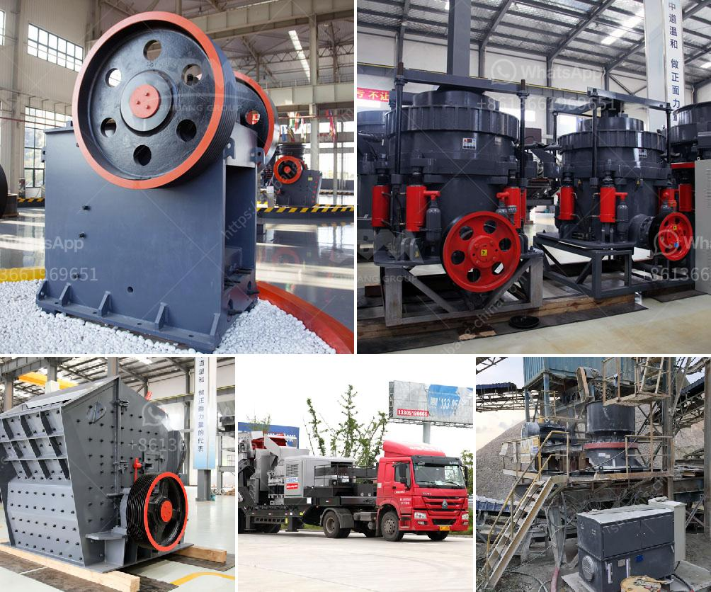

<h3>الشركة المصنعة لشاشات الاهتزاز</h3>
تُعد شاشات الاهتزاز أحد أهم التقنيات المستخدمة في مجال الصناعة للفصل والتصنيف والتحجيم لمجموعة متنوعة من المواد الصلبة والسائلة. وتسهم هذه الشاشات في تحسين كفاءة العملية الصناعية وزيادة الإنتاجية، مما يؤدي في النهاية إلى تحسين أرباح الشركات. يلعب الشركة المصنعة لشاشات الاهتزاز دوراً حيوياً في هذا المجال.

تختص الشركة المصنعة لشاشات الاهتزاز بتطوير وتصميم وتصنيع شاشات الاهتزاز عالية الجودة بتقنيات حديثة ومبتكرة. تعتمد هذه الشركة على فريق من المهندسين المؤهلين وذوي الخبرة في مجال تصنيع الشاشات، لضمان تقديم منتجات عالية الجودة وفعالة في الأداء.

تتميز شاشات الاهتزاز المصنعة من قبل هذه الشركة بعدة عوامل مهمة. أحدها هو استخدام تقنيات متقدمة في تصنيع الشاشات مثل تكنولوجيا الاهتزاز العالية التردد وتصميم الشاشات المبتكرة التي تسمح بإزالة المواد الغريبة والشوائب بكفاءة عالية. كما تتميز بأنظمة التحكم المتطورة التي تعمل على ضبط الاهتزازات بدقة لتحقيق أفضل أداء للشاشة وتحقيق الفصل المثالي للمواد.

بالإضافة إلى ذلك، تعمل الشركة على تطوير وتقديم أحجام مختلفة من الشاشات لتلبية احتياجات العملاء المختلفة. حيث يمكن للشركة تصميم وتصنيع شاشات الاهتزاز ذات الأحجام المختلفة المناسبة للتطبيقات الصناعية المختلفة، بدءًا من الصناعات الغذائية والدوائية وحتى الألغام والمعادن.

الجودة والموثوقية هما أيضًا جانبان رئيسيان لشاشات الاهتزاز المصنعة من قبل هذه الشركة. فمن خلال استخدام مواد عالية الجودة وعمليات التصنيع المتقدمة، توفر هذه الشاشات مستوى عالٍ من الأداء الثابت وعمرًا طويلًا مما يقلل من التكاليف الصيانة ويزيد من كفاءة الإنتاج.

بالاستناد إلى كل هذه العوامل، يمكن القول أن الشركة المصنعة لشاشات الاهتزاز تلعب دورًا حيويًا في تحسين العمليات الصناعية وتحقيق الكفاءة والإنتاجية المثلى في مختلف الصناعات. وبالنظر إلى اعتبارات الجودة والموثوقية والابتكار، تعتبر هذه الشركة الاختيار المثالي للشركات التي تبحث عن شاشات اهتزاز عالية الجودة وفعالة في الأداء لتلبية احتياجاتها الصناعية.
<h3>Contact us</h3><ul><li><strong>Whatsapp:&nbsp;<a href="https://wa.me/8613661969651">+8613661969651</a></strong></li><li><a href="https://swt.shibang-china.com/?git&amp;zhl&amp;الشركة المصنعة لشاشات الاهتزاز"><strong>Online Service(chat now)</strong></a></li></ul><h3>Related</h3><ul><li><a href='بائعي آلة المحجر المحمولة في نيجيريا.md'>بائعي آلة المحجر المحمولة في نيجيريا</a></li><li><a href='اشتقاق السرعة الحرجة في مطحنة كرات PDF.md'>اشتقاق السرعة الحرجة في مطحنة كرات PDF</a></li><li><a href='تكلفة آلة معالجة الفلدسبار.md'>تكلفة آلة معالجة الفلدسبار</a></li><li><a href='قطع غيار لكسارات الحجر.md'>قطع غيار لكسارات الحجر</a></li><li><a href='سعر كسارة الخرسانة في بنجلاديش.md'>سعر كسارة الخرسانة في بنجلاديش</a></li></ul>