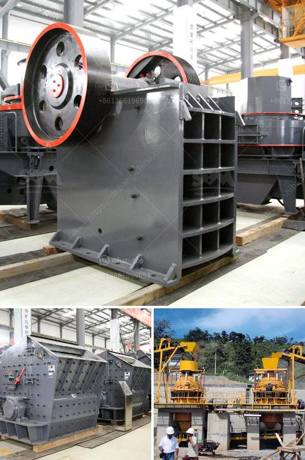

<h3>الطحن بالكرات العمودية والأفقية</h3>
يعتبر الطحن من الأعمال الهامة في صناعة التعدين والتصنيع، حيث يتم استخدامه لتفتيت المواد الصلبة إلى جزيئات أصغر وذلك لاستخلاص العناصر القيمة منها أو لتحويلها إلى منتج نهائي قابل للاستخدام. وهناك نوعين رئيسيين من طحن المواد الصلبة، الكرات العمودية والأفقية.

تتكون طواحين الكرات العمودية من أسطوانة عمودية تحتوي على كرات معدنية أو سيراميكية تدور حول نفسها. وعند استخدام هذا النوع من الطواحين، يتم إدخال المادة الصلبة من الجزء العلوي للأسطوانة، وعندما تدور الكرات تتعرض المادة لقوة الطحن وتتفتت إلى جزيئات أصغر. وتستخدم طواحين الكرات العمودية في العديد من التطبيقات، مثل طحن المواد الخام في صناعة الأسمنت والكيماويات.

أما طواحين الكرات الأفقية، فتكون أفقية الشكل وتحتوي على كرات في داخلها تدور بفضل حركة الأسطوانة الرأسية. وبتفتيت المادة الصلبة في هذا النوع من الطواحين، يتم إدخال المادة من الأعلى وتتفتت عند تعرضها للضغط بين الكرات وحائط الأسطوانة. وتستخدم طواحين الكرات الأفقية بشكل رئيسي في صناعة الطلاء والأصباغ، حيث تساعد في خلط المكونات وتفتيتها بشكل متجانس.

تتميز طواحين الكرات العمودية بالاستفادة الكاملة من قوة الجاذبية عند دوران الكرات حول الرأسي، مما يقلل من استهلاك الطاقة ويزيد من كفاءة العملية. بينما توفر طواحين الكرات الأفقية مساحة صغيرة وأداء عالي ومرونة في التشغيل. لذلك، يعتمد اختيار استخدام الطحن بالكرات العمودية أو الأفقية على طبيعة المادة المراد طحنها والتطبيق المستهدف.

في النهاية، يجب أن نعرف أن الطحن بالكرات العمودية والأفقية هي تقنيات مهمة تستخدم في صناعة التعدين والتصنيع. وعلى الرغم من وجود أنواع أخرى من الطواحين، فإن هاتين الطريقتين تتمتعان بفوائد فريدة وفعالة في تفتيت المواد الصلبة وتحويلها إلى منتج نهائي قابل للاستخدام.
<h3>Contact us</h3><ul><li><strong>Whatsapp:&nbsp;<a href="https://wa.me/8613661969651">+8613661969651</a></strong></li><li><a href="https://swt.shibang-china.com/?git&amp;zhl&amp;الطحن بالكرات العمودية والأفقية"><strong>Online Service(chat now)</strong></a></li></ul><h3>Related</h3><ul><li><a href='اختلافات بين مطحنة الهامر ومطحنة الكرة.md'>اختلافات بين مطحنة الهامر ومطحنة الكرة</a></li><li><a href='آلة كسارة الحجر في المملكة العربية السعودية.md'>آلة كسارة الحجر في المملكة العربية السعودية</a></li><li><a href='مطحنة الكرة للبيع في جنوب أفريقيا.md'>مطحنة الكرة للبيع في جنوب أفريقيا</a></li><li><a href='مطاحن الحجر للبيع في كينيا.md'>مطاحن الحجر للبيع في كينيا</a></li><li><a href='مصنع طحن الجبس المصنع في الهند.md'>مصنع طحن الجبس المصنع في الهند</a></li></ul>